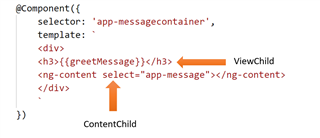

# Angular Interview Questions ( v13.0.x )

*Click  if you like the project. Pull Request are highly appreciated.*

<br/>

## Related Interview Questions

* [HTML5 Interview Questions](https://github.com/learning-zone/html-interview-questions/blob/master/README.md)
* [CSS Interview Questions](https://github.com/learning-zone/css-interview-questions/blob/master/README.md)
* [JavaScript Interview Questions](https://github.com/learning-zone/javascript-interview-questions/blob/master/README.md)

<br/>

## Table of Contents

* *[TypeScript Interview Questions](typescript-questions.md)*
* *[Angular Unit Testing Interview Questions](unit-testing-questions.md)*
* *[Angular Commands List](angular-commands.md)*

<br/>

### Projects

|Sl.No| Project Name                              | Technologies Used                             |Live Demo    |
|-----|-------------------------------------------|---------------------------------------------- |-------------|
| 01  |	[Angular-Features](angular-practice)      |Angular, Routing                               |[live](https://angular-features.firebaseapp.com)             |
| 02  |	[Angular-Material](angular-material-practice)|Angular, Material                           |[live](https://angular-material8.firebaseapp.com)            |
| 03  |	[Performance-Tuning](angular-performance-tuning)|Angular                                  |[live](https://performance-tuning-3450d.firebaseapp.com)             |

<br/>

### Angular Basics

|Sl.No|   Questions                                              |
|-----|----------------------------------------------------------|
| 01. |[What is an Angular Module?](#q-what-is-an-angular-module)|
| 02. |[What are the case types in Angular?](#q-what-are-the-case-types-in-angular)|
| 03. |[What is the difference between AngularJS and Angular?](#q-what-is-the-difference-between-angularjs-and-angular)|
| 04. |[What are the frequently used command in angular?](#q-what-are-the-frequently-used-command-in-angular)|
| 05. |[What are lifecycle hooks available in Angular?](#q-what-are-lifecycle-hooks-available-in-angular)|
| 06. |[What is data binding in Angular?](#q-what-is-data-binding-in-angular)|
| 07. |[What is the difference between constructor() and ngOnInit()?](#q-what-is-the-difference-between-constructor-and-ngoninit)|
| 08. |[What are Angular Services?](#q-what-are-angular-services)|
| 09. |[What is Interpolation?](#q-what-is-interpolation)|
| 10. |[What is index property in ngFor directive?](#q-what-is-index-property-in-ngfor-directive)|
| 11. |[What happens if you use script tag inside template?](#q-what-happens-if-you-use-script-tag-inside-template)|
| 12. |[What are template expressions?](#q-what-are-template-expressions)|
| 13. |[What are template statement?](#q-what-are-template-statement)|
| 14. |[How do you enable binding expression validation?](#q-how-do-you-enable-binding-expression-validation)|
| 15. |[What is the purpose of any type cast function?](#q-what-is-the-purpose-of-any-type-cast-function)|
| 16. |[What is Non null type assertion operator?](#q-what-is-non-null-type-assertion-operator)|
| 17. |[How do you describe various dependencies in angular application?](#q-how-do-you-describe-various-dependencies-in-angular-application)|
| 18. |[What is declarable in Angular?](#q-what-is-declarable-in-angular)|
| 19. |[What are the restrictions on declarable classes?](#q-what-are-the-restrictions-on-declarable-classes)|
| 20. |[When to use NgOnInit and constructor in Angular?](#q-when-to-use-ngoninit-and-constructor-in-angular)|
| 21. |[What is the expression context in Angular?](#q-what-is-the-expression-context-in-angular)|
| 22. |[How can you add an active class to a selected element in a list component?](#q-how-can-you-add-an-active-class-to-a-selected-element-in-a-list-component)|
| 23. |[What is the purpose of NgModule? How do you decide to create a new NgModule?](#q-what-is-the-purpose-of-ngmodule-how-do-you-decide-to-create-a-new-ngmodule)|
| 24. |[What is difference between Angular Modules and JavaScript Modules?](#q-what-is-difference-between-angular-modules-and-javascript-modules)|
| 25. |[How would you make use of ngOnInit()?](#q-how-would-you-make-use-of-ngoninit)|

###  Configuration & Tools

|Sl.No|  Questions                                   |
|-----|----------------------------------------------|
| 26. |[What is angular CLI?](#q-what-is-angular-cli)|
| 27. |[What is codelyzer?](#q-what-is-codelyzer)|
| 28. |[What is Angular CLI Builder?](#q-what-is-angular-cli-builder)|
| 29. |[What is a builder?](#q-what-is-a-builder)|
| 30. |[How do you invoke a builder?](#q-how-do-you-invoke-a-builder)|
| 31. |[How do you create app shell in Angular?](#q-how-do-you-create-app-shell-in-angular)|
| 32. |[What is difference between Angular JIT compilation and AOT compilation?](#q-what-is-difference-between-angular-jit-compilation-and-aot-compilation)|
| 33. |[What are the advantages with AOT?](#q-what-are-the-advantages-with-aot)|
| 34. |[What are the three phases of AOT?](#q-what-are-the-three-phases-of-aot)|
| 35. |[Can I use arrow functions in AOT?](#q-can-i-use-arrow-functions-in-aot)|
| 36. |[What is the purpose of metadata json files?](#q-what-is-the-purpose-of-metadata-json-files)|
| 37. |[Can I use any javascript feature for expression syntax in AOT?](#q-can-i-use-any-javascript-feature-for-expression-syntax-in-aot)|
| 38. |[What are the ways to control AOT compilation?](#q-what-are-the-ways-to-control-aot-compilation)|
| 39. |[What is Bazel tool?](#q-what-is-bazel-tool)|
| 40. |[How do you use Bazel with Angular CLI?](#q-how-do-you-use-bazel-with-angular-cli)|
| 41. |[How do you run Bazel directly?](#q-how-do-you-run-bazel-directly)|
| 42. |[What is Redux and how does it relate to an Angular app?](#q-what-is-redux-and-how-does-it-relate-to-an-angular-app)|
| 43. |[What are Zones? What is Change Detection? What would be a good use for NgZone service?](#q-what-are-zones-what-is-change-detection-what-would-be-a-good-use-for-ngzone-service)|
| 44. |[If your data model is updated outside the Zone explain the process how will you the view?](#q-if-your-data-model-is-updated-outside-the-zone-explain-the-process-how-will-you-the-view)|
| 45. |[What is Traceur Compiler?](#q-what-is-traceur-compiler)|
| 46. |[What Is PrimeNG? How Can It Be Used With Angular?](#q-what-is-primeng-how-can-it-be-used-with-angular)|
| 47. |[What is hammerjs in angular?](#q-what-is-hammerjs-in-angular)|
| 48. |[How to call component function from outside the app?](#q-how-to-call-component-function-from-outside-the-app)|
| 49. |[What is Babel and how it is used in Angular?](#q-what-is-babel-and-how-it-is-used-in-angular)|
| 50. |[Why yarn is better than npm?](#q-why-yarn-is-better-than-npm)|
| 51. |[What is a good use case for ngrx/store?](#q-what-is-a-good-use-case-for-ngrx-store)|
| 52. |[What is a good use case for ngrx/entity?](#q-what-is-a-good-use-case-for-ngrx-entity)|
| 53. |[What tools would you use to find a performance issue in your code?](#q-what-tools-would-you-use-to-find-a-performance-issue-in-your-code)|


###  Architecture 

|Sl.No|    Questions                                                                                             |
|-----|----------------------------------------------------------------------------------------------------------|
| 54. |[How an Angular application gets started or loaded?](#q-how-an-angular-application-gets-started-or-loaded)|
| 55. |[What is a bootstrapping module?](#q-what-is-a-bootstrapping-module)|
| 56. |[Why do we need compilation process?](#q-why-do-we-need-compilation-process)|
| 57. |[How to optimize loading large data in angular?](#q-how-to-optimize-loading-large-data-in-angular)|
| 58. |[What is metadata in Angular?](#q-what-is-metadata-in-angular)|
| 59. |[What is dependency injection in Angular?](#q-what-is-dependency-injection-in-angular)|
| 60. |[What are angular elements?](#q-what-are-angular-elements)|
| 61. |[What is the browser support of Angular Elements?](#q-what-is-the-browser-support-of-angular-elements)|
| 62. |[What are custom elements?](#q-what-are-custom-elements)|
| 63. |[Do I need to bootstrap custom elements?](#q-do-i-need-to-bootstrap-custom-elements)|
| 64. |[How custom elements works internally?](#q-how-custom-elements-works-internally)|
| 65. |[How to transfer components to custom elements?](#q-how-to-transfer-components-to-custom-elements)|
| 66. |[What are the mapping rules between Angular component and custom element?](#q-what-are-the-mapping-rules-between-angular-component-and-custom-element)|
| 67. |[How do you define typings for custom elements?](#q-how-do-you-define-typings-for-custom-elements)|
| 68. |[What are the restrictions of metadata?](#q-what-are-the-restrictions-of-metadata)|
| 69. |[What is folding?](#q-what-is-folding)|
| 70. |[What are macros?](#q-what-are-macros)|
| 71. |[Give an example of few metadata errors?](#q-give-an-example-of-few-metadata-errors)|
| 72. |[What is metadata rewriting?](#q-what-is-metadata-rewriting)|
| 73. |[How do you provide configuration inheritance?](#q-how-do-you-provide-configuration-inheritance)|
| 74. |[How do you specify angular template compiler options?](#q-how-do-you-specify-angular-template-compiler-options)|
| 75. |[What is zone?](#q-what-is-zone)|
| 76. |[What is the purpose of common module?](#q-what-is-the-purpose-of-common-module)|
| 77. |[What is Angular Ivy?](#q-what-is-angular-ivy)|
| 78. |[What are the features included in ivy preview?](#q-what-are-the-features-included-in-ivy-preview)|
| 79. |[Can I use AOT compilation with Ivy?](#q-can-i-use-aot-compilation-with-ivy)|
| 80. |[What is the difference between exports and declarations in NgModule?](#q-what-is-the-difference-between-exports-and-declarations-in-ngmode)|


### Component Interaction

|Sl.No|  Questions                                                         |
|-----|--------------------------------------------------------------------|
| 81. |[What are components in angular?](#q-what-are-components-in-angular)|
| 82. |[What are directives in angular?](#q-what-are-directives-in-angular)|
| 83. |[What are the differences between Component and Directive?](#q-what-are-the-differences-between-component-and-directive)|
| 84. |[What is the purpose of ngFor directive?](#q-what-is-the-purpose-of-ngfor-directive)|
| 85. |[What are dynamic components?](#q-what-are-dynamic-components)|
| 86. |[What are the class decorators in Angular?](#q-what-are-the-class-decorators-in-angular)|
| 87. |[What are class field decorators?](#q-what-are-class-field-decorators)|
| 88. |[Explain local reference variables, `@ViewChild()` and `@ContentChild()`.](#q-explain-local-reference-variables-viewchild-and-contentchild)|
| 89. |[Can we create two Components with the same name in two different .ts files?](#q-can-we-create-two-components-with-the-same-name-in-two-different-ts-files)|
| 90. |[How do you get a reference to a child component?](#q-how-do-you-get-a-reference-to-a-child-component)|
| 91. |[How do you listen for events in a component?](#q-how-do-you-listen-for-events-in-a-component)|
| 92. |[How do you force a change detection cycle?](#q-how-do-you-force-a-change-detection-cycle)|
| 93. |[How would you get a reference to a parent component?](#q-how-would-you-get-a-reference-to-a-parent-component)|
| 94. |[What are entryComponents?](#q-what-are-entrycomponents)|
| 95. |[When building custom form components, what interface do they components need to implement to particpate in forms?](#q-when-building-custom-form-components-what-interface-do-they-components-need-to-implement-to-particpate-in-forms)|
| 96. |[How Event Emitters works in Angular?](#q-how-event-emitters-works-in-angular)|
| 97. |[What is the difference between an Annotation and a Decorator in Angular?](#q-what-is-the-difference-between-an-annotation-and-a-decorator-in-angular)|
| 98. |[What is the process of inserting an embedded view from a prepared TemplateRef?](#q-what-is-the-process-of-inserting-an-embedded-view-from-a-prepared-templateref)|
| 99. |[List the differences between Angular components vs directives?](#q-list-the-differences-between-angular-components-vs-directives)|
| 100. |[How can we bind a variable with DOM element in Angular?](#q-how-can-we-bind-a-variable-with-dom-element-in-angular)|
| 101. |[What is Self and Host Decorator in Angular?](#q-what-is-self-and-host-decorator-in-angular)|
| 102. |[How do components communicate with each other?](#q-how-do-components-communicate-with-each-other)|
| 103. |[How to dynamically create a component in Angular?](#q-how-to-dynamically-create-a-component-in-angular)|
| 104. |[Why EventEmitter is needed for `@Output` decorator?](#q-why-eventemitter-is-needed-for-output-decorator)|
| 105. |[Why would you use renderer2 methods instead of using native element methods?](#q-why-would-you-use-renderer2-methods-instead-of-using-native-element-methods)|
| 106. |[What does lean component mean to you?](#q-what-does-lean-component-mean-to-you)|
| 107. |[How would you create a component to display error messages throughout your application?](#q-how-would-you-create-a-component-to-display-error-messages-throughout-your-application)|
| 108. |[What is the difference between a smart/container component and dumb/presentational component? What is a good use case example? What are the advantages?](#q-what-is-the-difference-between-a-smart-container-component-and-dumb-presentational-component-what-is-a-good-use-case-example-what-are-the-advantages)|
| 109. |[Which components will be notified when an event is emitted?](#q-which-components-will-be-notified-when-an-event-is-emitted)|
| 110. |[What is the difference between Stateless and Stateful Component?](#q-what-is-the-difference-between-stateless-and-stateful-component)|

###  Angular Forms 

|Sl.No|  Questions                                                                      |
|-----|---------------------------------------------------------------------------------|
| 111. |[What the importance of Dirty Flag, pristine, touched, untouched, valid, invalid?](#q-what-the-importance-of-dirty-flag-pristine-touched-untouched-valid-invalid)|
| 112. |[What is the difference between formControlName and FormControl?](#q-what-is-the-difference-between-formcontrolname-and-formcontrol)|
| 113. |[When do you use template driven vs model driven forms? Why?](#q-when-do-you-use-template-driven-vs-model-driven-forms-why)|
| 114. |[How do you submit a form?](#q-how-do-you-submit-a-form)|
| 115. |[What is the difference between NgForm, FormGroup, and FormControl? How do they work together?](#q-what-is-the-difference-between-ngform-formgroup-and-formcontrol-how-do-they-work-together)|
| 116. |[What is the advantage of using FormBuilder?](#q-what-s-the-advantage-of-using-formbuilder)|
| 117. |[How do you add form validation to a form built with FormBuilder?](#q-how-do-you-add-form-validation-to-a-form-built-with-formbuilder)|
| 118. |[What is the difference between dirty, touched, and pristine on a form element?](#q-what-is-the-difference-between-dirty-touched-and-pristine-on-a-form-element)|
| 119. |[What is async validation and how is it done?](#q-what-is-async-validation-and-how-is-it-done)|


###  Pipes

|Sl.No|  Questions                         |
|-----|------------------------------------|
| 120. |[What are pipes?](#q-what-are-pipes)|
| 121. |[What is a parameterized pipe?](#q-what-is-a-parameterized-pipe)|
| 122. |[What is a custom pipe?](#q-what-is-a-custom-pipe)|
| 123. |[What is the purpose of async pipe?](#q-what-is-the-purpose-of-async-pipe)|
| 124. |[What is the difference between pure and impure pipe?](#q-what-is-the-difference-between-pure-and-impure-pipe)|
| 125. |[What is difference between Stateful and Stateless Pipes in angular?](#q-what-is-difference-between-stateful-and-stateless-pipes-in-angular)|
| 126. |[How does async pipe prevents memory leaks?](#q-how-does-async-pipe-prevents-memory-leaks)|
| 127. |[What happens if you subscribe to a data source multiple times with async pipe?](#q-what-happens-if-you-subscribe-to-a-data-source-multiple-times-with-async-pipe)|

 
###  RxJS

|Sl.No|  Questions                     |
|-----|--------------------------------|
| 128. |[What is RxJS?](#q-what-is-rxjs)|
| 129. |[What is subscribing?](#q-what-is-subscribing)|
| 130. |[What is an observable?](#q-what-is-an-observable)|
| 131. |[What is an observer?](#q-what-is-an-observer)|
| 132. |[What is multicasting?](#q-what-is-multicasting)|
| 133. |[What is an RxJS Operator?](#q-what-is-an-rxjs-operator)|
| 134. |[What is rxjs subject in Angular?](#q-what-is-rxjs-subject-in-angular)|
| 135. |[What are observable creation functions?](#q-what-are-observable-creation-functions)|
| 136. |[What are the utility functions provided by RxJS?](#q-what-are-the-utility-functions-provided-by-rxjs)|
| 137. |[How do you perform error handling in observables?](#q-how-do-you-perform-error-handling-in-observables)|
| 138. |[What is RxJS BehaviorSubject, ReplaySubject and AsyncSubject in angular?](#q-what-is-rxjs-behaviorsubject-replaysubject-and-asyncsubject-in-angular)|
| 139. |[What is difference between BehaviorSubject and Observable?](#q-what-is-difference-between-behaviorsubject-and-observable)|
| 140. |[What is the difference between Subject and BehaviorSubject?](#q-what-is-the-difference-between-subject-and-behaviorsubject)|
| 141. |[How can you read full response?](#q-how-can-you-read-full-response)|
| 142. |[How do you perform Error handling?](#q-how-do-you-perform-error-handling)|
| 143. |[What will happen if you do not supply handler for observer?](#q-what-will-happen-if-you-do-not-supply-handler-for-observer)|
| 144. |[What is the short hand notation for subscribe method?](#q-what-is-the-short-hand-notation-for-subscribe-method)|
| 145. |[Explain the difference between Promise and Observable in Angular?](#q-explain-the-difference-between-promise-and-observable-in-angular)|
| 146. |[How to cache an observable data?](#q-how-to-cache-an-observable-data)|
| 147. |[What are the best way to unsubscribe from Observables in Angular?](#q-what-are-the-best-way-to-unsubscribe-from-observables-in-angular)|
| 148. |[If you need to respond to two different Observable or Subject with one callback function how would you do it?](#q-if-you-need-to-respond-to-two-different-observable-or-subject-with-one-callback-function-how-would-you-do-it)|
| 149. |[What is the difference between an observable and a subject?](#q-what-is-the-difference-between-an-observable-and-a-subject)|
| 150. |[What is the difference between observable and promises?](#q-what-is-the-difference-between-observable-and-promises)|
| 151. |[What are rxjs lettable operators?](#q-what-are-rxjs-lettable-operators)|
| 152. |[How would you implement a multiple api calls that needs to happen in order using rxjs?](#q-how-would-you-implement-a-multiple-api-calls-that-needs-to-happen-in-order-using-rxjs)|
| 153. |[What is the difference between switchMap, concatMap and mergeMap?](#q-what-is-the-difference-between-switchmap-concatmap-and-mergemap)|
| 154. |[How would you implement a brush behavior using rxjs?](#q-how-would-you-implement-a-brush-behavior-using-rxjs)|
| 155. |[How would you implement a color picker with rxjs?](#q-how-would-you-implement-a-color-picker-with-rxjs)|
| 156. |[If you need to respond to two different Observable/Subject with one callback function, how would you do it?(ex: if you need to change the url through route parameters and with prev/next buttons).](#q-if-you-need-to-respond-to-two-different-observable-subject-with-one-callback-function-how-would-you-do-it-ex-if-you-need-to-change-the-url-through-route-parameters-and-with-prev-next-buttons)|
 

### Routing

|Sl.No|  Questions                                                     |
|-----|----------------------------------------------------------------|
| 157. |[How routing works in Angular?](#q-how-routing-works-in-angular)|
| 158. |[What is the difference between RouterModule.forRoot() and RouterModule.forChild()?](#q-what-is-the-difference-between-routermoduleforroot-and-routermoduleforchild)|
| 159. |[Explain on how to use HttpClient with an example?](#q-explain-on-how-to-use-httpclient-with-an-example)|
| 160. |[What is router outlet?](#q-what-is-router-outlet)|
| 161. |[How to create multiple router-outlets?](#q-how-to-create-multiple-router-outlets)|
| 162. |[What is routerLink?](#q-what-is-routerlink)|
| 163. |[What are active router links?](#q-what-are-active-router-links)|
| 164. |[What is router state?](#q-what-is-router-state)|
| 165. |[What are Router Events?](#q-what-are-router-events)|
| 166. |[What is Activated Route?](#q-what-is-activated-route)|
| 167. |[How do you define Angular Routes?](#q-how-do-you-define-angular-routes)|
| 168. |[What is the purpose of Wildcard route?](#q-what-is-the-purpose-of-wildcard-route)|
| 169. |[What is auxiliary routes in angular?](#q-what-is-auxiliary-routes-in-angular)|
| 170. |[How can you cancel a router navigation?](#q-how-can-you-cancel-a-router-navigation)|
| 171. |[What is RouterLink? How would you pass data from a parent component to a child component?](#q-what-is-routerlink-how-would-you-pass-data-from-a-parent-component-to-a-child-component)|
| 172. |[Can you explain the difference between ActivatedRoute and RouterState?](#q-can-you-explain-the-difference-between-activatedroute-and-routerstate)|
| 173. |[How would you protect a component being activated through the router?](#q-how-would-you-protect-a-component-being-activated-through-the-router)|
| 174. |[How would you make sure an api call that needs to be called only once but with multiple conditions. Example: if you need to get some data in multiple routes but, once you get it, you can reuse it in the routes that needs it, therefor no need to make another call to your backend apis.](#q-how-would-you-make-sure-an-api-call-that-needs-to-be-called-only-once-but-with-multiple-conditions-example-if-you-need-to-get-some-data-in-multiple-routes-but-once-you-get-it-you-can-reuse-it-in-the-routes-that-needs-it-therefor-no-need-to-make-another-call-to-your-backend-apis)
| 175. |[Why do we need route guards?](#q-why-do-we-need-route-guards)|
| 176. |[How to use authguard in angular 7?](#q-how-to-use-authguard-in-angular-7)|


### Services & DI

|Sl.No|  Questions                                                             |
|-----|------------------------------------------------------------------------|
| 177. |[What is Angular Language Service?](#q-what-is-angular-language-service)|
| 178. |[How do you install angular language service in the project?](#q-how-do-you-install-angular-language-service-in-the-project)|
| 179. |[What is a DI token?](#q-what-is-a-di-token)|
| 180. |[How to make sure that single instance will be used in an entire application?](#q-how-to-make-sure-that-single-instance-will-be-used-in-an-entire-application)|
| 181. |[How do you reference the host of a component?](#q-how-do-you-reference-the-host-of-a-component)|
| 182. |[What are the difference between `@Inject` and `@Injectable`?](#q-what-are-the-difference-between-inject-and-injectable)|
| 183. |[What does forwardRef do?](#q-what-does-forwardref-do)|
| 184. |[How will you intercept http to inject header to each http call?](#q-how-will-you-intercept-http-to-inject-header-to-each-http-call)|
| 185. |[How will you parallelize multiple observable call?](#q-how-will-you-parallelize-multiple-observable-call)|
| 186. |[How will you put one async call before another?](#q-how-will-you-put-one-async-call-before-another)|
| 187. |[How would you make sure an api call that needs to be called only once but with multiple conditions?](#q-how-would-you-make-sure-an-api-call-that-needs-to-be-called-only-once-but-with-multiple-conditions)|
| 188. |[What is defer in promise?](#q-what-is-defer-in-promise)|
| 189. |[Why do we need provider aliases?](#q-why-do-we-need-provider-aliases)|
| 190. |[What module would you put a singleton service whose instance will be shared throughout the application (e.g. ExceptionService andLoggerService)?](#q-what-module-would-you-put-a-singleton-service-whose-instance-will-be-shared-throughout-the-application-eg-exceptionservice-andloggerservice)|
| 191. |[Why is it bad if Shared Module provides a service to a lazy loaded module?](#q-why-is-it-bad-if-shared-module-provides-a-service-to-a-lazy-loaded-module)|
| 192. |[What is circular dependency error in angular?](#q-what-is-circular-dependency-error-in-angular)|
| 193. |[What is static injector error in angular?](#q-what-is-static-injector-error-in-angular)|
| 194. |[How to create logger service in angular?](#q-how-to-create-logger-service-in-angular)|


### Angular Template

|Sl.No|  Questions                                                                       |
|-----|----------------------------------------------------------------------------------|
| 195.  |[What is Ng-Content/Content Projection?](#q-what-is-ng-content-content-projection)|
| 196. |[Why would you use renderer methods instead of using native element methods?](#q-why-would-you-use-renderer-methods-instead-of-using-native-element-methods)|
| 197. |[What is difference between Renderer and ElementRef in angular?](#q-what-is-difference-between-renderer-and-elementref-in-angular)|
| 198. |[How would you control size of an element on resize of the window in a component?](#q-how-would-you-control-size-of-an-element-on-resize-of-the-window-in-a-component)|
| 199. |[What do you understand by a template variable?](#q-what-do-you-understand-by-a-template-variable)|
| 200. |[How can you access validation errors in the template to display error messages?](#q-how-can-you-access-validation-errors-in-the-template-to-display-error-messages)|
| 201. |[What is transclusion in angular?](#q-what-is-transclusion-in-angular)|
| 202. |[What is ng-container and why is it useful?](#q-what-is-ng-container-and-why-is-it-useful)|
| 203. |[When can you omit the brackets in template binding?](#q-when-can-you-omit-the-brackets-in-template-binding)|
| 204. |[How would you insert an embedded view from a prepared TemplateRef?](#q-how-would-you-insert-an-embedded-view-from-a-prepared-templateref)|
| 205. |[How can you access validation errors in the template to display error messages?](#q-how-can-you-access-validation-errors-in-the-template-to-display-error-messages-1)
| 206. |[What is a template variable. How would you use it?](#q-what-is-a-template-variable-how-would-you-use-it)|
| 207. |[What is the difference of using a property binding verses a function binding on a template?](#q-what-is-the-difference-of-using-a-property-binding-verses-a-function-binding-on-a-template)|
| 208. |[what is the difference between ng-content, ng-container and ng- template?](#q-what-is-the-difference-between-ng-content-ng-container-and-ng-template)|
| 209. |[When you create a data-binding in Angular, are you working with attributes or properties? What is the difference anyway?](#q-when-you-create-a-data-binding-in-angular-are-you-working-with-attributes-or-properties-what-is-the-difference-anyway)|


### Angular Animations

|Sl.No|  Quesions                                          |
|-----|----------------------------------------------------|
| 210. |[What is State function?](#q-what-is-state-function)|
| 211. |[What is Style function?](#q-what-is-style-function)|
| 212. |[What is Angular DSL?](#q-what-is-angular-dsl)|
| 213. |[What is the purpose of animate function?](#q-what-is-the-purpose-of-animate-function)|
| 214. |[What is transition function?](#q-what-is-transition-function)|
| 215. |[How would you animate routing?](#q-how-would-you-animate-routing)|
| 216. |[How do you define the transition between two states in Angular?](#q-how-do-you-define-the-transition-between-two-states-in-angular)|
| 217. |[What selector force a style down through the child component tree into all the child component views?](#q-what-selector-force-a-style-down-through-the-child-component-tree-into-all-the-child-component-views)|
| 218. |[How can you add an active class to a selected element in a list component?](#q-how-can-you-add-an-active-class-to-a-selected-element-in-a-list-component)|
| 219. |[How would you select a custom component to style it.](#q-how-would-you-select-a-custom-component-to-style-it)|
| 220. |[What pseudo-class selector targets styles in the element that hosts the component?](#q-what-pseudo-class-selector-targets-styles-in-the-element-that-hosts-the-component)|
| 221. |[How would you select all the child components elements?](#q-how-would-you-select-all-the-child-components-elements)|
| 222. |[How would you select a css class in any ancestor of the component host element, all the way up to the document root?](#q-how-would-you-select-a-css-class-in-any-ancestor-of-the-component-host-element-all-the-way-up-to-the-document-root)|


### Performance

|Sl.No|  Questions                                       |
|-----|--------------------------------------------------|
| 223. |[What is a service worker and its role in Angular?](#q-what-is-a-service-worker-and-its-role-in-angular)|
| 224. |[How do you add web workers in your application?](#q-how-do-you-add-web-workers-in-your-application)|
| 225. |[What are the limitations with web workers?](#q-what-are-the-limitations-with-web-workers)|
| 226. |[How to set time for caching in service-worker?](#q-how-to-set-time-for-caching-in-service-worker)|
| 227. |[What are the types of cache in browsers?](#q-what-are-the-types-of-cache-in-browsers)|
| 228. |[How will you optimize image and svg in your angular app?](#q-how-will-you-optimize-image-and-svg-in-your-angular-app)|
| 229. |[What is shadow DOM? How is it helping Angular to perform better?](#q-what-is-shadow-dom-how-is-it-helping-angular-to-perform-better)|
| 230. |[What is Angular Universal?](#q-what-is-angular-universal)|
| 231. |[What is server side rendering in angular?](#q-what-is-server-side-rendering-in-angular)|
| 232. |[How would you use cached data?](#q-how-would-you-use-cached-data)|
| 233. |[What are some ways you may improve your website scrolling performance?](#q-what-are-some-ways-you-may-improve-your-website-s-scrolling-performance)|


### Miscellaneous

|Sl.No|  Questions                           |
|-----|--------------------------------------|
| 234. |[How to display only month in Angular?](#q-how-to-display-only-month-in-angular)|
| 235. |[What is the purpose of base href tag?](#q-what-is-the-purpose-of-base-href-tag)|
| 236. |[What is type narrowing?](#q-what-is-type-narrowing)|
| 237. |[How to inject the dynamic script in angular?](#q-how-to-inject-the-dynamic-script-in-angular)|
| 238. |[How do you use a JavaScript third party lib in an Angular App?](#q-how-do-you-use-a-javascript-third-party-lib-in-an-angular-app)|
| 239. |[How to configure Webpack with Angular?](#q-how-to-configure-webpack-with-angular)|
| 240. |[How do you provide build configuration for multiple locales?](#q-how-do-you-provide-build-configuration-for-multiple-locales)|
| 241. |[What would you have in a shared module?](#q-what-would-you-have-in-a-shared-module)|
| 242. |[What would you not put shared module?](#q-what-would-you-not-put-shared-module)|
| 243. |[What is the difference between scan() vs reduce()?](#q-what-is-the-difference-between-scan-vs-reduce)|
| 244. |[Can you talk about a bug related to a race condition, how to solve it and how to test it?](#q-can-you-talk-about-a-bug-related-to-a-race-condition-how-to-solve-it-and-how-to-test-it)|
| 245. |[Explain the difference between layout, painting and compositing.](#q-explain-the-difference-between-layout-painting-and-compositing)
| 246. |[Write a program to perform column sorting using angular-material?](#q-write-a-program-to-perform-column-sorting-using-angular-material)|

<br/>

#### Q. ***What are the frequently used command in angular?***

|Commands                             |Description                                                                  |
|-------------------------------------|-----------------------------------------------------------------------------|
|ng new project-name                  | Create an Angular project with Angular CLI                                  |
|ng serve --open                      | Builds and serves app, rebuilding on file changes                           |
|ng test						                  | Running unit tests                                                          |
|ng e2e 						                  | Running end-to-end tests with protractor framwork                           |
|ng generate					                | Generate Angular components                                                 |
|ng lint						                  | prints out linting errors                                                   |
|ng build						                  | Compiles an Angular app into an output directory named dist/ at the given output path. |
|ng build --prod				              | apply uglify and minify to reduce the bundle as well make angular work in production mode which reduces runtime warnings given by angular compiler as well increase performance. The ng build command with the --prod meta-flag (ng build --prod) compiles with AOT by default.                          |
|ng build --dev				                | Compiles an Angular app into an output directory named dist/ at the given output path.|
|ng get/ng set					              | Set a value in the Angular CLI configuration                                |
|ng doc						                    | Opens a browser window with the keyword as search in Angular documentation. | 
|ng eject						                  | ejects your app and output the proper webpack configuration and scripts     |
|ng xi18n						                  | Extracts i18n messages from the templates.                                  |
|<pre>ng test --watch=false --code-coverage</pre>| Generate Code Coverage Reports                                   |
|npm run                              | Runs an Architect target with an optional custom builder configuration defined in  project. |
|ng build --aot                       | generally when we serve angular project all the angular files are downloaded on browser and it will compile and execute the application on the browser but in aot entire application delivered to the browser is precompiled hence improves the performance. |
|ng add @angular/pwa                  |Adds support for an external library to project  |
|ng xi18n --output-path src/locale    |Internationalization |
|ng generate web-worker app           |Add a Web Worker to angular app|

<div align="right">
    <b><a href="#">↥ back to top</a></b>
</div>

## Q. ***What is difference between Angular JIT compilation and AOT compilation?***

Angular has 2 types of build dev build or prod build

**JIT**  
Just-in-Time (JIT) is a type of compilation that compiles app in the browser at runtime. JIT compilation is the default when you run the ng build (build only) or ng serve (build and serve locally) CLI commands. i.e, the below commands used for JIT compilation,

```javascript
ng build
ng serve
```
**AOT**  
Ahead-of-Time (AOT) is a type of compilation that compiles app at build time. For AOT compilation, include the `--aot` option with the ng build or ng serve command as below,

```javascript
ng build --aot
ng serve --aot
```

```
ng build or ng build --dev   -  this is for development build
ng build --prod              -  this is for production build
```

|Dev Build	                                |Production build                           |
|-------------------------------------------|-------------------------------------------|
|Source maps(.js.map files) are generated	  |Source maps not generated                  |
|Dev Build is not minified and uglified	    |Production Build is minified and uglified  |
|Dev build is not tree shaked	              |Production build is tree shaked            |
|No AOT compilation	                        |AOT compilation takes place                |


* **minification** - process of removing excess whitespace, comments and optinal tokens like curly braces and semi colons
* **uglification** - process of transforming code to use short variable and function names  
* **tree shaking** -  is the process of removing any code that we are not actually using in our application from the final bundle

*Note: The ng build command with the --prod meta-flag (`ng build --prod`) compiles with AOT by default.*

<div align="right">
    <b><a href="#">↥ back to top</a></b>
</div>

## Q. ***What are the advantages with AOT?***

1. **Faster rendering** The browser downloads a pre-compiled version of the application. So it can render the application immediately without compiling the app.
2. **Fewer asynchronous requests** It inlines external HTML templates and CSS style sheets within the application javascript which eliminates separate ajax requests.
3. **Smaller Angular framework download size** Does not require downloading the Angular compiler. Hence it dramatically reduces the application payload.
4. **Detect template errors earlier** Detects and reports template binding errors during the build step itself
5. **Better security** It compiles HTML templates and components into JavaScript.  So there wont be any injection attacks.

<div align="right">
    <b><a href="#">↥ back to top</a></b>
</div>

## Q. ***What are the ways to control AOT compilation?***

You can control your app compilation in two ways
1. By providing template compiler options in the `tsconfig.json` file
2. By configuring Angular metadata with decorators

<div align="right">
    <b><a href="#">↥ back to top</a></b>
</div>

## Q. ***How to optimize loading large data in angular?***

**Load Time Performance**

1. **AOT**: The Angular Ahead-of-Time (AOT) compiler converts your Angular HTML and TypeScript code into efficient JavaScript code during the build phase before the browser downloads and runs that code. Compiling your application during the build process provides a faster rendering in the browser.
2. **Tree-shaking**: This is the process of removing unused code resulting in smaller build size. In **angular-cli**, Tree-Shaking is enabled by default.
3. **Uglify**: It is the process where the code size is reduced using various code transformations like mangling, removal of white spaces, removal of comments etc. For webpack use uglify plugin and with angular-cli specify the “prod” flag to perform the uglification process.
4. **Lazy loading**: Lazy loading is the mechanism where instead of loading complete app, we load only the modules which are required at the moment thereby reducing the initial load time. 
5. **Ivy Render Engine**: It results in much smaller bundle size than the current engine with improved debugging experience.
6. **RxJS**: RxJS makes the whole library more tree-shakable thereby reducing the final bundle size. However, it has some breaking changes like operators chaining is not possible instead, pipe() function (helps in better tree shaking) is introduced to add operators. 
7. **Service worker cache**: A service worker is a script that runs in the web browser and manages caching for an application.
8. **defer attribute**: Mentioning defer attribute to script tag will defer the loading of the scripts (sychronous) until the document is not parsed thus making site interactive quicker. 
9. **async attribute**: async delays the loading of scripts until the document is not parsed but without respecting the order of loading of the scripts.
10. **ChangeDetectionStrategy.OnPush**: `ChangeDetectionStrategy.OnPush` tells Angular that the component only depends on his Inputs ( aka pure ) and needs to be checked in only the following cases:  
i). The `Input` reference changes.  
ii). An event occurred from the component or one of his children.  
iii). You run change detection explicitly by calling `detectChanges()/tick()/markForCheck()`  

Example

```typescript
@Component({
  selector: 'my-select',
  template: `
    ...
  `,
  changeDetection: ChangeDetectionStrategy.OnPush
})
```

11. **TrackBy**: If we provide a trackBy function, Angular can track which items have been added or removed according to the unique identifier and only create or destroy the things that have changed.

Example:

```typescript
@Component({
  selector: 'my-app',
  template: `
    <ul>
      <li *ngFor="let item of collection;trackBy: trackByFn">{{item.id}}</li>
    </ul>
    <button (click)="getItems()">Refresh items</button>
  `,
})
export class App {

  constructor() {
    this.collection = [{id: 1}, {id: 2}, {id: 3}];
  }
  getItems() {
    this.collection = this.getItemsFromServer();
  }
  getItemsFromServer() {
    return [{id: 1}, {id: 2}, {id: 3}, {id: 4}];
  }
  trackByFn(index, item) {
    return index; // or item.id
  }
}
```

<div align="right">
    <b><a href="#">↥ back to top</a></b>
</div>

## Q. ***How an Angular application gets started or loaded?***

The **main.ts** file, that is the first code which gets executed. The job of main.ts is to bootstrap the application. It loads everything and controls the startup of the application.

**main.ts**

```typescript
import { enableProdMode } from '@angular/core';
import { platformBrowserDynamic } from '@angular/platform-browser-dynamic';

import { AppModule } from './app/app.module';
import { environment } from './environments/environment';

if (environment.production) {
  enableProdMode();
}

platformBrowserDynamic().bootstrapModule(AppModule)
  .catch(err => console.error(err));
```

Most importantly here is the line where bootstraps start our angular app by passing app module to the method. AppModule refers to the app.module.ts file.

**app.module.ts**

```typescript
import { BrowserModule } from '@angular/platform-browser';
import { NgModule, ErrorHandler } from '@angular/core';
import { HttpClientModule } from '@angular/common/http';
import { AppComponent } from './app.component';

@NgModule({
  declarations: [
    AppComponent
  ],
  imports: [
    BrowserModule,
    HttpClientModule
  ],
  providers: [ ],
  bootstrap: [AppComponent]
})
export class AppModule { }
```

When angular starts, it bootstrap array in `@NgModule`. It basically there is a list of all components which should be known to Angular at the point of time it analyzes **index.html** file.

**index.html**

```html
<!DOCTYPE html>
<html lang="en">
  <head>
    <meta charset="utf-8" />
    <title>Angular 8</title>
    <base href="/" />
    <meta name="viewport" content="width=device-width, initial-scale=1" />
    <link rel="icon" type="image/x-icon" href="favicon.ico" />
  </head>
  <body>
    <app-root>Loading...</app-root>
  </body>
</html>
```

<div align="right">
    <b><a href="#">↥ back to top</a></b>
</div>

## Q. ***What is rxjs subject in Angular?***

An RxJS Subject is a special type of Observable that allows values to be **multicasted** to many Observers. While plain Observables are unicast (each subscribed Observer owns an independent execution of the Observable), Subjects are multicast.

A Subject observable is used to immediately notify subscribers of updated values emitted by it. It does not keep track of old values, i.e. if a Subject observable first emitted a value and was then later subscribed to, then the subscriber will not get that value. A Subject is like an Observable, but can multicast to many Observers. Subjects are like **EventEmitters**: they maintain a registry of many listeners.

``` typescript
import { Subject } from 'rxjs';

const mySubject = new Rx.Subject();

mySubject.next(1); // Data can be pushed into the subject using its next method

const subscription1 = mySubject.subscribe(x => {
  console.log('From subscription 1:', x);
});

mySubject.next(2);

const subscription2 = mySubject.subscribe(x => {
  console.log('From subscription 2:', x);
});

mySubject.next(3);

subscription1.unsubscribe();

mySubject.next(4);
```

Output

```typescript
From subscription 1: 2
From subscription 1: 3
From subscription 2: 3
From subscription 2: 4
```

<div align="right">
    <b><a href="#">↥ back to top</a></b>
</div>

## Q. ***What is RxJS BehaviorSubject, ReplaySubject and AsyncSubject in angular?***

**a.) BehaviorSubject**: It has the characteristic that it stores the **current** value. This means that we can always directly get the last emitted value from the BehaviorSubject. We can either get the value by accessing the **.value** property on the BehaviorSubject or we can subscribe to it. 

```typescript
import * as Rx from "rxjs";

const subject = new Rx.BehaviorSubject();

// subscriber 1
subject.subscribe((data) => {
    console.log('Subscriber A: ', data);
});

subject.next(Math.random());
subject.next(Math.random());

// subscriber 2
subject.subscribe((data) => {
    console.log('Subscriber B: ', data);
});

subject.next(Math.random());

console.log(subject.value)

// output
// Subscriber A: 0.24957144215097515
// Subscriber A: 0.8751123892486292
// Subscriber B: 0.8751123892486292
// Subscriber A: 0.1901322109907977
// Subscriber B: 0.1901322109907977
// 0.1901322109907977
```

**b.) ReplaySubject**: It can send **old** values to new subscribers. It however has the extra characteristic that it can record a part of the observable execution and therefore store multiple old values and **replay** them to new subscribers.

When creating the ReplaySubject we can specify how much values want to store and for how long want to store them.

```typescript
import * as Rx from "rxjs";

const subject = new Rx.ReplaySubject(2);

// subscriber 1
subject.subscribe((data) => {
    console.log('Subscriber A:', data);
});

subject.next(Math.random())
subject.next(Math.random())
subject.next(Math.random())

// subscriber 2
subject.subscribe((data) => {
    console.log('Subscriber B:', data);
});

subject.next(Math.random());

// Subscriber A: 0.3541746356538569
// Subscriber A: 0.12137498878080955
// Subscriber A: 0.531935186034298
// Subscriber B: 0.12137498878080955
// Subscriber B: 0.531935186034298
// Subscriber A: 0.6664809293975393
// Subscriber B: 0.6664809293975393
```

**c.) AsyncSubject**: It is a Subject variant where only the last value of the Observable execution is sent to its subscribers, and only when the execution completes. 

```typescript
import * as Rx from "rxjs";

const subject = new Rx.AsyncSubject();

// subscriber 1
subject.subscribe((data) => {
    console.log('Subscriber A:', data);
});

subject.next(Math.random())
subject.next(Math.random())
subject.next(Math.random())

// subscriber 2
subject.subscribe((data) => {
    console.log('Subscriber B:', data);
});

subject.next(Math.random());
subject.complete();

// Subscriber A: 0.4447275989704571
// Subscriber B: 0.4447275989704571
```

<div align="right">
    <b><a href="#">↥ back to top</a></b>
</div>

## Q. ***What is difference between BehaviorSubject and Observable?***

Behavior Subject is a type of subject, a subject is a special type of observable so you can subscribe to messages like any other observable.   

The unique features of a behavior subject are:

* Behavior subject needs an initial value as it must always return a value on subscription even if it hasn’t received a **next()**
* Upon subscription, it returns the last value of the subject. A regular observable only triggers when it receives a onnext
* At any point you can retrieve the last value of the subject in a non-observable code using the **getValue()** method.

The unique features of a subject compared to a observable are:

* It is a observer in addition to being a observable so you can also send values to a subject in addition to subscribing to it.
* In addition you can get a observable from behavior subject using the asobservable() method on behaviour subject.
* Observable is a Generic, and Behavior subject is technically a sub-type of Observable because behavior subject is a observable with specific qualities.

```typescript
// Behavior Subject

// a is a initial value. if there is a subscription 
// after this, it would get "a" value immediately
let bSubject = new BehaviorSubject("a"); 

bSubject.next("b");

bSubject.subscribe((value) => {
  console.log("Subscription got", value); // Subscription got b, 
                                          // ^ This would not happen 
                                          // for a generic observable 
                                          // or generic subject by default
});

bSubject.next("c"); // Subscription got c
bSubject.next("d"); // Subscription got d
```

**Example 2**: With regular subject

```typescript
// Regular Subject

let subject = new Subject(); 

subject.next("b");

subject.subscribe((value) => {
  console.log("Subscription got", value); // Subscription wont get 
                                          // anything at this point
});

subject.next("c"); // Subscription got c
subject.next("d"); // Subscription got d
```

<div align="right">
    <b><a href="#">↥ back to top</a></b>
</div>

## Q. ***What is the difference between Subject and BehaviorSubject?***

**Subject**  

Subject does not return the current value on Subscription. It triggers only on `.next(value)` call and return/output the value

```javascript
var subject = new Rx.Subject();

subject.next(1); //Subjects will not output this value

subject.subscribe({
  next: (v) => console.log('observerA: ' + v)
});
subject.subscribe({
  next: (v) => console.log('observerB: ' + v)
});

subject.next(2);
subject.next(3);
```

Output:

```
observerA: 2
observerB: 2
observerA: 3
observerB: 3
```

**BehaviorSubject**  

A BehaviorSubject holds one value. When it is subscribed it emits the value immediately. A Subject does not hold a value. BehaviourSubject will return the initial value or the current value on Subscription.

```javascript
var subject = new Rx.BehaviorSubject(0);  // 0 is the initial value

subject.subscribe({
  next: (v) => console.log('observerA: ' + v)  // output initial value, then new values on `next` triggers
});

subject.next(1);  // output new value 1 for 'observer A'
subject.next(2);  // output new value 2 for 'observer A', current value 2 for 'Observer B' on subscription

subject.subscribe({
  next: (v) => console.log('observerB: ' + v)  // output current value 2, then new values on `next` triggers
});

subject.next(3);
```

Output:

```
observerA: 0
observerA: 1
observerA: 2
observerB: 2
observerA: 3
observerB: 3
```

<div align="right">
    <b><a href="#">↥ back to top</a></b>
</div>

## Q. ***What is the difference between AngularJS and Angular?***

Angular is a completely revived component-based framework in which an application is a tree of individual 
components.


| AngularJS                                         | Angular                                             |
|---------------------------------------------------|-----------------------------------------------------|
|JavaScript-based framework for creating SPA.       |Complete re-write of AngularJS version.       |
|Still supported but no longer will be developed.   |It is updated version regularly released because of Semantic Versioning.|
|The architecture of AngularJS is based on MVC.     |The architecture of Angular 2 is component based|
|AngularJS was not developed with a mobile base in mind.|Angular 2 is a mobile-oriented framework.|
|AngularJS code can write by using only ES5, ES6, and Dart.|We can use ES5, ES6, Typescript to write an Angular 2 code.|
|Factory, service, provider, value and constant are used for services|The class is the only method to define services in Angular2|
|Run on only client-side                             |Runs on client-side & server-side|
|ng-app and angular bootstrap function are used to initialize | bootstrapmodule() function is used to initialize|

**a.) AngularJS**  


**Advantages**  

* It has great MVC data binding that makes app development fast.
* Using HTML as a declarative language makes it very intuitive.
* It is a comprehensive solution for rapid front-end development since it does not need any other frameworks or plugins.
* AngularJS apps can run on every significant program and advanced cells including iOS and Android-based phones and tablets.
* Two-way data binding
* Directives
* Dependency injection

**Disadvantages**  

* It is big and complicated due to the multiple ways of doing the same thing.
* Implementations scale poorly.
* If a user of an AngularJS application disables JavaScript, nothing but the basic page is visible.
* There is a lagging UI if there are more than 200 watchers.


**b.) Angular**


**Advantages** 

* Component-based architecture that provides a higher quality of code
* Reusability: Components of similar nature are well encapsulated, in other words, self-sufficient. Developers can reuse them across different parts of an application. 
* Unit-test friendly: The independent nature of components simplifies unit tests, quality assurance procedures aimed at verifying the performance of the smallest parts of the application, units.
* Maintainability: Components that are easily decoupled from each other can be easily replaced with better implementations.


**Disadvantages**

* Angular is verbose and complex
* Steep learning curve
* Migrating legacy systems from AngularJS to Angular requires time

<div align="right">
    <b><a href="#">↥ back to top</a></b>
</div>

## Q. ***How do you add web workers in your application?***

We can add web worker anywhere in our application. For example, If the file that contains expensive computation is `src/app/app.component.ts`, we can add a Web Worker using `ng generate web-worker app` command which will create `src/app/app.worker.ts` web worker file. This command will perform below actions,
1. Configure project to use Web Workers
2. Adds app.worker.ts to receive messages

```typescript
addEventListener('message', ({ data }) => {
  const response = `worker response to ${data}`;
  postMessage(response);
});
```

3. The component `app.component.ts` file updated with web worker file

```typescript
if (typeof Worker !== 'undefined') {
  // Create a new
  const worker = new Worker('./app.worker', { type: 'module' });
  worker.onmessage = ({ data }) => {
    console.log('page got message: $\{data\}');
  };
  worker.postMessage('hello');
} else {
  // Web Workers are not supported in this environment.
}
```

*Note: You may need to refactor your initial scaffolding web worker code for sending messages to and from.*

<div align="right">
    <b><a href="#">↥ back to top</a></b>
</div>

## Q. ***What are directives in angular?***

Directives add behaviour to an existing DOM element or an existing component instance.
There are four types of directives in Angular
* Components directives  
* Structural directives  
* Attribute directives  
* Custom Directive  

**Structural Directives**   
Structural Directives are directives which change the structure of the DOM by adding or removing elements. There are three built in structural directives, `NgIf`, `NgFor` and `NgSwitch`.

Example: Structural Directives

```html
<div *ngIf="user$ | async as user">
  <span>Name: {{user.name}}</span>
  <span>Age: {{user.age}}</span>
</div>
```

**Attribute Directives**   
Attribute directives change the appearance or behavior of an element, component, or another directive.  `ngClass`, `ngStyle` are examples of attribute directives built-in to the Angular framework.

Example: Attribute Directives

```html
<p [ngStyle]="{'background': isBlue ? 'blue' : 'red'}"> I am an Attribute Directive</p>
```

Example: Custom Directive

```typescript
import { Directive, ElementRef, Input } from '@angular/core';

@Directive({ selector: '[myHighlight]' })
export class HighlightDirective {
    constructor(el: ElementRef) {
        el.nativeElement.style.backgroundColor = 'yellow';
    }
}
```

Now this directive extends HTML element behavior with a yellow background as below

```html
<p myHighlight>Highlight me!</p>
```
<div align="right">
    <b><a href="#">↥ back to top</a></b>
</div>

## Q. ***What are components in angular?***


Components are the most basic UI building block of an Angular app which formed a tree of Angular components. These components are subset of directives. Unlike directives, components always have a template and only one component can be instantiated per an element in a template.

```typescript
import { Component } from '@angular/core';

@Component ({
    selector: 'my-app',
    template: ` <div>
        <h1>{{title}}</h1>
        <div>Angular components example</div>
    </div> `,
})

export class AppComponent {
    title: string = 'Welcome to Angular world';
}
```

<div align="right">
    <b><a href="#">↥ back to top</a></b>
</div>

## Q. ***What are the differences between Component and Directive?***

A component is also a type of directive with template, styles and logic part.

| Component | Directive |
|---------- |-----------|
| To register a component we use @Component meta-data annotation  | To register directives we use @Directive meta-data annotation |
| Components are typically used to create UI widgets| Directive is used to add behavior to an existing DOM element |
| Component is used to break up the application into smaller components| Directive is use to design re-usable components|
| Only one component can be present per DOM element | Many directives can be used per DOM element |
| @View decorator or templateurl/template are mandatory | Directive does not use View|


Example:

```typescript
import { Component, HostListener, HostBinding, Directive, ElementRef } from '@angular/core';

@Directive({
  selector: '[appHighlight]'
})
export class HighlightDirective {
  constructor(el: ElementRef) {
    el.nativeElement.style.backgroundColor = 'red';
 }
}

@Component({
  selector: 'app-root',
  template: `
    <div *ngIf='myBool' appHighlight>Hi there</div>
  `,
  styleUrls: ['./app.component.scss'],
})
export class AppComponent  {

  myBool:boolean = true;

}
```

<div align="right">
    <b><a href="#">↥ back to top</a></b>
</div>

## Q. ***What is an Angular Module?***

In Angular, a module is a mechanism to group components, directives, pipes and services that are related, in such a way that can be combined with other modules to create an application. 

```typescript
import { NgModule }      from '@angular/core';
import { BrowserModule } from '@angular/platform-browser';
import { AppComponent }  from './app.component';

@NgModule ({
    imports:      [ BrowserModule ],
    declarations: [ AppComponent ],
    bootstrap:    [ AppComponent ]
})
export class AppModule { }
```

The NgModule decorator has three options
* The imports option is used to import other dependent modules. The BrowserModule is required by default for any web based angular application
* The declarations option is used to define components in the respective module
* The bootstrap option tells Angular which Component to bootstrap in the application

<div align="right">
    <b><a href="#">↥ back to top</a></b>
</div>

## Q. ***What are lifecycle hooks available in Angular?***

Angular creates and renders components along with their children, checks when their data-bound properties change, and destroys them before removing them from the DOM.

Angular offers lifecycle hooks that provide visibility into these key life moments and the ability to act when they occur.

* **ngOnChanges** When the value of a data bound property changes, then this method is called.
* **ngOnInit** This is called whenever the initialization of the directive/component after Angular first displays the data-bound properties happens.
* **ngDoCheck** This is for the detection and to act on changes that Angular can not or wont detect on its own.
* **ngAfterContentInit** This is called in response after Angular projects external content into the components view.
* **ngAfterContentChecked** This is called in response after Angular checks the content projected into the component.
* **ngAfterViewInit** This is called in response after Angular initializes the components views and child views.
* **ngAfterViewChecked** This is called in response after Angular checks the components views and child views.
* **ngOnDestroy** This is the cleanup phase just before Angular destroys the directive/component.

<div align="right">
    <b><a href="#">↥ back to top</a></b>
</div>

## Q. ***What is data binding in Angular?***

Data binding is a core concept in Angular and allows to define communication between a component and the DOM, making it very easy to define interactive applications without worrying about pushing and pulling data.

**From the Component to the DOM**  
**1. Interpolation** `{{ value }}`: Adds the value of a property from the component

```html
<li>Name: {{ user.name }}</li>
<li>Address: {{ user.address }}</li>
```

**2. Property binding** `[property] = "value"`: The value is passed from the component to the specified property or simple HTML attribute

```html
<input type="email" [value]="user.email">
```

**From the DOM to the Component**  

**3. Event binding** `(event) = "function"`: When a specific DOM event happens (eg.: click, change, keyup), call the specified method in the component

```html
<button (click)="logout()"></button>
``` 

**4. Two-way data binding** `[(ngModel)] = "value"`: Two-way data binding allows to have the data flow both ways. For example, in the below code snippet, both the email DOM input and component email property are in sync

```html
<input type="email" [(ngModel)]="user.email">
```

<div align="right">
    <b><a href="#">↥ back to top</a></b>
</div>

## Q. ***What is metadata in Angular?***

Metadata is used to decorate a class so that it can configure the expected behavior of the class. The metadata is represented by decorators  

**1. Class Decorators** e.g. @Component and @NgModule

```typescript
import { NgModule, Component } from '@angular/core';

@Component({
    selector: 'my-component',
    template: '<div>Class decorator</div>',
})
export class MyComponent {
  constructor() {
    console.log('Hey I am a component!');
  }
}

@NgModule({
    imports: [],
    declarations: [],
})
export class MyModule {
  constructor() {
    console.log('Hey I am a module!');
  }
}
```
**2. Property Decorators** Used for properties inside classes, e.g. `@Input()` and `@Output()`

```typescript
import { Component, Input } from '@angular/core';

@Component({
    selector: 'my-component',
    template: '<div>Property decorator</div>'
})

export class MyComponent {
    @Input() title: string;
}
```
**3. Method Decorators** Used for methods inside classes, e.g. `@HostListener()`

```typescript
import { Component, HostListener } from '@angular/core';

@Component({
    selector: 'my-component',
    template: '<div>Method decorator</div>'
})
export class MyComponent {
    @HostListener('click', ['$event'])
    onHostClick(event: Event) {
        // clicked, `event` available
    }
}
```

**4. Parameter Decorators** Used for parameters inside class constructors, e.g. `@Inject()`

```typescript
import { Component, Inject } from '@angular/core';
import { MyService } from './my-service';

@Component({
    selector: 'my-component',
    template: '<div>Parameter decorator</div>'
})
export class MyComponent {
    constructor(@Inject(MyService) myService) {
        console.log(myService); // MyService
    }
}
```

<div align="right">
    <b><a href="#">↥ back to top</a></b>
</div>

## Q. ***What is a service worker and its role in Angular?***

A service worker is a script that runs in the web browser and manages caching for an application. Starting from 5.0.0 version, Angular ships with a service worker implementation. Angular service worker is designed to optimize the end user experience of using an application over a slow or unreliable network connection, while also minimizing the risks of serving outdated content. Adding a service worker to an Angular application is one of the steps for turning an application into a **Progressive Web App** (also known as a `PWA`).

Below are the list of design goals of Angular service workers,
* It caches an application just like installing a native application
* A running application continues to run with the same version of all files without any incompatible files
* When you refresh the application, it loads the latest fully cached version
* When changes are published then it immediately updates in the background
* Service workers saves the bandwidth by downloading the resources only when they changed.

*Syntax*

```bash
ng add @angular/pwa --project *project-name*
```
The above command completes the following actions:

* Adds the `@angular/service-worker` package to your project.
* Enables service worker build support in the CLI.
* Imports and registers the service worker in the app module.
* Updates the *index.html* file:
    * Includes a link to add the *manifest.json* file.
    * Adds meta tags for theme-color.
* Installs icon files to support the installed Progressive Web App (PWA).
* Creates the service worker configuration file called *ngsw-config.json*, which specifies the caching behaviors and other settings.

<div align="right">
    <b><a href="#">↥ back to top</a></b>
</div>

## Q. ***How to set time for caching in service-worker?***

**ngsw-config.json**
```typescript
{
    ...
    "dataGroups": [{
            "name": "api-freshness",
            "urls": [
                "/timeline"
            ],
            "cacheConfig": {
                "strategy": "freshness",
                "maxSize": 100,
                "maxAge": "3d",
                "timeout": "10s"
            }
        },
        {
            "name": "api-performance",
            "urls": [
                "/favorites"
            ],
            "cacheConfig": {
                "strategy": "performance",
                "maxSize": 100,
                "maxAge": "3d"
            }
        }
    ]
}
```

<div align="right">
    <b><a href="#">↥ back to top</a></b>
</div>

## Q. ***What are the types of cache in browsers?***

There are two types of cache in the browser: browser-managed cache and application-managed cache (service worker).

* **Browser-managed caches** are a temporary storage location on computer for files downloaded by browser to display websites. Files that are cached locally include any documents that make up a website, such as HTML files, CSS style sheets, JavaScript scripts, as well as graphic images and other multimedia content. This cache is managed automatically by the browser and is not available offline.

* **Application-managed caches** are created using the Cache API independent of the browser-managed caches. This API is available to applications (via **window.caches**) and the **service worker**. Application- managed caches hold the same kinds of assets as a browser cache but are accessible offline (e.g. by the service worker to enable offline support).This cache is managed by developers who implement scripts that use the Cache API to explicitly update items in named cache objects.

<div align="right">
    <b><a href="#">↥ back to top</a></b>
</div>

## Q. ***What is the difference between constructor() and ngOnInit()?***

TypeScript classes has a default method called `constructor()` which is normally used for the initialization purpose. Whereas `ngOnInit()` method is specific to Angular, especially used to define Angular bindings. Even though `constructor()` getting called first, it is preferred to use `ngOnInit()` method for Angular bindings.

Example

```typescript
export class App implements OnInit{
    constructor(){
        //called first time before the ngOnInit()
    }

    ngOnInit(){
        //called after the constructor and called  after the first ngOnChanges()
    }
}
```

<div align="right">
    <b><a href="#">↥ back to top</a></b>
</div>

## Q. ***What are Angular Services?***

Angular services are singleton objects which get instantiated only once during the lifetime of an application. It contains method that maintain data throughout the life of an application, i.e. data does not get refreshed and is available all the time. The main objective of a service is to organize and share business logic, models, or data and functions with different components of an Angular application.

**Benefits**

An Angular service is a stateless object and provides some very useful functions. These functions can be invoked from any component of Angular, like Controllers, Directives, etc. This helps in dividing the web application into small, different logical units which can be reused.

```typescript
import { Injectable } from '@angular/core';
import { Http } from '@angular/http';

@Injectable({ // The Injectable decorator is required for dependency injection to work
    // providedIn option registers the service with a specific NgModule
    providedIn: 'root',  // This declares the service with the root app (AppModule)
})
export class RepoService {
    constructor(private http: Http) { }

    fetchAll() {
       return this.http.get('https://api.github.com/repositories');
    }
}
```

The above service uses Http service as a dependency.

<div align="right">
    <b><a href="#">↥ back to top</a></b>
</div>

## Q. ***What is dependency injection in Angular?***

Dependency Injection (DI) allows a class receive dependencies from another class. Most of the time in Angular, dependency injection is done by injecting a service class into a component or module class.

```typescript
import { Injectable } from '@angular/core';

@Injectable()
export class PopcornService {

  constructor() {
    console.log("Popcorn has been injected!");
  }

  cookPopcorn(qty) {
    console.log(qty, "bags of popcorn cooked!");
  }
}
```
*AppComponent.ts*
```typescript
import { Component } from '@angular/core';
import { PopcornService } from './popcorn.service';

@Component({
  selector: 'app-root',
  templateUrl: './app.component.html',
  styleUrls: ['./app.component.css'],
  providers: [PopcornService]
})
export class AppComponent {
  constructor(private popcorn: PopcornService) {}

  cookIt(qty) {
    this.popcorn.cookPopcorn(qty);
  }
}
```

<div align="right">
    <b><a href="#">↥ back to top</a></b>
</div>

## Q. ***What is the purpose of async pipe?***

The AsyncPipe subscribes to an observable or promise and returns the latest value it has emitted. When a new value is emitted, the pipe marks the component to be checked for changes.
Lets take a time observable which continuously updates the view for every 2 seconds with the current time.

```typescript
@Component({
    selector: 'async-observable-pipe',
    template: `<div><code>observable|async</code>:
        Time: {{ time | async }}</div>`
})
export class AsyncObservablePipeComponent {
    time = new Observable(observer =>
    setInterval(() => observer.next(new Date().toString()), 2000)
    );
}
```

<div align="right">
    <b><a href="#">↥ back to top</a></b>
</div>

## Q. ***What is the purpose of ngFor directive?***

NgFor is a structural directive, meaning that it changes the structure of the DOM. It is used to repeat a given HTML template once for each value in an array, each time passing it the array value as context for string interpolation or binding.

```typescript
@Component({
  selector: 'ngfor-app',
  template: `
      <ul>
       <li *ngFor="let person of people">
         {{ person.name }}
       </li>
      </ul>
  `
})
class NgForAppComponent {
  people: any[] = [
    { "name": "Douglas  Pace" },
    { "name": "Mcleod  Mueller" },
    { "name": "Day  Meyers" }
  ];
}
```

<div align="right">
    <b><a href="#">↥ back to top</a></b>
</div>

## Q. ***What happens if you use script tag inside template?***

Angular recognizes the value as unsafe and automatically sanitizes it, which removes the `<script>` tag but keeps safe content such as the text content of the `<script>` tag. This way it eliminates the risk of script injection attacks.
Lets take an example of innerHtml property binding which causes XSS vulnerability,

```typescript
export class InnerHtmlBindingComponent {
  // For example, a user/attacker-controlled value from a URL.
  htmlSnippet = 'Template <script>alert("0wned")</script> <b>Syntax</b>';
}
```

<div align="right">
    <b><a href="#">↥ back to top</a></b>
</div>

## Q. ***What is Interpolation?***

Interpolation is a special syntax that Angular converts into property binding. It is a convenient alternative to property binding. It is represented by double curly braces(`{{ }}`). The text between the braces is often the name of a component property. Angular replaces that name with the string value of the corresponding component property.

```html
<h3>
  {{title}}
  
</h3>
```

In the example above, Angular evaluates the title and url properties and fills in the blanks, first displaying a bold application title and then a URL.

<div align="right">
    <b><a href="#">↥ back to top</a></b>
</div>

## Q. ***What are template expressions?***

A template expression produces a value similar to any Javascript expression. Angular executes the expression and assigns it to a property of a binding target; the target might be an HTML element, a component, or a directive. In the property binding, a template expression appears in quotes to the right of the = symbol as in [property]="expression".
In interpolation syntax, the template expression is surrounded by double curly braces. For example, in the below interpolation, the template expression is {{username}},
```html
<h3>{{username}}, welcome to Angular</h3>
```
The below javascript expressions are prohibited in template expression
* assignments (=, +=, -=, ...)
* new
* chaining expressions with ; or ,
* increment and decrement operators (++ and -)

<div align="right">
    <b><a href="#">↥ back to top</a></b>
</div>

## Q. ***What are template statement?***

A template statement responds to an event raised by a binding target such as an element, component, or directive. The template statement appear in quotes to the right of the = symbol like **(event)="statement"**. 
```html
<button (click)="editProfile()">Edit Profile</button>
```
In the above expression, editProfile is a template statement. The below JavaScript syntax expressions are not allowed.
* new
* increment and decrement operators, `++` and `--`
* operator assignment, such as `+=` and `-=`
* the bitwise operators `|` and `&`
* the template expression operators

<div align="right">
    <b><a href="#">↥ back to top</a></b>
</div>

## Q. ***What are pipes?***

A pipe takes in data as input and transforms it to a desired output. For example, let us take a pipe to transform a component birthday property into a human-friendly date using **date** pipe.
```typescript
import { Component } from '@angular/core';

@Component({
  selector: 'app-birthday',
  template: `<p>Birthday is {{ birthday | date }}</p>`
})
export class BirthdayComponent {
  birthday = new Date(2002, 6, 18); // June 18, 2002
}
```

<div align="right">
    <b><a href="#">↥ back to top</a></b>
</div>

## Q. ***What is a parameterized pipe?***

A pipe can accept any number of optional parameters to fine-tune its output. The parameterized pipe can be created by declaring the pipe name with a colon (` : `) and then the parameter value. If the pipe accepts multiple parameters, separate the values with colons. Lets take a birthday example with a particular format(dd/mm/yyyy)

```typescript
import { Component } from '@angular/core';

@Component({
  selector: 'app-birthday',
  template: `<p>Birthday is {{ birthday | date:'dd/mm/yyyy'}}</p>` // 18/06/2002
})
export class BirthdayComponent {
  birthday = new Date(2002, 6, 18);
}
```

*Note: The parameter value can be any valid template expression, such as a string literal or a component property.*

<div align="right">
    <b><a href="#">↥ back to top</a></b>
</div>

## Q. ***What is a custom pipe?***

A pipe is a class decorated with pipe metadata `@Pipe()` decorator, which you import from the core Angular library

```typescript
@Pipe({name: 'myCustomPipe'})
```
The pipe class implements the **PipeTransform()** interface transform method that accepts an input value followed by optional parameters and returns the transformed value.

```typescript
interface PipeTransform {
  transform(value: any, ...args: any[]): any
}
```
The `@Pipe()` decorator allows to define the pipe name that you'll use within template expressions. It must be a valid JavaScript identifier.
```typescript
template: `{{someInputValue | myCustomPipe: someOtherValue}}`
```
Example: 
```typescript
import { Pipe, PipeTransform } from '@angular/core';

@Pipe({name: 'customFileSizePipe'})
export class FileSizePipe implements PipeTransform {
  transform(size: number, extension: string = 'MB'): string {
    return (size / (1024 * 1024)).toFixed(2) + extension;
  }
}
```
Now you can use the above pipe in template expression as below,
```typescript
  template: `
    <h2>Find the size of a file</h2>
    <p>Size: {{288966 | customFileSizePipe: 'GB'}}</p>
  `
```

<div align="right">
    <b><a href="#">↥ back to top</a></b>
</div>

## Q. ***What is the difference between pure and impure pipe?***

A pure pipe is only called when Angular detects a change in the value or the parameters passed to a pipe. For example, any changes to a primitive input value (String, Number, Boolean, Symbol) or a changed object reference (Date, Array, Function, Object). An impure pipe is called for every change detection cycle no matter whether the value or parameters changes. i.e, An impure pipe is called often, as often as every keystroke or mouse-move.

**impure-pipe** works for every change in the component  
**pure-pipe** works only when the component is loaded.  

```typescript
@Pipe({
  name: 'sort',
  pure: false // true makes it pure and false makes it impure
})
export class myPipe implements PipeTransform {

  transform(value: any, args?: any): any {
     // your logic here and return the result
  }
}
```

```html
<div> {{ arrayOfElements | sort }}<div>
```

<div align="right">
    <b><a href="#">↥ back to top</a></b>
</div>

## Q. ***How to display only month in Angular?***

```typescript
import { Component } from '@angular/core';

@Component({
  selector: 'app-birthday',
  template: `<p>Birthday is {{ birthday | date:'LLLL'}}</p>` // January
})
export class BirthdayComponent {
  birthday = new Date(2002, 1, 18);
}
```

<div align="right">
    <b><a href="#">↥ back to top</a></b>
</div>

## Q. ***What is a bootstrapping module?***

Every application has at least one Angular module, the root module that you bootstrap to launch the application is called as bootstrapping module. It is commonly known as AppModule. The default structure of AppModule generated by AngularCLI would be as follows,

```typescript
/* JavaScript imports */
import { BrowserModule } from '@angular/platform-browser';
import { NgModule } from '@angular/core';
import { FormsModule } from '@angular/forms';
import { HttpClientModule } from '@angular/common/http';

import { AppComponent } from './app.component';

/* the AppModule class with the @NgModule decorator */
@NgModule({
  declarations: [
    AppComponent
  ],
  imports: [
    BrowserModule,
    FormsModule,
    HttpClientModule
  ],
  providers: [],
  bootstrap: [AppComponent]
})
export class AppModule { }
```

<div align="right">
    <b><a href="#">↥ back to top</a></b>
</div>

## Q. ***What is the difference between RouterModule.forRoot() and RouterModule.forChild()?***

* **RouterModule.forRoot(ROUTES)**: forRoot creates a module that contains all the directives, the given routes, and the router service itself.
* **RouterModule.forChild(ROUTES)**: forChild creates a module that contains all the directives and the given routes, but does not include the router service.  

Example: *RouterModule.forRoot(ROUTES)*

```typescript
// ...
import { Routes, RouterModule } from '@angular/router';

export const ROUTES: Routes = [];

@NgModule({
  imports: [BrowserModule, RouterModule.forRoot(ROUTES)],
  // ...
})
export class AppModule {}
```

Example: *RouterModule.forChild(ROUTES)*

```typescript
import { NgModule } from '@angular/core';
import { CommonModule } from '@angular/common';
import { Routes, RouterModule } from '@angular/router';

export const ROUTES: Routes = [];

@NgModule({
  imports: [CommonModule, RouterModule.forChild(ROUTES)],
  // ...
})
export class ChildModule {}
```

* **forRoot()**: service register to entire application
* **forChild()**: service register to particular child component

<div align="right">
    <b><a href="#">↥ back to top</a></b>
</div>

## Q. ***Explain on how to use HttpClient with an example?***

Below are the steps need to be followed for the usage of HttpClient.

**Step 01**: Import `HttpClient` into root module

```typescript
import { HttpClientModule } from '@angular/common/http';
@NgModule({
  imports: [
    ...
    HttpClientModule
  ],
  ......
  })
  export class AppModule {}
```
**Step 02**: Inject the HttpClient into the application  

Lets create a `userProfileService(userprofile.service.ts)` as an example. It also defines get method of HttpClient
```typescript
import { Injectable } from '@angular/core';
import { HttpClient } from '@angular/common/http';

const userProfileUrl: string = 'assets/data/profile.json';

@Injectable()
export class UserProfileService {
  constructor(private http: HttpClient) { }

  getUserProfile() {
    return this.http.get(this.userProfileUrl);
  }
}
```
**Step 03**: Create a component for subscribing service  

Lets create a component called `UserProfileComponent(userprofile.component.ts)` which inject UserProfileService and invokes the service method,
```typescript
fetchUserProfile() {
  this.userProfileService.getUserProfile()
    .subscribe((data: User) => this.user = {
        id: data['userId'],
        name: data['firstName'],
        city:  data['city']
    });
}
```
Since the above service method returns an Observable which needs to be subscribed in the component.

**Advantages**  
* Contains testability features
* Provides typed request and response objects
* Intercept request and response
* Supports Observalbe APIs
* Supports streamlined error handling

<div align="right">
    <b><a href="#">↥ back to top</a></b>
</div>

## Q. ***How can you read full response?***

The response body may not return full response data because sometimes servers also return special headers or status code which which are important for the application workflow. In order to get full response, we should use observe option from HttpClient,

```typescript
getUserResponse(): Observable<HttpResponse<User>> {
  return this.HttpClient.get<User>(
    this.userUrl, { observe: 'response' });
}
```

Now `HttpClient.get()` method returns an Observable of typed HttpResponse rather than just the JSON data.

<div align="right">
    <b><a href="#">↥ back to top</a></b>
</div>

## Q. ***How do you perform Error handling?***

If the request fails on the server or failed to reach the server due to network issues then HttpClient will return an error object instead of a successful reponse. In this case, we need to handle in the component by passing error object as a second callback to subscribe() method.

```typescript
fetchUser() {
  this.userService.getProfile()
    .subscribe(
      (data: User) => this.userProfile = { ...data }, // success path
      error => this.error = error // error path
    );
}
```

It is always a good idea to give the user some meaningful feedback instead of displaying the raw error object returned from HttpClient.

<div align="right">
    <b><a href="#">↥ back to top</a></b>
</div>

## Q. ***What is RxJS?***

RxJS is a library for composing asynchronous and callback-based code in a functional, reactive style using Observables. Many APIs such as  HttpClient produce and consume RxJS Observables and also uses operators for processing observables.
For example, you can import observables and operators for using HttpClient as below,

```typescript
import { Observable, throwError } from 'rxjs';
import { catchError, retry } from 'rxjs/operators';
```

<div align="right">
    <b><a href="#">↥ back to top</a></b>
</div>

## Q. ***What is an RxJS Operator?***

RxJS Operators are pure functions that transform information in the observable stream that create new observables, often based on the current observable.

The operators can be broken down in multiple categories. There are `creation operators` that create a new observable optionally from a source, such as a promise or a value, `Transformation operators` will transform the data in the stream, and `filtration operators` will act as a gate for the observable stream.

**Categories of operators**  


|AREA          |OPERATORS         |
|--------------|------------------|
|Creation	     |from,fromEvent, of|
|Combination	 |combineLatest, concat, merge, startWith , withLatestFrom, zip|
|Filtering	   |debounceTime, distinctUntilChanged, filter, take, takeUntil|
|Transformation|bufferTime, concatMap, map, mergeMap, scan, switchMap|
|Utility	     |tap|
|Multicasting	 |share|

**1. Pipeable Operators [`pipe()`]**: These are operators that can be piped to existing Observables using the pipe syntax.
```typescript
class PostsComponent {

  private user: Observable<User>;

  ngOnInit() {
    this.posts = this.user.pipe(
      map(user => user.id),
      switchMap(id => 
        this.postsService.getPosts(id)
      )
    );
  }
}
```
**2. Map Operator [`map()`]**: The map() operator, basically, helps us to transform data using an observer. The map operator applies a given project function to each value emitted by the source Observable and emits the resulting values as an observable.
```typescript
import {map} from 'rxjs/operators';

const nums = of (1, 2, 3);

const mulValues = map ((val: number) => val * 2);
const mulNums = mulValues (nums);

mulNums.subscribe(x => console.log(x));

// Outputs
// 1
// 4
// 6
```
**3. Filter Operator [`filter()`]**: RxJS filter() is used to filter values emitted by source Observable on the basis of given predicate. If the condition returns true, filter will emit value obtained from source Observable otherwise not.

Example: Filter values for null
```typescript
this.countryName$ = this.filterDemoService.getCountry().pipe(
  filter(country => country.getCountryName() !== null),
  map(country => country.getCountryName()),
  catchError(err => {
	  console.error(err);
	  return of("");
  })
); 
```
**4. Concat Operator [`concat()`]**: Creates an output Observable which sequentially emits all values from given Observable and then moves on to the next.

Example: Concatenate a timer counting from 0 to 3 with a synchronous sequence from 1 to 10
```typescript
import { concat, interval, range } from 'rxjs';
import { take } from 'rxjs/operators';

const timer = interval(1000).pipe(take(4));
const sequence = range(1, 10);
const result = concat(timer, sequence);
result.subscribe(x => console.log(x));

// results in:
// 0 -1000ms-> 1 -1000ms-> 2 -1000ms-> 3 -immediate-> 1 ... 10
```
**5. FlatMap Operator [`flatMap()`] or mergeMap Operator [`mergeMap()`]**: flatMap() is an alias for mergeMap(). By using flatMap we can transform our event stream (the keypress events on the text field) into our response stream (the search results from the HTTP request).

Example: `app/services/search.service.ts`

```typescript
import {Http} from '@angular/http';
import {Injectable} from '@angular/core';

@Injectable()
export class SearchService {

  constructor(private http: Http) {}

  search(term: string) {
    return this.http
            .get('https://api.spotify.com/v1/search?q=' + term + '&type=artist')
            .map((response) => response.json())
  }
}
```
`app/app.component.ts`
```typescript
import { Component } from '@angular/core';
import { FormControl,
    FormGroup,
    FormBuilder } from '@angular/forms';
import { SearchService } from './services/search.service';
import 'rxjs/Rx';

@Component({
    selector: 'app-root',
    template: `
        <form [formGroup]="coolForm"><input formControlName="search" placeholder="Search Spotify artist"></form>

        <div *ngFor="let artist of result">
          {{artist.name}}
        </div>
    `
})
export class AppComponent {
    searchField: FormControl;
    coolForm: FormGroup;

    constructor(private searchService:SearchService, private fb:FormBuilder) {
        this.searchField = new FormControl();
        this.coolForm = fb.group({search: this.searchField});

        this.searchField.valueChanges
          .debounceTime(400)
            .flatMap(term => this.searchService.search(term))
            .subscribe((result) => {
                this.result = result.artists.items
            });
    }
}
```

**6. SwitchMap Operator [`switchMap()`]**: The switchMap() operator switches from one stream to another, unsubscribing from the previous observable and returning a new observable.
```typescript
import { Component } from '@angular/core';
import { FormControl, FormGroup, FormBuilder } from '@angular/forms';
import { SearchService } from './services/search.service';
import 'rxjs/Rx';

@Component({
    selector: 'app-root',
    template: `
        <form [formGroup]="coolForm"><input formControlName="search" placeholder="Search Spotify artist"></form>

        <div *ngFor="let artist of result">
          {{artist.name}}
        </div>
    `
})
export class AppComponent {
    searchField: FormControl;
    coolForm: FormGroup;

    constructor(private searchService:SearchService, private fb:FormBuilder) {
        this.searchField = new FormControl();
        this.coolForm = fb.group({search: this.searchField});

        this.searchField.valueChanges
          .debounceTime(400)
            .switchMap(term => this.searchService.search(term))
            .subscribe((result) => {
                this.result = result.artists.items
            });
    }
}
```

**7. Tap Operator [`tap()`]**: The `do()` operator was renamed to tap() in RxJS v5.5.x as part of the upgrade to lettable operators to avoid a confict with the reserved word do (part of the do-while loop).

RxJS Tap operator uses to perform a side effect for every emission on the source Observable but returns an Observable that is identical to the source.
```typescript
getProducts(): Observable<any[]> {
  return this.http.get<any[]>(apiUrl)
    .pipe(
      tap(product => console.log('fetched products')),
      catchError(this.handleError('getProducts', []))
    );
}
```

**8. Catch Operator [`catch()`]**: The catch() operator was renamed in RxJS v5.5.x to catchError(). The catchError() operator to receive any error notifications that are emitted in the observable stream.
```typescript
getProduct(id: number): Observable<any> {
  const url = `${apiUrl}/${id}`;
  return this.http.get<any>(url).pipe(
    tap(_ => console.log(`fetched product id=${id}`)),
    catchError(this.handleError<any>(`getProduct id=${id}`))
  );
}
```

**9. forkJoin Operator [`forkJoin()`]**: The forkJoin() operator is similar to the `Promise.all()` method in that it starts (forks) multiple observers at once and then joins the final values from each observable when all observables complete. It is important to note that if any of the input observables never complete, then the forkJoin() will never complete.

Example: Multiple http calls in parallel using forkJoin()
```
Observable.forkJoin(
    call1(params),
    call2(params),
    call3(params)
).subscribe((responses) => {
    // responses[0] -> response of call1
    // responses[1] -> response of call2
    // responses[2] -> response of call3
})
```

**10. retry Operator [`retry()`]**:  retry() operator returns source Observable with the exception of an error. When source Observable calls error then retry operator resubscribe it for the maximum of given number of time. If Observable starts emitting elements and suppose at any point it calls error before completion, then retry operator will resubscribe the source Observable and starts emitting from start again.
```typescript
return this.http
           .get(this.url)
           .retry(5);
```

**11. StartWith Operator [`startWith()`]**:
```typescript
import { startWith } from 'rxjs/operators';
import { of } from 'rxjs';

//emit (1,2,3)
const source = of(1, 2, 3);
//start with 0
const example = source.pipe(startWith(0));
//output: 0,1,2,3
const subscribe = example.subscribe(val => console.log(val));
```

**12. Of Operator [`of()`]**:
```typescript
import { of } from 'rxjs';
//emits any number of provided values in sequence
const source = of(1, 2, 3, 4, 5);
//output: 1,2,3,4,5
const subscribe = source.subscribe(val => console.log(val));
```

**13. take Operator [`take()`]**: take() an operator returns the first N values observed and complete stream. It is also another filteration operator.
```typescript
import { interval } from ‘rxjs’;
import { take } from ‘rxjs/operators’;

const intervalCount = interval(1000);
const takeFive = intervalCount.pipe(take(5));
takeFive.subscribe(x => console.log(x));
```
Output
```
0, 1, 2, 3, 4
```
The above example will take only the first five elements after every 5 seconds with the 1-second interval for five seconds.

<div align="right">
    <b><a href="#">↥ back to top</a></b>
</div>

## Q. ***What is subscribing?***

An Observable instance begins publishing values only when someone subscribes to it. So you need to subscribe by calling the **subscribe()** method of the instance, passing an observer object to receive the notifications.

```typescript
// Creates an observable sequence of 5 integers, starting from 1
const source = range(1, 5);

// Create observer object
const myObserver = {
  next: x => console.log('Observer got a next value: ' + x),
  error: err => console.error('Observer got an error: ' + err),
  complete: () => console.log('Observer got a complete notification'),
};

// Execute with the observer object and Prints out each item
myObservable.subscribe(myObserver);
// => Observer got a next value: 1
// => Observer got a next value: 2
// => Observer got a next value: 3
// => Observer got a next value: 4
// => Observer got a next value: 5
// => Observer got a complete notification
```

<div align="right">
    <b><a href="#">↥ back to top</a></b>
</div>

## Q. ***What is an observable?***

An Observable is a unique Object similar to a Promise that can help manage async code. Observables are not part of the JavaScript language so we need to rely on a popular Observable library called RxJS.
The observables are created using new keyword. 
```typescript
import { Observable } from 'rxjs';

const observable = new Observable(observer => {
  setTimeout(() => {
    observer.next('Hello from a Observable!');
  }, 2000);
});
```

<div align="right">
    <b><a href="#">↥ back to top</a></b>
</div>

## Q. ***What is an observer?***

Observer is an interface for a consumer of push-based notifications delivered by an Observable. It has below structure,
```typescript
interface Observer<T> {
  closed?: boolean;
  next: (value: T) => void;
  error: (err: any) => void;
  complete: () => void;
}
```
A handler that implements the Observer interface for receiving observable notifications will be passed as a parameter for observable as below,
```javascript
myObservable.subscribe(myObserver);
```
*Note: If you do not supply a handler for a notification type, the observer ignores notifications of that type.*

<div align="right">
    <b><a href="#">↥ back to top</a></b>
</div>

## Q. ***What is multicasting?***

Multi-casting is the practice of broadcasting to a list of multiple subscribers in a single execution. Lets demonstrate the multi-casting feature,
```typescript
var source = Rx.Observable.from([1, 2, 3]);
var subject = new Rx.Subject();
var multicasted = source.multicast(subject);

// These are, under the hood, `subject.subscribe({...})`:
multicasted.subscribe({
  next: (v) => console.log('observerA: ' + v)
});
multicasted.subscribe({
  next: (v) => console.log('observerB: ' + v)
});

// This is, under the hood, `s
```

<div align="right">
    <b><a href="#">↥ back to top</a></b>
</div>

## Q. ***How do you perform error handling in observables?***

We can handle errors by specifying an **error callback** on the observer instead of relying on try/catch which are ineffective in asynchronous environment. For example, you can define error callback as below,
```typescript
myObservable.subscribe({
  next(num) { console.log('Next num: ' + num)},
  error(err) { console.log('Received an errror: ' + err)}
});
```

<div align="right">
    <b><a href="#">↥ back to top</a></b>
</div>

## Q. ***What is the short hand notation for subscribe method?***

The subscribe() method can accept callback function definitions in line, for next, error, and complete handlers is known as short hand notation or Subscribe method with positional arguments. For example, you can define subscribe method as below,

```typescript
myObservable.subscribe(
  x => console.log('Observer got a next value: ' + x),
  err => console.error('Observer got an error: ' + err),
  () => console.log('Observer got a complete notification')
);
```

<div align="right">
    <b><a href="#">↥ back to top</a></b>
</div>

## Q. ***What are the utility functions provided by RxJS?***

The RxJS library also provides below utility functions for creating and working with observables.
1. Converting existing code for async operations into observables
2. Iterating through the values in a stream
3. Mapping values to different types
4. Filtering streams
5. Composing multiple streams

<div align="right">
    <b><a href="#">↥ back to top</a></b>
</div>

## Q. ***What are observable creation functions?***

RxJS provides creation functions for the process of creating observables from things such as promises, events, timers and Ajax requests. Let us explain each of them with an example,

1. Create an observable from a promise

```typescript
import { from } from 'rxjs'; // from function
const data = from(fetch('/api/endpoint')); //Created from Promise
data.subscribe({
  next(response) { console.log(response); },
  error(err) { console.error('Error: ' + err); },
  complete() { console.log('Completed'); }
});
```
2. Create an observable that creates an AJAX request
```typescript
import { ajax } from 'rxjs/ajax'; // ajax function
const apiData = ajax('/api/data'); // Created from AJAX request
// Subscribe to create the request
apiData.subscribe(res => console.log(res.status, res.response));
```
3. Create an observable from a counter
```typescript
import { interval } from 'rxjs'; // interval function
const secondsCounter = interval(1000); // Created from Counter value
secondsCounter.subscribe(n =>
  console.log(`Counter value: ${n}`));
```
4. Create an observable from an event
```typescript
import { fromEvent } from 'rxjs';
const el = document.getElementById('custom-element');
const mouseMoves = fromEvent(el, 'mousemove');
const subscription = mouseMoves.subscribe((e: MouseEvent) => {
  console.log(`Coordnitaes of mouse pointer: ${e.clientX} * ${e.clientY}`);
  });
```

<div align="right">
    <b><a href="#">↥ back to top</a></b>
</div>

## Q. ***What will happen if you do not supply handler for observer?***

Normally an observer object can define any combination of next, error and complete notification type handlers. If you do not supply a handler for a notification type, the observer just ignores notifications of that type.

<div align="right">
    <b><a href="#">↥ back to top</a></b>
</div>

## Q. ***Explain the difference between Promise and Observable in Angular?***

**Promises**:

* return a single value
* not cancellable
* more readable code with try/catch and async/await


**Observables**:

* work with multiple values over time
* cancellable
* support map, filter, reduce and similar operators
* use Reactive Extensions (RxJS)
* an array whose items arrive asynchronously over time

<div align="right">
    <b><a href="#">↥ back to top</a></b>
</div>

## Q. ***What are angular elements?***

Angular elements are Angular components packaged as **custom elements**(a web standard for defining new HTML elements in a framework-agnostic way). Angular Elements hosts an Angular component, providing a bridge between the data and logic defined in the component and standard DOM APIs, thus, providing a way to use Angular components in `non-Angular environments`.

<div align="right">
    <b><a href="#">↥ back to top</a></b>
</div>

## Q. ***What is the browser support of Angular Elements?***

Since Angular elements are packaged as custom elements the browser support of angular elements is same as custom elements support. This feature is is currently supported natively in a number of browsers and pending for other browsers.

| Browser | Angular Element Support |
|---- | --------- |
| Chrome | Natively supported|
| Opera | Natively supported |
| Safari| Natively supported |
| Firefox | Natively supported from 63 version onwards. You need to enable dom.webcomponents.enabled and dom.webcomponents.customelements.enabled in older browsers |
| Edge| Currently it is in progress|

<div align="right">
    <b><a href="#">↥ back to top</a></b>
</div>

## Q. ***What are custom elements?***

Custom elements (or Web Components) are a Web Platform feature which extends HTML by allowing you to define a tag whose content is created and controlled by JavaScript code. The browser maintains a `CustomElementRegistry` of defined custom elements, which maps an instantiable JavaScript class to an HTML tag. Currently this feature is supported by Chrome, Firefox, Opera, and Safari, and available in other browsers through polyfills.

<div align="right">
    <b><a href="#">↥ back to top</a></b>
</div>

## Q. ***Do I need to bootstrap custom elements?***

No, custom elements bootstrap (or start) automatically when they are added to the DOM, and are automatically destroyed when removed from the DOM. Once a custom element is added to the DOM for any page, it looks and behaves like any other HTML element, and does not require any special knowledge of Angular.

<div align="right">
    <b><a href="#">↥ back to top</a></b>
</div>

## Q. ***How custom elements works internally?***

Below are the steps in an order about custom elements functionality,
1. **App registers custom element with browser** Use the createCustomElement() function to convert a component into a class that can be registered with the browser as a custom element.
2. **App adds custom element to DOM**  Add custom element just like a built-in HTML element directly into the DOM.
3. **Browser instantiate component based class** Browser creates an instance of the registered class and adds it to the DOM.
4. **Instance provides content with data binding and change detection** The content with in template is rendered using the component and DOM data.

<div align="right">
    <b><a href="#">↥ back to top</a></b>
</div>

## Q. ***How to transfer components to custom elements?***

Transforming components to custom elements involves **two** major steps,
1. **Build custom element class** Angular provides the `createCustomElement()` function for converting an Angular component (along with its dependencies) to a custom element. The conversion process implements `NgElementConstructor` interface, and creates a constructor class which is used to produce a self-bootstrapping instance of Angular component.
2. **Register element class with browser** It uses `customElements.define()` JS function, to register the configured constructor and its associated custom-element tag with the browser `CustomElementRegistry`. When the browser encounters the tag for the registered element, it uses the constructor to create a custom-element instance.

<div align="right">
    <b><a href="#">↥ back to top</a></b>
</div>

## Q. ***What are the mapping rules between Angular component and custom element?***

The Component properties and logic maps directly into HTML attributes and the browser event system. Let us describe them in two steps,
1. The createCustomElement() API parses the component input properties with corresponding attributes for the custom element. For example, component `@Input('myInputProp')` converted as custom element attribute `my-input-prop`.
2. The Component outputs are dispatched as HTML Custom Events, with the name of the custom event matching the output name. For example, component `@Output()` valueChanged = new EventEmitter() converted as custom element with dispatch event as "valueChanged".

<div align="right">
    <b><a href="#">↥ back to top</a></b>
</div>

## Q. ***How do you define typings for custom elements?***

You can use the `NgElement` and `WithProperties` types exported from `@angular/elements`. Lets see how it can be applied by comparing with Angular component,
The simple container with input property would be as below,

```typescript
@Component(...)
class MyContainer {
  @Input() message: string;
}
```
After applying types typescript validates input value and their types,

```javascirpt
const container = document.createElement('my-container') as NgElement & WithProperties<{message: string}>;
container.message = 'Welcome to Angular elements!';
container.message = true;  // ERROR: TypeScript knows this should be a string.
container.greet = 'News';  // ERROR: TypeScript knows there is no `greet` property on `container`.
```

<div align="right">
    <b><a href="#">↥ back to top</a></b>
</div>

## Q. ***What are dynamic components?***

Dynamic components are the components in which components location in the application is not defined at build time.i.e, They are not used in any angular template. But the component is instantiated and placed in the application at runtime.

<div align="right">
    <b><a href="#">↥ back to top</a></b>
</div>

## Q. ***What is the purpose of base href tag?***

The routing application should add <base> element to the index.html as the first child in the <head> tag inorder to indicate how to compose navigation URLs. If app folder is the application root then you can set the href value as below

```html
<base href="/">
```

<div align="right">
    <b><a href="#">↥ back to top</a></b>
</div>

## Q. ***What is router outlet?***

The RouterOutlet is a directive from the router library and it  acts as a placeholder that marks the spot in the template where the router should display the components for that outlet. Router outlet is used like a component,

```html
<router-outlet></router-outlet>
<!-- Routed components go here -->
```

<div align="right">
    <b><a href="#">↥ back to top</a></b>
</div>

## Q. ***How to create multiple router-outlets?***

```html
<router-outlet></router-outlet>  
<router-outlet  name="sidebar"></router-outlet>  
```
```typescript
{
   path: "",
   component: SidebarComponent,
   outlet: "sidebar"
}
```

<div align="right">
    <b><a href="#">↥ back to top</a></b>
</div>

## Q. ***What is routerLink?***

The RouterLink is a directive on the anchor tags give the router control over those elements. Since the navigation paths are fixed, you can assign string values to router-link directive as below,
```html
<h1>Angular Router</h1>
<nav>
  <a routerLink="/home" >Home</a>
  <a routerLink="/user" >Users</a>
</nav>
<router-outlet></router-outlet>
```

<div align="right">
    <b><a href="#">↥ back to top</a></b>
</div>

## Q. ***What are active router links?***

RouterLinkActive is a directive that toggles css classes for active RouterLink bindings based on the current RouterState. i.e, the Router will add CSS classes when this link is active and and remove when the link is inactive. For example, you can add them to RouterLinks as below

```html
<h1>Angular Router</h1>
<nav>
  <a routerLink="/home" routerLinkActive="active">Home</a>
  <a routerLink="/user" routerLinkActive="active">Users</a>
</nav>
<router-outlet></router-outlet>
```

<div align="right">
    <b><a href="#">↥ back to top</a></b>
</div>

## Q. ***What is router state?***

RouterState is a tree of activated routes. Every node in this tree knows about the "consumed" URL segments, the extracted parameters, and the resolved data. You can access the current RouterState from anywhere in the application using the `Router service` and the `routerState` property.
```typescript
@Component({templateUrl:'template.html'})
class MyComponent {
  constructor(router: Router) {
    const state: RouterState = router.routerState;
    const root: ActivatedRoute = state.root;
    const child = root.firstChild;
    const id: Observable<string> = child.params.map(p => p.id);
    //...
  }
}
```

<div align="right">
    <b><a href="#">↥ back to top</a></b>
</div>

## Q. ***What are Router Events?***

During each navigation, the Router emits navigation events through the Router.events property allowing you to track the lifecycle of the route. The sequence of router events is as below,
* NavigationStart
* RouteConfigLoadStart
* RouteConfigLoadEnd
* RoutesRecognized
* GuardsCheckStart
* ChildActivationStart
* ActivationStart
* GuardsCheckEnd
* ResolveStart
* ResolveEnd
* ActivationEnd
* ChildActivationEnd
* NavigationEnd
* NavigationCancel
* NavigationError
* Scroll

<div align="right">
    <b><a href="#">↥ back to top</a></b>
</div>

## Q. ***What is Activated Route?***

ActivatedRoute contains the information about a route associated with a component loaded in an outlet. It can also be used to traverse the router state tree. The ActivatedRoute will be injected as a router service to access the information. In the below example, you can access route path and parameters,
```typescript
@Component({...})
class MyComponent {
  constructor(route: ActivatedRoute) {
    const id: Observable<string> = route.params.pipe(map(p => p.id));
    const url: Observable<string> = route.url.pipe(map(segments => segments.join('')));
    // route.data includes both `data` and `resolve`
    const user = route.data.pipe(map(d => d.user));
  }
}
```

<div align="right">
    <b><a href="#">↥ back to top</a></b>
</div>

## Q. ***How do you define Angular Routes?***

The Angular Router enables navigation from one view to the next as users perform application tasks.
```typescript
const appRoutes: Routes = [
  { 
    path: 'home/:id', 
    component: HomeComponent },
  {
    path: 'users',
    component: UsersListComponent,
    data: { title: 'Users List' }
  },
  { path: '',
    redirectTo: '/home',
    pathMatch: 'full'
  },
  { 
    path: '**', 
    component: PageNotFoundComponent 
  }
];

@NgModule({
  imports: [
    RouterModule.forRoot(
      appRoutes,
      { enableTracing: true } // <-- debugging purposes only
    )
    // other imports here
  ],
  ...
})
export class AppModule { }
```

<div align="right">
    <b><a href="#">↥ back to top</a></b>
</div>

## Q. ***What is the purpose of Wildcard route?***

If the URL does not match any predefined routes then it causes the router to throw an error and crash the app. In this case, you can use wildcard route. A wildcard route has a path consisting of two asterisks to match every URL.
For example, you can define PageNotFoundComponent for wildcard route as below
```typescript
{ path: '**', component: PageNotFoundComponent }
```

<div align="right">
    <b><a href="#">↥ back to top</a></b>
</div>

## Q. ***What is Angular Universal?***

Angular Universal is a server-side rendering module for Angular applications in various scenarios. This is a community driven project and available under `@angular/platform-server` package. Recently Angular Universal is integrated with Angular CLI.

<div align="right">
    <b><a href="#">↥ back to top</a></b>
</div>

## Q. ***Why do we need compilation process?***

The Angular components and templates cannot be understood by the browser directly. Due to that Angular applications require a compilation process before they can run in a browser. For example, In AOT compilation, both Angular HTML and TypeScript code converted into efficient JavaScript code during the build phase before browser runs it.

<div align="right">
    <b><a href="#">↥ back to top</a></b>
</div>

## Q. ***What are the restrictions of metadata?***

In Angular, You must write metadata with the following general constraints,
1. Write expression syntax with in the supported range of javascript features
2. The compiler can only reference symbols which are exported
3. Only call the functions supported by the compiler
4. Decorated and data-bound class members must be public.

<div align="right">
    <b><a href="#">↥ back to top</a></b>
</div>

## Q. ***What are the three phases of AOT?***

The AOT compiler works in three phases,  

**1. Code Analysis** In this phase, the TypeScript compiler and AOT collector create a representation of the source.  
**2. Code Generation** It handles the interpretation as well as places restrictions on what it interprets.  
**3. Template Type Checking** In this phase, the Angular template compiler uses the TypeScript compiler to validate the binding expressions in templates.  

<div align="right">
    <b><a href="#">↥ back to top</a></b>
</div>

## Q. ***Can I use arrow functions in AOT?***

No, Arrow functions or lambda functions can’t be used to assign values to the decorator properties. For example, the following snippet is invalid:
```typescript
@Component({
  providers: [{
    provide: MyService, useFactory: () => getService()
  }]
})
```
To fix this, it has to be changed as following exported function:
```typescript
function getService(){
  return new MyService();
}

@Component({
  providers: [{
    provide: MyService, useFactory: getService
  }]
})
```
If you still use arrow function, it generates an error node in place of the function. When the compiler later interprets this node, it reports an error to turn the arrow function into an exported function.  

*Note: From Angular5 onwards, the compiler automatically performs this rewriting while emitting the `.js` file.*

<div align="right">
    <b><a href="#">↥ back to top</a></b>
</div>

## Q. ***What is the purpose of metadata json files?***

The metadata.json file can be treated as a diagram of the overall structure of a decorator metadata, represented as an abstract syntax tree(AST). During the analysis phase, the AOT collector scan the metadata recorded in the Angular decorators and outputs metadata information in .metadata.json files, one per .d.ts file.

<div align="right">
    <b><a href="#">↥ back to top</a></b>
</div>

## Q. ***Can I use any javascript feature for expression syntax in AOT?***

No, the AOT collector understands a subset  of (or limited) JavaScript features. If an expression uses unsupported syntax, the collector writes an error node to the .metadata.json file. Later point of time, the compiler reports an error if it needs that piece of metadata to generate the application code.

<div align="right">
    <b><a href="#">↥ back to top</a></b>
</div>

## Q. ***What is folding?***

The compiler can only resolve references to exported symbols in the metadata. Where as some of the non-exported members are folded while generating the code. i.e Folding is a process in which the collector evaluate an expression during collection and record the result in the .metadata.json instead of the original expression.
For example, the compiler couldnot refer selector reference because it is not exported
```typescript
let selector = 'app-root';
@Component({
  selector: selector
})
```
Will be folded into inline selector
```typescript
@Component({
      selector: 'app-root'
    })
```
Remember that the compiler can’t fold everything. For example, spread operator on arrays, objects created using new keywords and function calls.

<div align="right">
    <b><a href="#">↥ back to top</a></b>
</div>

## Q. ***What are macros?***

The AOT compiler supports macros in the form of functions or static methods that return an expression in a `single return expression`.
For example, let us take a below macro function,

```typescript
export function wrapInArray<T>(value: T): T[] {
  return [value];
}
```
You can use it inside metadata as an expression,
```typescript
@NgModule({
  declarations: wrapInArray(TypicalComponent)
})
export class TypicalModule {}
```
The compiler treats the macro expression as it written directly
```typescript
@NgModule({
  declarations: [TypicalComponent]
})
export class TypicalModule {}
```

<div align="right">
    <b><a href="#">↥ back to top</a></b>
</div>

## Q. ***Give an example of few metadata errors?***

**1. Expression form not supported:** Some of the language features outside of the compiler restricted expression syntax used in angular metadata can produce this error.

```typescript
1. export class User { ... }
    const prop = typeof User; // typeof is not valid in metadata
2. { provide: 'token', useValue: { [prop]: 'value' } }; // bracket notation is not valid in metadata
```
**2. Reference to a local (non-exported) symbol:** The compiler encountered a referenced to a locally defined symbol that either wasnot exported or wasnot initialized.

```typescript
// ERROR
let username: string; // neither exported nor initialized

@Component({
  selector: 'my-component',
  template: ... ,
  providers: [
    { provide: User, useValue: username }
  ]
})
export class MyComponent {}
```
You can fix this by either exporting or initializing the value,
```typescript
export let username: string; // exported
(or)
let username = 'John'; // initialized
```
**3. Function calls are not supported:** The compiler does not currently support function expressions or lambda functions. For example, you cannot set a provider useFactory to an anonymous function or arrow function as below.
```typescript
  providers: [
    { provide: MyStrategy, useFactory: function() { ... } },
    { provide: OtherStrategy, useFactory: () => { ... } }
  ]
```
You can fix this with exported function
```typescript
export function myStrategy() { ... }
export function otherStrategy() { ... }
... // metadata
providers: [
    { provide: MyStrategy, useFactory: myStrategy },
    { provide: OtherStrategy, useFactory: otherStrategy },
```
**4. Destructured variable or constant not supported:** The compiler does not support references to variables assigned by destructuring.
For example, you cannot write something like this:
```typescript
import { user } from './user';

// destructured assignment to name and age
const {name, age} = user;
... //metadata
providers: [
    {provide: Name, useValue: name},
    {provide: Age, useValue: age},
  ]
```
You can fix this by non-destructured values
```typescript
import { user } from './user';
... //metadata
providers: [
    {provide: Name, useValue: user.name},
    {provide: Age, useValue: user.age},
  ]
```

<div align="right">
    <b><a href="#">↥ back to top</a></b>
</div>

## Q. ***What is metadata rewriting?***

Metadata rewriting is the process in which the compiler converts the expression initializing the fields such as `useClass`, `useValue`, `useFactory`, and data into an exported variable, which replaces the expression. Remember that the compiler does this rewriting during the emit of the `.js` file but not in definition files ( .d.ts file).

<div align="right">
    <b><a href="#">↥ back to top</a></b>
</div>

## Q. ***How do you provide configuration inheritance?***

Angular Compiler supports configuration inheritance through extends in the **tsconfig.json** on `angularCompilerOptions`. i.e,The configuration from the base file (example, tsconfig.base.json) are loaded first, then overridden by those in the inheriting config file.
```typescript
{
  "extends": "../tsconfig.base.json",
  "compilerOptions": {
    "experimentalDecorators": true,
    ...
  },
  "angularCompilerOptions": {
    "fullTemplateTypeCheck": true,
    "preserveWhitespaces": true,
    ...
  }
}
```

<div align="right">
    <b><a href="#">↥ back to top</a></b>
</div>

## Q. ***How do you specify angular template compiler options?***

The angular template compiler options are specified as members of the `angularCompilerOptions` object in the **tsconfig.json** file. These options will be specified adjecent to typescript compiler options.
```typescript
{
  "compilerOptions": {
    "experimentalDecorators": true,
              ...
  },
  "angularCompilerOptions": {
    "fullTemplateTypeCheck": true,
    "preserveWhitespaces": true,
              ...
  }
}
```

<div align="right">
    <b><a href="#">↥ back to top</a></b>
</div>

## Q. ***How do you enable binding expression validation?***

You can enable binding expression validation explicitly by adding the compiler option **fullTemplateTypeCheck** in the "angularCompilerOptions" of the project tsconfig.json. It produces error messages when a type error is detected in a template binding expression.
For example, consider the following component:

```typescript
@Component({
  selector: 'my-component',
  template: '{{user.contacts.email}}'
})
class MyComponent {
  user?: User;
}
```
This will produce the following error:

```typescript
my.component.ts.MyComponent.html(1,1): : Property 'contacts' does not exist on type 'User'. Did you mean 'contact'?
```

<div align="right">
    <b><a href="#">↥ back to top</a></b>
</div>

## Q. ***What is the purpose of any type cast function?***

You can disable binding expression type checking using $any() type cast function(by surrounding the expression). In the following example, the error Property contacts does not exist is suppressed by casting user to the any type.
```typescript
  template: '{{$any(user).contacts.email}}'
```
The $any() cast function also works with this to allow access to undeclared members of the component.
```typescript
  template: '{{$any(this).contacts.email}}'
```

<div align="right">
    <b><a href="#">↥ back to top</a></b>
</div>

## Q. ***What is Non null type assertion operator?***

You can use the non-null type assertion operator to suppress the Object is possibly 'undefined' error. In the following example, the user and contact properties are always set together, implying that contact is always non-null if user is non-null. The error is suppressed in the example by using contact!.email.

```typescript
@Component({
  selector: 'my-component',
  template: '<span *ngIf="user"> {{user.name}} contacted through {{contact!.email}} </span>'
})
class MyComponent {
  user?: User;
  contact?: Contact;

  setData(user: User, contact: Contact) {
    this.user = user;
    this.contact = contact;
  }
}
```

<div align="right">
    <b><a href="#">↥ back to top</a></b>
</div>

## Q. ***What is type narrowing?***

The expression used in an ngIf directive is used to narrow type unions in the Angular template compiler similar to if expression in typescript. So `*ngIf` allows the typeScript compiler to infer that the data used in the binding expression will never be undefined.
```typescript
@Component({
  selector: 'my-component',
  template: '<span *ngIf="user"> {{user.contact.email}} </span>'
})
class MyComponent {
  user?: User;
}
```

<div align="right">
    <b><a href="#">↥ back to top</a></b>
</div>

## Q. ***How do you describe various dependencies in angular application?***

The dependencies section of package.json with in an angular application can be divided as follow,  

**1. Angular packages** Angular core and optional modules; their package names begin `@angular`.  
**2. Support packages** Third-party libraries that must be present for Angular apps to run.  
**3. Polyfill packages** Polyfills plug gaps in a browser JavaScript implementation.  

<div align="right">
    <b><a href="#">↥ back to top</a></b>
</div>

## Q. ***What is zone?***

A Zone is an execution context that persists across async tasks. Angular relies on zone.js to run Angular change detection processes when native JavaScript operations raise events

<div align="right">
    <b><a href="#">↥ back to top</a></b>
</div>

## Q. ***What is the purpose of common module?***

The commonly-needed services, pipes, and directives provided by `@angular/common` module. Apart from these HttpClientModule is available under `@angular/common/http`.

<div align="right">
    <b><a href="#">↥ back to top</a></b>
</div>

## Q. ***What is codelyzer?***

Codelyzer provides set of tslint rules for static code analysis of Angular TypeScript projects. ou can run the static code analyzer over web apps, NativeScript, Ionic etc. Angular CLI has support for this and it can be use as below,
```javascript
ng new codelyzer
ng lint
```

<div align="right">
    <b><a href="#">↥ back to top</a></b>
</div>

## Q. ***What is State function?***

Angular state() function is used to define different states to call at the end of each transition. This function takes two arguments a unique name like open or closed and a style() function.
For example, you can write a open state function

```typescript
state('open', style({
  height: '300px',
  opacity: 0.5,
  backgroundColor: 'blue'
})),
```

<div align="right">
    <b><a href="#">↥ back to top</a></b>
</div>

## Q. ***What is Style function?***

The style function is used to define a set of styles to associate with a given state name. You need to use it along with state() function to set CSS style attributes. For example, in the close state, the button has a height of 100 pixels, an opacity of 0.8, and a background color of green.
```typescript
state('close', style({
  height: '100px',
  opacity: 0.8,
  backgroundColor: 'green'
})),
```

*Note: The style attributes must be in camelCase*

<div align="right">
    <b><a href="#">↥ back to top</a></b>
</div>

## Q. ***What is the purpose of animate function?***

Angular Animations are a powerful way to implement sophisticated and compelling animations for your Angular single page web application.

```typescript
import { Component, OnInit, Input } from '@angular/core';
import { trigger, state, style, animate, transition } from '@angular/animations';

@Component({
selector: 'app-animate',
templateUrl: `<div [@changeState]="currentState" class="myblock mx-auto"></div>`,
styleUrls: `.myblock {
    background-color: green;
    width: 300px;
    height: 250px;
    border-radius: 5px;
    margin: 5rem;
    }`,
animations: [
    trigger('changeState', [
    state('state1', style({
        backgroundColor: 'green',
        transform: 'scale(1)'
    })),
    state('state2', style({
        backgroundColor: 'red',
        transform: 'scale(1.5)'
    })),
    transition('*=>state1', animate('300ms')),
    transition('*=>state2', animate('2000ms'))
    ])
]
})
export class AnimateComponent implements OnInit {

    @Input() currentState;

    constructor() { }

    ngOnInit() {
    }
}
```

<div align="right">
    <b><a href="#">↥ back to top</a></b>
</div>

## Q. ***What is transition function?***

The animation transition function is used to specify the changes that occur between one state and another over a period of time. It accepts two arguments: the first argument accepts an expression that defines the direction between two transition states, and the second argument accepts an animate() function.
Lets take an example state transition from open to closed with an half second transition between states.

```typescript
transition('open => closed', [
  animate('500ms')
]),
```

<div align="right">
    <b><a href="#">↥ back to top</a></b>
</div>

## Q. ***How to inject the dynamic script in angular?***

Using `DomSanitizer` we can inject the dynamic Html, Style, Script, Url.

```typescript
import { Component, OnInit } from '@angular/core';
import { DomSanitizer } from '@angular/platform-browser';
@Component({
  selector: 'my-app',
  template: `
      <div [innerHtml]="htmlSnippet"></div>
  `,
})
export class App {
      constructor(protected sanitizer: DomSanitizer) {}
      htmlSnippet: string = this.sanitizer.bypassSecurityTrustScript("<script>safeCode()</script>");
  }
```

<div align="right">
    <b><a href="#">↥ back to top</a></b>
</div>

## Q. ***What is Angular Ivy?***

Angular Ivy is a new rendering engine for Angular. You can choose to opt in a preview version of Ivy from Angular version 8.
1. You can enable ivy in a new project by using the --enable-ivy flag with the ng new command
```javascript
ng new ivy-demo-app --enable-ivy
```
2. You can add it to an existing project by adding `enableIvy` option in the `angularCompilerOptions` in your project `tsconfig.app.json`.
```typescript
{
  "compilerOptions": { ... },
  "angularCompilerOptions": {
    "enableIvy": true
  }
}
```

<div align="right">
    <b><a href="#">↥ back to top</a></b>
</div>

## Q. ***What are the features included in ivy preview?***

You can expect below features with Ivy preview,
* Generated code that is easier to read and debug at runtime
* Faster re-build time
* Improved payload size
* Improved template type checking

<div align="right">
    <b><a href="#">↥ back to top</a></b>
</div>

## Q. ***Can I use AOT compilation with Ivy?***

Yes, it is a recommended configuration. Also, AOT compilation with Ivy is faster. So you need set the default build options(with in angular.json) for your project to always use AOT compilation.
```typescript
{
  "projects": {
    "my-project": {
      "architect": {
        "build": {
          "options": {
            ...
            "aot": true,
          }
        }
      }
    }
  }
}
```

<div align="right">
    <b><a href="#">↥ back to top</a></b>
</div>

## Q. ***What is Angular Language Service?***

The Angular Language Service is a way to get completions, errors, hints, and navigation inside your Angular templates whether they are external in an HTML file or embedded in annotations/decorators in a string. It has the ability to autodetect that you are opening an Angular file, reads your `tsconfig.json` file, finds all the templates you have in your application, and then provides all the language services.

<div align="right">
    <b><a href="#">↥ back to top</a></b>
</div>

## Q. ***How do you install angular language service in the project?***

You can install Angular Language Service in your project with the following npm command
```javascript
npm install --save-dev @angular/language-service
```
After that add the following to the "compilerOptions" section of your project tsconfig.json
```typescript
"plugins": [
    {"name": "@angular/language-service"}
]
```

*Note: The completion and diagnostic services works for `.ts` files only. You need to use custom plugins for supporting HTML files.*

<div align="right">
    <b><a href="#">↥ back to top</a></b>
</div>

## Q. ***What are the limitations with web workers?***

1. Some environments or platforms(like `@angular/platform-server`) used in Server-side Rendering, do not support Web Workers. In this case we need to provide a fallback mechanism to perform the computations to work in this environments.
2. Running Angular in web worker using `@angular/platform-webworker` is not yet supported in Angular CLI.

<div align="right">
    <b><a href="#">↥ back to top</a></b>
</div>

## Q. ***What is Angular CLI Builder?***

In Angular8, the CLI Builder API is stable and available to developers who want to customize the `Angular CLI` by adding or modifying commands. For example, you could supply a builder to perform an entirely new task, or to change which third-party tool is used by an existing command.

<div align="right">
    <b><a href="#">↥ back to top</a></b>
</div>

## Q. ***What is a builder?***

A builder function is a function that uses the `Architect API` to perform a complex process such as "build" or "test". The builder code is defined in an npm package. For example, BrowserBuilder runs a webpack build for a browser target and KarmaBuilder starts the Karma server and runs a webpack build for unit tests.

<div align="right">
    <b><a href="#">↥ back to top</a></b>
</div>

## Q. ***How do you invoke a builder?***

The Angular CLI command `ng run` is used to invoke a builder with a specific target configuration. The workspace configuration file, `angular.json`, contains default configurations for built-in builders.

<div align="right">
    <b><a href="#">↥ back to top</a></b>
</div>

## Q. ***How do you create app shell in Angular?***

An App shell is a way to render a portion of your application via a route at build time. This is useful to first paint of your application that appears quickly because the browser can render static HTML and CSS without the need to initialize JavaScript. You can achieve this using Angular CLI which generates an app shell for running server-side of your app.

```javascript
ng generate appShell [options] (or)
ng g appShell [options]
```

<div align="right">
    <b><a href="#">↥ back to top</a></b>
</div>

## Q. ***What are the case types in Angular?***

Angular uses capitalization conventions to distinguish the names of various types. Angular follows the list of the below case types.
* **camelCase** Symbols, properties, methods, pipe names, non-component directive selectors, constants uses lowercase on the first letter of the item. For example, "selectedUser"
* **UpperCamelCase (or PascalCase)** Class names, including classes that define components, interfaces, NgModules, directives, and pipes uses uppercase on the first letter of the item.
* **dash-case (or "kebab-case")** The descriptive part of file names, component selectors uses dashes between the words. For example, "app-user-list".
* **UPPER_UNDERSCORE_CASE** All constants uses capital letters connected with underscores. For example, "NUMBER_OF_USERS".

<div align="right">
    <b><a href="#">↥ back to top</a></b>
</div>

## Q. ***What are the class decorators in Angular?***

A class decorator is a decorator that appears immediately before a class definition, which declares the class to be of the given type, and provides metadata suitable to the type
The following list of decorators comes under class decorators,
1. `@Component()`
2. `@Directive()`
3. `@Pipe()`
4. `@Injectable()`
5. `@NgModule()`

<div align="right">
    <b><a href="#">↥ back to top</a></b>
</div>

## Q. ***What are class field decorators?***

The class field decorators are the statements declared immediately before a field in a class definition that defines the type of that field. Some of the examples are: `@input()` and `@output()`,

```typescript
@Input() myProperty;
@Output() myEvent = new EventEmitter();
```

<div align="right">
    <b><a href="#">↥ back to top</a></b>
</div>

## Q. ***What is declarable in Angular?***

Declarable is a class type that you can add to the declarations list of an NgModule. The class types such as components, directives, and pipes comes can be declared in the module.

<div align="right">
    <b><a href="#">↥ back to top</a></b>
</div>

## Q. ***What are the restrictions on declarable classes?***

Below classes should not be declared,
1. A class that is already declared in another NgModule
2. Ngmodule classes
3. Service classes
4. Helper classes

<div align="right">
    <b><a href="#">↥ back to top</a></b>
</div>

## Q. ***What is a DI token?***

A DI token is a lookup token associated with a dependency provider in dependency injection system. The injector maintains an internal token-provider map that it references when asked for a dependency and the DI token is the key to the map. Lets take example of DI Token usage,

```typescript
const BASE_URL = new InjectionToken<string>('BaseUrl');
const injector =
    Injector.create({providers: [{provide: BASE_URL, useValue: 'http://some-domain.com'}]});
const url = injector.get(BASE_URL);
```

<div align="right">
    <b><a href="#">↥ back to top</a></b>
</div>

## Q. ***What is Angular DSL?***

A domain-specific language (DSL) is a computer language specialized to a particular application domain. Angular has its own Domain Specific Language (DSL) which allows us to write Angular specific html-like syntax on top of normal html. It has its own compiler that compiles this syntax to html that the browser can understand. This DSL is defined in NgModules such as animations, forms, and routing and navigation.
Basically you will see 3 main syntax in Angular DSL.
1. `()`: Used for Output and DOM events.
2. `[]`: Used for Input and specific DOM element attributes.
3. `*` : Structural directives(*ngFor or *ngIf) will affect/change the DOM structure.

<div align="right">
    <b><a href="#">↥ back to top</a></b>
</div>

## Q. ***What is Bazel tool?***

Bazel is a powerful build tool developed and massively used by Google and it can keep track of the dependencies between different packages and build targets. In Angular8, you can build your CLI application with Bazel.  

*Note: The Angular framework itself is built with Bazel.*

**Advantages**  
Below are the list of key advantages of Bazel tool,
1. It creates the possibility of building your back-ends and front-ends with the same tool
2. The incremental build and tests
3. It creates the possibility to have remote builds and cache on a build farm.

<div align="right">
    <b><a href="#">↥ back to top</a></b>
</div>

## Q. ***How do you use Bazel with Angular CLI?***

The `@angular/bazel` package provides a builder that allows Angular CLI to use Bazel as the build tool.  

**1. Use in an existing applciation:** Add `@angular/bazel` using CLI
```javascript
ng add @angular/bazel
```
**2. Use in a new application:** Install the package and create the application with collection option
```javascript
npm install -g @angular/bazel
ng new --collection=@angular/bazel
```
When you use ng build and ng serve commands, Bazel is used behind the scenes and outputs the results in dist/bin folder.

<div align="right">
    <b><a href="#">↥ back to top</a></b>
</div>

## Q. ***How do you run Bazel directly?***

Sometimes you may want to bypass the Angular CLI builder and run Bazel directly using Bazel CLI. You can install it globally using `@bazel/bazel` npm package. i.e, Bazel CLI is available under `@bazel/bazel` package. After you can apply the below common commands,

```javascrippt
bazel build [targets] // Compile the default output artifacts of the given targets.
bazel test [targets] // Run the tests with *_test targets found in the pattern.
bazel run [target]: Compile the program represented by target and then run it.
```

<div align="right">
    <b><a href="#">↥ back to top</a></b>
</div>

## Q. ***What is angular CLI?***

Angular CLI(**Command Line Interface**) is a command line interface to scaffold and build angular apps using nodejs style (commonJs) modules.
You need to install using below npm command,
```
npm install @angular/cli@latest
```
Below are the list of few commands, which will come handy while creating angular projects
1. **Creating New Project** ng new <project-name>
2. **Generating Components, Directives & Services** ng generate/g <feature-name>  
The different types of commands would be,
* ng generate class my-new-class: add a class to your application
* ng generate component my-new-component: add a component to your application
* ng generate directive my-new-directive: add a directive to your application
* ng generate enum my-new-enum: add an enum to your application
* ng generate module my-new-module: add a module to your application
* ng generate pipe my-new-pipe: add a pipe to your application
* ng generate service my-new-service: add a service to your application
3. **Running the Project** ng serve

<div align="right">
    <b><a href="#">↥ back to top</a></b>
</div>

## Q. ***What is Ng-Content/Content Projection?***

The `<ng-content></ng-content>` tag as a placeholder for dynamic content, then when the template is parsed Angular will replace that placeholder tag with your content.

They are used to create configurable components. This means the components can be configured depending on the needs of its user. This is well known as **Content Projection**. Components that are used in published libraries make use of <ng-content> to make themselves configurable.
Example
```html
<!-- project-content.html -->
<div class="heading">
  <h1>Welcome to Content Projection</h1>
</div>
<div class="body">
  <div>Some Content...</div>
</div>
<div class="footer">
  <ng-content></ng-content>
</div>
```
```html
<project-content>
  <div>This is custom footer...</div>
</project-content>
```

<div align="right">
    <b><a href="#">↥ back to top</a></b>
</div>

## Q. ***How can I select an element in a component template?***

We can get a handle to the DOM element via **ElementRef** by injecting it into component constructor:
```typescript
constructor(myElement: ElementRef) { ... }
```

<div align="right">
    <b><a href="#">↥ back to top</a></b>
</div>

## Q. ***What is Redux and how does it relate to an Angular app?***

Redux is a way to manage application state and improve maintainability of asynchronicity in application by providing a single source of truth for the application state, and a unidirectional flow of data change in the application. **ngrx/store** is one implementation of Redux principles.

<div align="right">
    <b><a href="#">↥ back to top</a></b>
</div>

## Q. ***How routing works in Angular?***

When a user navigates to a page, Angular Router performs the following steps in order:

1. It reads the browser URL the user wants to navigate to
1. It applies a URL redirect (if one is defined)
1. It figures out which router state corresponds to the URL
1. It runs the guards that are defined in the router state
1. It resolves the required data for the router state
1. It activates the Angular components to display the page
1. It manages navigation and repeats the steps above when a new page is requested.

To accomplish its tasks, Angular Router introduces the following terms and concepts:

* **router service**: the global Angular Router service in our application
* **router configuration**: definition of all possible router states our application can be in
* **router state**: the state of the router at some point in time, expressed as a tree of activated route snapshots
* **activated route snapshot**: provides access to the URL, parameters, and data for a router state node
* **guard**: script that runs when a route is loaded, activated or deactivated
* **resolver**: script that fetches data before the requested page is activated
* **router outlet**: location in the DOM where Angular Router can place activated components.
<div align="right">
    <b><a href="#">↥ back to top</a></b>
</div>

## Q. ***Explain local reference variables, `@ViewChild()` and `@ContentChild()`?***



The `@ViewChild()` and `@ViewChildren()` decorators in Angular provide a way to access and manipulate DOM elements, directives and components. `@ViewChild()` is used to query one element from the DOM and `@ViewChildren()` for multiple elements.

If you want to access following inside the Parent Component, use `@ViewChild()` decorator of Angular.

1. Child Component
1. Directive
1. DOM Element

ViewChild returns the first element that matches the selector.
Example: `@ViewChild()`

```typescript
import { Component, Input } from '@angular/core';
@Component({
    selector: 'app-message',
    template: `
    <h2>{{message}}</h2>
`
})
export class MessageComponent {
    @Input() message: string;
}
```
We are using MessageComponent inside AppComponent as shown in below listing:

```typescript
import { Component, OnInit } from '@angular/core';
@Component({
    selector: 'app-root',
    template: `
    <div>
      <h1>Messages</h1>
      <app-message [message]='message'></app-message>
    </div>
`
})
export class AppComponent implements OnInit {
    message: any;
    ngOnInit() {
        this.message = 'Hello World !';
    }
}
```
Here MessageComponent is located inside template of AppComponent, so it can be accessed as ViewChild.

```typescript
export class AppComponent implements OnInit, AfterViewInit {
    message: any;
    @ViewChild(MessageComponent) messageViewChild: MessageComponent;
  
    ngAfterViewInit() {
        console.log(this.messageViewChild);
    }
    ngOnInit() {
        this.message = 'Hello World !';
    }
}
```

* **@ContentChild()**

Example: MessageContainerComponent

```typescript
import { Component } from '@angular/core';
@Component({
    selector: 'app-messagecontainer',
    template: `
    <div>
      <h3>{{greetMessage}}</h3>
      <ng-content select="app-message"></ng-content>
    </div>
  `
})
export class MessageContainerComponent {
    greetMessage = 'Ignite UI Rocks!';
}
```

```typescript
import { Component, OnInit } from '@angular/core';
@Component({
    selector: 'app-root',
    template: `
    <div>
      <app-messagecontainer>
      <app-message [message]='message'></app-message>
      </app-messagecontainer>
    </div>
`
})
export class AppComponent implements OnInit {
    message: any;
    ngOnInit() {
        this.message = 'Hello World !';
    }
}
```
Since, MessageComponnet is projected and being used inside template of MessageContainerComponent, it can be used as ContentChild as shown in the below listing:

```typescript
import { Component, ContentChild, AfterContentInit } from '@angular/core';
import { MessageComponent } from './message.component';
  
@Component({
    selector: 'app-messagecontainer',
    template: `
    <div>
        <h3>{{greetMessage}}</h3>
        <ng-content select="app-message"></ng-content>
    </div>
    `
})
export class MessageContainerComponent implements AfterContentInit {
    greetMessage = 'Ignite UI Rocks!';
    @ContentChild(MessageComponent) MessageComponnetContentChild: MessageComponent;
    ngAfterContentInit() {
        console.log(this.MessageComponnetContentChild);
    }
}
```

<div align="right">
    <b><a href="#">↥ back to top</a></b>
</div>

## Q. ***How to make sure that single instance will be used in an entire application?***

There are two ways to make a service a singleton in Angular:

* Declare root for the value of the `@Injectable()` providedIn property
* Include the service in the AppModule or in a module that is only imported by the AppModule

<div align="right">
    <b><a href="#">↥ back to top</a></b>
</div>

## Q. ***How do you reference the host of a component?***

We can get the host element reference using
```typescript
class MyComponent {
  constructor(private elRef:ElementRef) {
    console.log(this.elRef.nativeElement);
  }
}
```
We can also subscribe to the `focus` event
```typescript
class MyComponent {
  @HostBinding() tabindex = 0;
  @HostListener('focus', ['$event'])
  onFocus(event) {
    console.log(event);
  }
}
```

<div align="right">
    <b><a href="#">↥ back to top</a></b>
</div>

## Q. ***Why would you use renderer methods instead of using native element methods? What is difference between Renderer and ElementRef in angular?***

The `Renderer` is a class that is a partial abstraction over the DOM. Using the `Renderer` for manipulating the DOM does not break server-side rendering or Web Workers (where direct access to the DOM would break).

`ElementRef` is a class that can hold a reference to a DOM element. This is again an abstraction to not break in environments where the browsers DOM is not actually available.

There are other ways to acquire an `ElementRef` instance like `@ViewChild()`, `@ViewChildren()`, `@ContentChild()`, `@ContentChildren()`. In this case `ElementRef` is a reference to the matching element(s) in the template or children.

<div align="right">
    <b><a href="#">↥ back to top</a></b>
</div>

## Q. ***How would you control size of an element on resize of the window in a component?***

```html
<div (window:resize)="onResize($event)"
```

```typescript
@Component({
  selector: 'app-root',
  templateUrl: './app.component.html',
  styleUrls: ['./app.component.css'],
  host: {
    '(window:resize)': 'onResize($event)'
  }
})
export class AppComponent{
   onResize(event){
     event.target.innerWidth; // window width
   }
}

//OR
@HostListener('window:resize', ['$event'])
onResize(event) {
  event.target.innerWidth;
}
```

<div align="right">
    <b><a href="#">↥ back to top</a></b>
</div>

## Q. ***How to cache an observable data?***

```typescript
import { Injectable } from '@angular/core';
import { Http, Response } from '@angular/http';
import { Observable, ReplaySubject } from 'rxjs';

@Injectable()
export class CachedService {
  data$: Observable<Response> = this.dataSubject.asObservable();

  private dataSubject = new ReplaySubject<Response>(1);

  constructor(private http: Http) { }

  fetch() {
    this.http.get(...).subscribe(res => this.dataSubject.next(res));
  }
}
```
This will make an HTTP call when the fetch method is called, and any subscribers to `service.data$` ($ as a suffix basically represents a stream of values) will get the response from the `ReplaySubject`. As it replays earlier values, any subscribers who join after the HTTP call resolves will still get the previous response.

If we want to trigger an update, we can just call `service.fetch()` to kick off a new HTTP call and all subscribers will be updated once the new response arrives.

```typescript
@Component({ ... })
export class SomeComponent implements OnInit {

  constructor(private service: CachedService) { }

  ngOnInit() {
    this.service.fetch();
    this.service.data$.subscribe(...);
  }
}
```
<div align="right">
    <b><a href="#">↥ back to top</a></b>
</div>

## Q. ***What do you understand by a template variable?*** 

A template reference variable is often a reference to a DOM element within a template. It can also be a reference to an Angular component or directive or a web component.  
Example:
```html
<input type="text" #name>
<button (click)="show(name)">Show</button>
```
```typescript
show(name: HTMLInputElement){
    console.log(name.value);
}
```

<div align="right">
    <b><a href="#">↥ back to top</a></b>
</div>

## Q. ***What is shadow DOM? How is it helping Angular to perform better?***

Shadow DOM basically allows group of DOM implementation to be hidden inside a single element and encapsulate styles to the element. Whenever we create a component, Angular puts its template into a shadowRoot, which is the Shadow DOM of that particular component.     
Example:

```typescript
@Component({
  templateUrl: 'card.html',
  styles: [`
    .card {
      height: 70px;
      width: 100px;
    }
  `],
  encapsulation: ViewEncapsulation.Native
  // encapsulation: ViewEncapsulation.None
  // encapsulation: ViewEncapsulation.Emulated is default 
})
```

* **ViewEncapsulation.None**: - No Shadow DOM at all. Therefore, also no style encapsulation.
* **ViewEncapsulation.Emulated**: - No Shadow DOM but style encapsulation emulation.
* **ViewEncapsulation.Native**: - Native Shadow DOM enabled.

<div align="right">
    <b><a href="#">↥ back to top</a></b>
</div>

## Q. ***How do you use a JavaScript third party lib in an Angular App?***

Example: Adding `underscore.js` library to a Angular Project.

Step 1: Create a new project using Angular CLI
```typescript
ng new learning
```
Step 2: Install the package 
```typescript
npm install --save underscore
```
Step 3: Import the library into Angular (TypeScript)
```typescript
npm install --save @types/underscore
```
Step 4: Import type declaration into Angular app
```typescript
import * as _ from 'underscore';

export class AppComponent {
  constructor() {
    const myArray: number[] = [9, 1, 5];
    const lastItem: number = _.last(myArray); //Using underscore
    console.log(lastItem); //5
  }
}
```

<div align="right">
    <b><a href="#">↥ back to top</a></b>
</div>

## Q. ***Can we create two Components with the same name in two different .ts files?***

* No

<div align="right">
    <b><a href="#">↥ back to top</a></b>
</div>

## Q. ***What are the difference between `@Inject()` and `@Injectable()`?***

The `@Injectable()` decorator aims to actually set some metadata about which dependencies to inject into the constructor of the associated class. It is a class decorator that does not require parameters. Without this decorator no dependency will be injected.

```typescript
@Injectable()
export class SomeService {
  constructor(private http:Http) {
  }
}
```
The `@Inject` decorator must be used at the level of constructor parameters to specify metadata regarding elements to inject. Without it, the type of parameters is used (`obj:SomeType` is equivalent to `@Inject(SomeType) obj`).
```typescript
@Injectable()
export class SomeService {
  constructor(@Inject(Http) private http:Http, @Inject('sometoken') obj) {
  }
}
```

<div align="right">
    <b><a href="#">↥ back to top</a></b>
</div>

## Q. ***What are Zones? What is Change Detection? What would be a good use for NgZone service?***

The most common use of `NgZone` service is to optimize performance when starting a work consisting of one or more asynchronous tasks that do not require UI updates or error handling to be handled by Angular.   

Zone.js is an execution context that helps developers intercept and keep track of async operations. Zone works on the concept of associating each operation with a zone. Each zone can fork and create a child zone with a different context, no limits. Inside a zone, async operations are captured using different APIs, so that the developer can decide what to do with the interceptions.

`Zone` and `NgZone` are used to automatically trigger change detection as a result of async operations. But since change detection is a separate mechanism it can successfully work without Zone and NgZone. 

<div align="right">
    <b><a href="#">↥ back to top</a></b>
</div>

## Q. ***What is auxiliary routes in angular?***

Angular supports the concept of auxiliary routes, which allow to set up and navigate multiple independent routes in a single app. Each component has one primary route and zero or more auxiliary outlets. Auxiliary outlets must have unique name within a component.  

To define the auxiliary route we must first add a named router `outlet` where contents for the auxiliary route are to be rendered.  
Example:
```typescript
import {Component} from '@angular/core';

@Component({
  selector: 'app',
  template: `
    <nav>
      <a [routerLink]="['/component-one']">Component One</a>
      <a [routerLink]="['/component-two']">Component Two</a>
      <a [routerLink]="[{ outlets: { 'sidebar': ['component-aux'] } }]">Component Aux</a>
    </nav>

    <div style="color: green; margin-top: 1rem;">Outlet:</div>
    <div style="border: 2px solid green; padding: 1rem;">
      <router-outlet></router-outlet>
    </div>

    <div style="color: green; margin-top: 1rem;">Sidebar Outlet:</div>
    <div style="border: 2px solid blue; padding: 1rem;">
      <router-outlet name="sidebar"></router-outlet>
    </div>
  `
})
export class AppComponent { }
```

Next we must define the link to the auxiliary route for the application to navigate and render the contents.
```html
<a [routerLink]="[{ outlets: { 'sidebar': ['component-aux'] } }]">
  Component Aux
</a>
```
Each auxiliary route is an independent route which can have:
* Its own child routes
* Its own auxiliary routes
* Its own route-params
* Its own history stack

<div align="right">
    <b><a href="#">↥ back to top</a></b>
</div>

## Q. ***How do you get a reference to a child component?*** 

`ViewChild`/`ViewChildren` or `ContentChild`/`ContentChildren`

<div align="right">
    <b><a href="#">↥ back to top</a></b>
</div>

## Q. ***How do you listen for events in a component?*** 

`HostListener` or via `elementRef.nativeElement`

<div align="right">
    <b><a href="#">↥ back to top</a></b>
</div>

## Q. ***How do you force a change detection cycle?*** 

`changeDetectorRef.markForCheck` or `changeDetectorRef.detectChanges()`

<div align="right">
    <b><a href="#">↥ back to top</a></b>
</div>

## Q. ***How would you get a reference to a parent component?***  

Inject it in the constructor.

<div align="right">
    <b><a href="#">↥ back to top</a></b>
</div>

## Q. ***What does forwardRef do?***

Allows to refer to references which are not yet defined.

For instance, `forwardRef` is used when the token which we need to refer to for the purposes of DI is declared, but not yet defined. It is also used when the token which we use when creating a query is not yet defined.  
Example:
```typescript
class Door {
  lock: Lock;

  // Door attempts to inject Lock, despite it not being defined yet.
  // forwardRef makes this possible.
  constructor(@Inject(forwardRef(() => Lock)) lock: Lock) { this.lock = lock; }
}

// Only at this point Lock is defined.
class Lock {}

const injector = ReflectiveInjector.resolveAndCreate([Door, Lock]);
const door = injector.get(Door);
expect(door instanceof Door).toBeTruthy();
expect(door.lock instanceof Lock).toBeTruthy();
```

<div align="right">
    <b><a href="#">↥ back to top</a></b>
</div>

## Q. ***What are entryComponents?***

An entry component is any component that Angular loads imperatively. 
There are two main kinds of entry components:

* The bootstrapped root component.
* A component you specify in a route definition.  
```typescript
@NgModule({
  declarations: [
    AppComponent
  ],
  imports: [
    BrowserModule,
    FormsModule,
    HttpClientModule,
    AppRoutingModule
  ],
  providers: [],
  bootstrap: [AppComponent] // bootstrapped entry component
})
```
A bootstrapped component is an entry component that Angular loads into the DOM during the bootstrap process (application launch).

<div align="right">
    <b><a href="#">↥ back to top</a></b>
</div>

## Q. ***When building custom form components, what interface do they components need to implement to particpate in forms?***

`ControlValueAccessor`

<div align="right">
    <b><a href="#">↥ back to top</a></b>
</div>

## Q. ***What are the best way to unsubscribe from Observables in Angular?***

**The Problem**  

```typescript
export class SimpleComponent implements OnInit, OnDestroy {
  private paramsSubscription: Subscription;
  private httpSubscription: Subscription;
  constructor(private route: ActivatedRoute,
              private http: Http) {
  }
  ngOnInit() {
    this.paramsSubscription = this.route.params
      .subscribe(params => {
        // do something
      });
    this.httpSubscription = this.http.get("/load")
      .subscribe(result => {
        // do something
      });
  }
  ngOnDestroy() {
    this.paramsSubscription.unsubscribe();
    this.httpSubscription.unsubscribe();
  }
}
```
For every `Observable.subscribe()`, we store the Subscription instance and call its unsubscribe method in the `ngOnDestroy` callback. Angular calls the `ngOnDestroy` method once the component is not used anymore. Therefore, its the perfect place to end our subscriptions. While this solution might be OK for if you have one or two subscriptions, it becomes very tedious if we have more subscriptions.

**The solution**  
```typescript
export class SimpleComponent implements OnInit, OnDestroy {
  constructor(private route: ActivatedRoute,
              private http: Http) {
  }
  ngOnInit() {
    this.route.params
      .takeUntil(componentDestroyed(this))
      .subscribe(params => {
        // do something
      });
    this.http.get("/load")
      .takeUntil(componentDestroyed(this))
      .subscribe(result => {
        // do something
      });
  }
  ngOnDestroy() {
    // empty
  }
}
```
At runtime, the function componentDestroyed alters the component instance and creates a new `ngOnDestroy` method which in turn calls an internally created Subject. The existing ngOnDestroy gets called by the new ngOnDestroy method.
<div align="right">
    <b><a href="#">↥ back to top</a></b>
</div>

## Q. ***How Event Emitters works in Angular?***

`Event Emitters` use in components with the `@Output()` directive to emit custom events synchronously or asynchronously, and register handlers for those events by subscribing to an instance.

EventEmitter is really an Angular abstraction, and should be used pretty much only for emitting custom Events in components. Otherwise, just use Rx as if it was any other library.

Example: 
```typescript
@Component({
    selector : 'child',
    template : `
        <button (click)="sendNotification()">Notify my parent!</button>
    `
})
class Child {
    @Output() notifyParent: EventEmitter<any> = new EventEmitter();
    sendNotification() {
        this.notifyParent.emit('Some value to send to the parent');
    }
}

@Component({
    selector : 'parent',
    template : `
        <child (notifyParent)="getNotification($event)"></child>
    `
})
class Parent {
    getNotification(evt) {
        // Do something with the notification (evt) sent by the child!
    }
}
```
**How not to use it?**
```typescript
class MyService {
    @Output() myServiceEvent : EventEmitter<any> = new EventEmitter();
}
```

<div align="right">
    <b><a href="#">↥ back to top</a></b>
</div>

## Q. ***How will you intercept http to inject header to each http call?***

It provides a way to intercept HTTP requests and responses to transform or handle them before passing them along. Although interceptors are capable of mutating requests and responses, the HttpRequest and HttpResponse instance properties are read-only, rendering them largely immutable.

This is because we might want to retry a request if it does not succeed at first. And immutability ensures that the interceptor chain can re-process the same request multiple times.

**Create an Interceptor**:  

Lets say we want to send 3 headers : Content-Type, Accept and Accept-Language. To set headers for every request in Angular, we will create a class that implements HttpInterceptor.

```typescript
import {HttpEvent, HttpHandler, HttpInterceptor, HttpRequest} from '@angular/common/http';
import {Injectable} from '@angular/core';
import {Observable} from 'rxjs';
 
@Injectable()
export class CustomHttpInterceptorService implements HttpInterceptor {
 
  intercept(request: HttpRequest<any>, next: HttpHandler): Observable<HttpEvent<any>> {
    request = request.clone({headers: request.headers.set('Content-Type', 'application/json')});
    if (!request.headers.has('Accept')) {
      request = request.clone({headers: request.headers.set('Accept', 'application/json')});
    }
    request = request.clone({headers: request.headers.set('Accept-Language', 'fr-FR')});
    return next.handle(request);
  }
}
```
Adding the interceptor to app.module.ts  
```typescript
import {HTTP_INTERCEPTORS} from '@angular/common/http';
import { BrowserModule } from '@angular/platform-browser';
import { NgModule } from '@angular/core';
 
import { AppComponent } from './app.component';
 
@NgModule({
  declarations: [
    AppComponent
  ],
  imports: [
    BrowserModule
  ],
  providers: [
    {provide: HTTP_INTERCEPTORS, useClass: CustomHttpInterceptorService, multi: true},
  ],
  bootstrap: [AppComponent]
})
export class AppModule { }
```
<div align="right">
    <b><a href="#">↥ back to top</a></b>
</div>

## Q. ***How will you parallelize multiple observable call?***


Parallel Http requests are required when application need to make simultaneously to get data and display result to end user. 

* **forkJoin()**: waits for each HTTP request to complete and groups all the observables returned by each HTTP call into a single observable array and finally return that observable array.  
```typescript
import { HttpClient } from '@angular/common/http';
import { Injectable } from '@angular/core';
import { Observable } from 'rxjs/Observable';
import { forkJoin } from 'rxjs';  // RxJS 6 syntax

@Injectable()
export class DataService {

  constructor(private http: HttpClient) { }

  public requestDataFromMultipleSources(): Observable<any[]> {
    let response1 = this.http.get(requestUrl1);
    let response2 = this.http.get(requestUrl2);
    let response3 = this.http.get(requestUrl3);
    // Observable.forkJoin (RxJS 5) changes to just forkJoin() in RxJS 6
    return forkJoin([response1, response2, response3]);
  }
}
```
At the component level we can subscribe to single observable array and save the responses separately.   
```typescript
import { Component, OnInit } from '@angular/core';
import { DataService } from "../data.service";

@Component({
    selector: 'app-page',
    templateUrl: './page.component.html',
    styleUrls: ['./page.component.css']
})
export class DemoComponent implements OnInit {
    public responseData1: any;
    public responseData2: any;
    public responseData3: any;

    constructor(private dataService: DataService) {}

    ngOnInit() {
        this.dataService.requestDataFromMultipleSources().subscribe(responseList => {
            this.responseData1 = responseList[0];
            this.responseData2 = responseList[1];
            this.responseData3 = responseList[1];
        });
    }
}
```

* **mergeMap()**: Projects each source value to an Observable which is merged in the output Observable. It executes requests in parallel and it is fault tolerant so we still display most of the posts even if some of the requests fail.
```typescript
getItems(ids: number[]): Observable<Item> {
  return from(ids).pipe(
    mergeMap(id => <Observable<Item>> this.httpClient.get(`item/${id}`))
  );
}
```
* **concatMap()**: Projects each source value to an Observable which is merged in the output Observable, in a serialized fashion waiting for each one to complete before merging the next
```typescript
getItems(ids: number[]): Observable<Item> {
  return from(ids).pipe(
     concatMap(id => <Observable<Item>> this.httpClient.get(`item/${id}`))
  );
}
```
<div align="right">
    <b><a href="#">↥ back to top</a></b>
</div>

## Q. ***How will you put one async call before another?***

An `async` function can contain an `await` expression, that pauses the execution of the async function and waits for the passed `Promise` resolution, and then resumes the `async` function execution and returns the resolved value.  
Example:
```typescript
import { Component } from '@angular/core';
import { HttpClient } from '@angular/common/http';

@Component({
  selector: 'my-app',
  templateUrl: './app.component.html',
  styleUrls: [ './app.component.css' ]
})
export class AppComponent  {
  name = 'Angular';
  users;

  constructor(private http: HttpClient) {}

  ngOnInit() {
    this.getAllData();
  }

  getUsers() {
    return this.http.get('https://jsonplaceholder.typicode.com/users')
      .toPromise();
  }

  getUserPosts(userId) {
    return this.http.get(`https://jsonplaceholder.typicode.com/posts?userId=${userId}`)
      .toPromise();
  }

  getPostComments(postId) {
    return this.http.get(`https://jsonplaceholder.typicode.com/comments?postId=${postId}`)
      .toPromise();
  }
```
<div align="right">
    <b><a href="#">↥ back to top</a></b>
</div>

## Q. ***How can you cancel a router navigation?***

```typescript
import { Injectable }           from '@angular/core';
import { Observable }           from 'rxjs';
import { CanDeactivate,
         ActivatedRouteSnapshot,
         RouterStateSnapshot }  from '@angular/router';

import { MyComponent} from './my-component/my-component.component';

@Injectable()
export class CanDeactivateGuard implements CanDeactivate<MyComponent> {

  canDeactivate(
    component: MyComponent,
    route: ActivatedRouteSnapshot,
    state: RouterStateSnapshot
  ): Observable<boolean> | boolean {
    // you can just return true or false synchronously
    if (expression === true) {
      return true;
    }
    // or, you can also handle the guard asynchronously, e.g.
    // asking the user for confirmation.
    return component.dialogService.confirm('Discard changes?');
  }
}
```
Where `MyComponent` is custom component and `CanDeactivateGuard` is going to be registered in `AppModule` in the providers section and, more importantly, in your routing config in the `canDeactivate` array property:
```typescript
{
  path: 'somePath',
  component: MyComponent,
  canDeactivate: [CanDeactivateGuard]
},
```

<div align="right">
    <b><a href="#">↥ back to top</a></b>
</div>

## Q. ***How would you animate routing?***

**Set up Routes**
```typescript
import { NgModule } from '@angular/core';
import { RouterModule, Routes } from '@angular/router';

import { HomeComponent } from './home/home.component';
import { AboutComponent } from './about/about.component';

export const routes: Routes = [
  { path: '', component: HomeComponent },
  { path: 'about', component: AboutComponent }
];

@NgModule({
  imports: [
    RouterModule.forRoot(routes)
  ],
  exports: [RouterModule]
})
export class AppRoutingModule {}
```
**Creating an Animation**  
First we need to add the Angular Animation module to our application.
```typescript
import { NgModule } from '@angular/core';
import { BrowserModule } from '@angular/platform-browser';
import { BrowserAnimationsModule } from '@angular/platform-browser/animations';

import { AppComponent } from './app.component';
import { AppRoutingModule } from './app-routing.module';
import { HomeComponent } from './home/home.component';
import { AboutComponent } from './about/about.component';

@NgModule({
  imports: [BrowserModule, BrowserAnimationsModule, AppRoutingModule],
  declarations: [AppComponent, HomeComponent, AboutComponent],
  bootstrap: [AppComponent]
})
export class AppModule { }
```
We will now add a new file `animations.ts`. In this file, we will define our fade animation.
```typescript
import {
  trigger,
  animate,
  transition,
  style,
  query
} from '@angular/animations';

export const fadeAnimation = trigger('fadeAnimation', [
  // The '* => *' will trigger the animation to change between any two states
  transition('* => *', [
    // The query function has three params.
    // First is the event, so this will apply on entering or when the element is added to the DOM.
    // Second is a list of styles or animations to apply.
    // Third we add a config object with optional set to true, this is to signal
    // angular that the animation may not apply as it may or may not be in the DOM.
    query(
      ':enter',
      [style({ opacity: 0 })],
      { optional: true }
    ),
    query(
      ':leave',
      // here we apply a style and use the animate function to apply the style over 0.3 seconds
      [style({ opacity: 1 }), animate('0.3s', style({ opacity: 0 }))],
      { optional: true }
    ),
    query(
      ':enter',
      [style({ opacity: 0 }), animate('0.3s', style({ opacity: 1 }))],
      { optional: true }
    )
  ])
]);
```
Now that we have defined our animation we need to explicitly set what element it should be applied to.  
```html
<header>
  <nav>
    <a routerLink="">home</a>
    <a routerLink="about">about</a>
  </nav>
</header>

<main [@fadeAnimation]="o.isActivated ? o.activatedRoute : ''">
  <router-outlet #o="outlet"></router-outlet>
</main>
```
Next in our App Component TypeScript file we need to add some information to our component decorator.  
```typescript
import { Component } from '@angular/core';
import { fadeAnimation } from './animations';

@Component({
  selector: 'my-app',
  templateUrl: './app.component.html',
  styleUrls: ['./app.component.css'],
  animations: [fadeAnimation] // register the animation
})
export class AppComponent { }
```
The last missing piece is some CSS in our global style sheet.  
```css
router-outlet ~ * {
  position: absolute;
  height: 100%;
  width: 100%;
}
```
<div align="right">
    <b><a href="#">↥ back to top</a></b>
</div>

## Q. ***How would you make sure an api call that needs to be called only once but with multiple conditions?***

We can store data in a  singleton service, which its object is created once and it won’t get destroyed throughout the application. So even routes get changes the data will be available in other routes

<div align="right">
    <b><a href="#">↥ back to top</a></b>
</div>

## Q. ***If you need to respond to two different Observable or Subject with one callback function how would you do it?***

We can create page change Subject and we can emit when route parameters change or next/prev button change.

<div align="right">
    <b><a href="#">↥ back to top</a></b>
</div>

## Q. ***How can you access validation errors in the template to display error messages?***

```typescript
*ngIf="name.invalid && (name.dirty || name.touched)"

*ngIf="name.errors.required"
```

<div align="right">
    <b><a href="#">↥ back to top</a></b>
</div>

## Q. ***What is the difference between an observable and a subject?***

A RxJS Subject is a special type of Observable that allows values to be multicasted to many Observers. While plain Observables are unicast (each subscribed Observer owns an independent execution of the Observable), Subjects are multicast.

A Subject is like an Observable, but can multicast to many Observers. Subjects are like EventEmitters: they maintain a registry of many listeners.

<div align="right">
    <b><a href="#">↥ back to top</a></b>
</div>

## Q. ***What the importance of Dirty Flag, pristine, touched, untouched, valid, invalid?***

* **Dirty flag** – indicates user has changed values
* **Pristine** – opposite of dirty flag
* **Touched** – indicates field is touched by user
* **Untouched** – Opposite of touched
* **Valid** – Checks whether all validation have passed
* **Invalid** – opposite of valid

<div align="right">
    <b><a href="#">↥ back to top</a></b>
</div>

## Q. ***What is defer in promise?***

`Defer` is a object that exposes promises. It has three methods.
* Reject
* Resolve
* Notify

<div align="right">
    <b><a href="#">↥ back to top</a></b>
</div>

## Q. ***What is the difference between an Annotation and a Decorator in Angular?***

A decorator corresponds to a function that is called on the class whereas annotations are "only" metadata set on the class using the Reflect Metadata library.

With TypeScript and ES7, `@Something` is a decorator. In the context of Angular2, decorators like `@Component`, `@Injectable`, ... define metadata for the decorated element using the `Reflect.defineMetadata` method.

|Annotation	              |Decorator                  |
|-------------------------|---------------------------|
|Used by Traceur compiler	|Used by Typescript compiler|
|Annotation creates the attribute ‘annotations’ that stores arrays and pass metadata to the constructor of the annotated class.	|It is a function that gets the object that needs to be decorated (or constructed). They can change the attributes of the object as necessary.|
|Annotations are hard-coded	|Not hard-coded|
|Example – import {Component} from 'angular2/angular2';|	Example - import {ComponentAnnotation as Component} from 'angular2/angular2';|

Example: **Class decorator**

```typescript
export function MyClassDecorator(value: string) {
  return function (target: Function) {
    Reflect.defineMetadata("MyClassDecorator", value, target);
  }
}

@Component({ ... })
@MyClassDecorator("my metadata")
export class AppComponent {
  constructor() {
    let decoratorValue: string
      = Reflect.getMetadata("MyClassDecorator", this.constructor);
  }
}
```
<div align="right">
    <b><a href="#">↥ back to top</a></b>
</div>

## Q. ***What is transclusion in angular?***

Transclusion is a way to let you define a fixed view template, and at the same time allow you to define a slot for dynamic content by using `ng-content` tag.

**Content Projection**: Content projection consists in passing a portion of the DOM tree from a parent component to a child component. It is perfect to build reusable components such as dialogs, modals, tabs, and the like.

Example: 

```html
<app-popup-window [isOpen]="showPopup" title="Test pop-up">
   This is the content of the pop-up 
</app-popup-window>
```

Note that I am also passing a title as an input to that component. Now, by default, the above code would not project the content. In order to make content projection happen, we need to add the ng-content directive somewhere in the template of the child component:
```html
<div class="modalW-content">
      <div class="modalW-header">
        <h2>{{title}}</h2>
      </div>
      <div class="modalW-body">
          <!-- Our content will be projected here -->
          <ng-content></ng-content>
      </div>
</div>
```

`ng-content` works very much like `router-outlet`: It is a directive that indicates where dynamic content is going to be loaded.
<div align="right">
    <b><a href="#">↥ back to top</a></b>
</div>

## Q. ***If your data model is updated outside the Zone explain the process how will you the view?***

We can update view using any of the following:

* **ApplicationRef.prototype.tick()** : It will perform change detection on the complete component tree.
* **NgZone.prototype.run()**: It will perform the change detection on the entire component tree. Here, the run() under the hood will call the tick itself and then parameter will take the function before tick and executes it.
* **ChangeDetectorRef.prototype.detectChanges()**: It will launch the change detection on the current component and its children.

<div align="right">
    <b><a href="#">↥ back to top</a></b>
</div>

## Q. ***What is the process of inserting an embedded view from a prepared TemplateRef?***

```typescript
@Component({
    selector: 'app-root',
    template: `
        <ng-template #template let-name='fromContext'><div>{{name}}</ng-template>
    `
})
export class AppComponent implements AfterViewChecked {
    @ViewChild('template', { read: TemplateRef }) _template: TemplateRef<any>;
    constructor() { }

    ngAfterViewChecked() {
        this.vc.createEmbeddedView(this._template, {fromContext: 'John'});
    }
}
```

<div align="right">
    <b><a href="#">↥ back to top</a></b>
</div>

## Q. ***What is the difference between observable and promises?***

**Promise**: A `Promise` handles a single event when an async operation completes or fails.
```typescript
new Promise(executorFunc);
function executorFunc(resolve, reject) {
    // Some code...
    resolve(value);
    // Some code...
    reject(error);
}
```
**Observable**: An `Observable` is like a `Stream` and allows to pass zero or more events where the callback is called for each event.

Often `Observable` is preferred over `Promise` because it provides the features of Promise and more. With Observable it does not matter if you want to handle 0, 1, or multiple events. You can utilize the same API in each case.
```typescript
new Observable(subscriberFunc);
function subscriberFunc(observer) {
    // Some code...
    observer.next(value);
    // Some code...
    observer.error(error);
}
```
`Observable` also has the advantage over `Promise` to be **cancelable**. If the result of an HTTP request to a server or some other expensive async operation is not needed anymore, the `Subscription` of an `Observable` allows to cancel the subscription, while a Promise will eventually call the success or failed callback even when you do not need the notification or the result it provides anymore.  

Observable provides operators like map(), forEach(), reduce(), ... similar to an array. There are also powerful operators like retry(), or replay(), ... that are often quite handy.

**Differences**  

| Observable | Promise  |
|------------|----------|
| Computation does not start until subscription so that they can be run whenever you need the result | Execute immediately on creation|
| Provide multiple values over time | Provide only one |
| Subscribe method is used for error handling which makes centralized and predictable error handling| Push errors to the child promises |
| Provides chaining and subscription to handle complex applications | Uses only .then() clause |

<div align="right">
    <b><a href="#">↥ back to top</a></b>
</div>

## Q. ***List the differences between Angular components vs directives?***

The difference between a component and a directive in Angular 2 is that a component is a directive with a view whereas a directive is a decorator with no view.

A Component is a special kind of directive that uses a simpler configuration which is suitable for a component-based application structure.

**Advantages of Components:**  
* simpler configuration than plain directives
* promote sane defaults and best practices
* optimized for component-based architecture
* writing component directives will make it easier to upgrade to Angular 2

**When not to use Components:**  
* for directives that rely on DOM manipulation, adding event listeners etc, because the compile and link functions are unavailable
* when you need advanced directive definition options like priority, terminal, multi-element
* when you want a directive that is triggered by an attribute or CSS class, rather than an element

<div align="right">
    <b><a href="#">↥ back to top</a></b>
</div>

## Q. ***How do you define the transition between two states in Angular?***

* **open-close.component.html**
```html
<div [@openClose]="isOpen ? 'open' : 'closed'" class="open-close-container">
  <p>The box is now {{ isOpen ? 'Open' : 'Closed' }}!</p>
</div>
```
* **open-close.component.ts**
```typescript
@Component({
  selector: 'app-open-close',
  animations: [
    trigger('openClose', [
      // ...
      state('open', style({
        height: '200px',
        opacity: 1,
        backgroundColor: 'yellow'
      })),
      state('closed', style({
        height: '100px',
        opacity: 0.5,
        backgroundColor: 'green'
      })),
      transition('open => closed', [
        animate('1s')
      ]),
      transition('closed => open', [
        animate('0.5s')
      ]),
    ]),
  ],
  templateUrl: 'open-close.component.html',
  styleUrls: ['open-close.component.css']
})
export class OpenCloseComponent {
  isOpen = true;

  toggle() {
    this.isOpen = !this.isOpen;
  }
}
```
* **open-close.component.css**
```css
:host {
  display: block;
}

.open-close-container {
  border: 1px solid #dddddd;
  margin-top: 1em;
  padding: 20px 20px 0px 20px;
  color: #000000;
  font-weight: bold;
  font-size: 20px;
}
```
<div align="right">
    <b><a href="#">↥ back to top</a></b>
</div>

## Q. ***When to use NgOnInit and constructor in Angular?***

* **Constructor**: The `Constructor` is a default method of the class that is executed when the class is instantiated and ensures proper initialization of fields in the class and its subclasses. Angular or better Dependency Injector (DI) analyzes the constructor parameters and when it creates a new instance by calling `new MyClass()` it tries to find providers that match the types of the constructor parameters, resolves them and passes them to the constructor like
```typescript
new MyClass(someArg);
```
* **ngOnInit**: The ngOnInit is a life cycle hook called by Angular2 to indicate that Angular is done creating the component.
```typescript
import {Component, OnInit} from '@angular/core';

export class App implements OnInit{
  constructor(){
     //called first time before the ngOnInit()
  }

  ngOnInit(){
     //called after the constructor and called  after the first ngOnChanges() 
  }
}
```

<div align="right">
    <b><a href="#">↥ back to top</a></b>
</div>

## Q. ***What is Traceur Compiler?***

Traceur compiler takes classes, generators, and other features from ECMAScript edition 6 (ES6) and compiles it into JavaScript ES5 that runs on the browser. This means developers can use the code from a future version that has more features and encourages design patterns.

<div align="right">
    <b><a href="#">↥ back to top</a></b>
</div>

## Q. ***How can we bind a variable with DOM element in Angular?***

**One-way data binding**: One-way data binding keeps updates on the template of the HTML template. The flow of change(updates) is unidirectional.
```typescript
import { Component } from '@angular/core';
@Component({
  selector: 'app-root',
  template: `
   <div>
     <p>{{title}} Rocks!</p>
   </div>
  `,
  style: []
})
export class AppComponent {
  title = 'Angular';
}
```
**Two-way data binding**: In two-way data binding both the class variables and the template keep each other up to date. This is achieved by using `[()]`.  
```typescript
import { Component } from "@angular/core";    
@Component({    
  selector: "app-root",    
  templateUrl: "./app.component.html",    
  styleUrls: ["./app.component.css"]    
})    
export class AppComponent {    
  message: string = "Hello World!";    
}    
```
```html
<h2>Two-way Binding Example</h2>    
   <input [(ngModel)]="message" />    
<p>{{message}}</p> 
```
Two-way data binding is mostly used in forms and when dealing with inputs. User input has to be grabbed from the DOM and stored in the class property before being used.

<div align="right">
    <b><a href="#">↥ back to top</a></b>
</div>

## Q. ***What is Self and Host Decorator in Angular?***

**`@Host()`**: The `@Host()` decorator tells DI to look for a dependency in any injector until it reaches the host.

When `@Self` is used, Angular will only look for a value that is bound on the component injector for the element that this Directive/Component exists on.

```typescript
class OtherService {}
class HostService {}

@Directive({selector: 'child-directive'})
class ChildDirective {
  logs: string[] = [];

  constructor(@Optional() @Host() os: OtherService, @Optional() @Host() hs: HostService) {
    // os is null: true
    this.logs.push(`os is null: ${os === null}`);
    // hs is an instance of HostService: true
    this.logs.push(`hs is an instance of HostService: ${hs instanceof HostService}`);
  }
}

@Component({
  selector: 'parent-cmp',
  viewProviders: [HostService],
  template: '<child-directive></child-directive>',
})
class ParentCmp {
}

@Component({
  selector: 'app',
  viewProviders: [OtherService],
  template: '<parent-cmp></parent-cmp>',
})
class App {
}
```
**`@Self()`**: The `@Self()` decorator tells DI to look for a dependency only from itself, so it will not walk up the tree.

When `@Host` is used, Angular will look for a value that is bound on either the component injector for the element that this Directive/Component exists on, or on the injector of the parent component. Angular calls this parent component the "host".
```typescript
class Dependency {}

@Injectable()
class NeedsDependency {
  constructor(@Self() public dependency: Dependency) {}
}

let inj = ReflectiveInjector.resolveAndCreate([Dependency, NeedsDependency]);
const nd = inj.get(NeedsDependency);

expect(nd.dependency instanceof Dependency).toBe(true);

inj = ReflectiveInjector.resolveAndCreate([Dependency]);
const child = inj.resolveAndCreateChild([NeedsDependency]);
expect(() => child.get(NeedsDependency)).toThrowError();
```
<div align="right">
    <b><a href="#">↥ back to top</a></b>
</div>

## Q. ***Why do we need provider aliases?***  

**Provider**: A provider is an object declared to Angular so that it can be injected in the constructor of your components, directives and other classes instantiated by Angular. A service is a particular type of provider that is declared with its class name.

In order for a service in Angular to be properly injected, it needs to be provided to either the component, the parent module or the app module. A service provided in the app module will have the same instance provided everywhere. Here is an example of two services provided in a component:
```typescript
import { Component } from '@angular/core';
import { WeatherApiService } from './weather-api.service';
import { AuthService } from './auth.service';

@Component({
  ...,
  providers: [WeatherApiService, AuthService]
})
export class AppComponent {

  constructor(public weatherApi: WeatherApiService,
              public auth: AuthService) {}

}
```
And here they are provided in the module instead:
```typescript
import { WeatherApiService } from './weather-api.service';
import { AuthService } from './auth.service';

@NgModule({
  declarations: [
    AppComponent
  ],
  imports: [
    ...
  ],
  providers: [WeatherApiService, AuthService],
  bootstrap: [AppComponent]
})
export class AppModule { }
```
**Class Providers**  
By default Angular will inject a provider with the same class name and token, but `useClass` allows to use a different class. For example, the following will provide a service with the Auth token, but the UserAuth class:
```typescript
providers: [{ provide: Auth, useClass: UserAuth }]
```
**Aliased Providers**  
If we want to alias an old provider to be handled by a new provider, we can do so with `useExisting`. This would be useful if,for example, a component needs to be still be using the old provider, but the logic should still be handled by the new provider:
```typescript
providers: [{ provide: OldService, useExisting: NewService }]
```
**Value Providers**  
Most of the time classes are used as providers, but simple values can also be used instead with `useValue`:
```typescript
const AUTH_CONFIG = {
  apiKey: "...",
  authDomain: "..."
};

providers: [{ provide: AuthConfig, useValue: AUTH_CONFIG }]
```
<div align="right">
    <b><a href="#">↥ back to top</a></b>
</div>

## Q. ***What is the expression context in Angular?***

A template helps us to render HTML with some dynamic parts depending on our data. It allows us to express data and property binding, event binding and templating concerns. To be able to express those behaviours, Angular 2 comes with its own symbols:

```typescript
{{ }} for interpolation.
[] for property binding.
() for event binding.
# for variable declaration.
* for structural directives.
```

<div align="right">
    <b><a href="#">↥ back to top</a></b>
</div>

## Q. ***What Is PrimeNG? How Can It Be Used With Angular?***

`PrimeNG` is a free and open source library of UI components. It is developed by PrimeTek Informatics. PrimeNG provides 80+ UI components in a single library, so there would be no need to add any other library for different UIs. It includes all UI components like Datatable, Breadcrumbs, Input, Accordion, Notification message box, Multimedia, and Menu etc.  

commands to install PrimeNG packages in the project
```
npm install primeng --save  
npm install primeicons --save  
npm install --save @angular/animations  
```
**App.module.ts**
```typescript
import { BrowserModule } from '@angular/platform-browser';  
import { NgModule } from '@angular/core';  
import { BrowserAnimationsModule } from "@angular/platform-browser/animations";  
import { AppRoutingModule } from './app-routing.module';  
import { AppComponent } from './app.component';  
import { AccordionModule } from 'primeng/components/accordion/accordion';  
import {OrderListModule} from 'primeng/orderlist';  
@NgModule({  
  declarations: [  
    AppComponent  
  ],  
  imports: [  
    BrowserModule,  
    AppRoutingModule,BrowserAnimationsModule,AccordionModule,OrderListModule  
  ],  
  providers: [],  
  bootstrap: [AppComponent]  
})  
export class AppModule { } 
```
**app.component.ts**
```typescript
import { Component } from '@angular/core';  
@Component({  
  selector: 'app-root',  
  templateUrl: './app.component.html',  
  styleUrls: ['./app.component.css']  
})  
export class AppComponent {  
  Indiastate = [  
    "Rajasthan",  
    "UP",  
    "Mp",  
    "Delhi",  
    "Goa",  
    "Gurjat",  
    "Punjab"  
  ];  
  Ausstate = [  
  
    "New South Wales",  
    "Queensland",  
    "South Australia",  
    "Tasmania"  
  ];  
  Slstate = [  
    "Kandy",  
    "Galle",  
    "Kegalle",  
    "Mannar"  
  ];  
}  
```
**app.component.html**
```html
<p-accordion>  
  <p-accordionTab header="India">  
    <p-orderList [value]="Indiastate">  
      <ng-template let-state pTemplate="item">  
        <div class="ui-helper-clearfix">  
          <div style="font-size:16px;float:left;margin:5px">{{state}}</div>  
        </div>  
      </ng-template>  
    </p-orderList>  
  </p-accordionTab>  
  <p-accordionTab header="Australia">  
    <p-orderList [value]="Ausstate">  
      <ng-template let-Ausstate pTemplate="item">  
        <div class="ui-helper-clearfix">  
          <div style="font-size:16px;float:left;margin:5px">{{Ausstate}}</div>  
        </div>  
      </ng-template>  
    </p-orderList>  
  </p-accordionTab>  
  <p-accordionTab header="SriLanka">  
    <p-orderList [value]="Slstate">  
      <ng-template let-Slstate pTemplate="item">  
        <div class="ui-helper-clearfix">  
          <div style="font-size:16px;float:center;margin:5px">{{Slstate}}</div>  
        </div>  
      </ng-template>  
    </p-orderList>  
  
  </p-accordionTab>  
</p-accordion>
```
<div align="right">
    <b><a href="#">↥ back to top</a></b>
</div>

## Q. ***How can you add an active class to a selected element in a list component?***

Add class to an element on click and remove on click of other item and highlight the current one.
**app.component.html**
```html
<div>
  <ul>
    <li *ngFor="let n of list" (click)="select(n)" [ngClass]="{active: isActive(n)}">
      <a>{{n}}</a>
    </li>
  </ul>
</div>
```
**app.component.ts**
```typescript
export class App {
  list:any;
  selected :any;
  constructor() {
    this.list = [
       'Read about Angular',
       'Read about knockout',
       'Read about backbone',
       'Read about jquery',
       'Read about javascript'
    ]; 
  }
  select(item) {
      this.selected = item; 
  };
  isActive(item) {
      return this.selected === item;
  };

}
```
**app.component.css**
```css
.active a { color: red; }
```

<div align="right">
    <b><a href="#">↥ back to top</a></b>
</div>

## Q. ***What is RouterLink? How would you pass data from a parent component to a child component?***

The Angular Router enables navigation from one view to the next as users perform application tasks.
**AppComponent.ts**
```typescript
import { Component } from '@angular/core';

@Component({
  selector: 'navigation-app',
  template: `
    <a [routerLink]="['/']">Home</a>
    <a [routerLink]="['/about']">About</a>
    <div class="outer-outlet">
      <router-outlet></router-outlet>
    </div>
  `
})
export class AppComponent { }
```
**AppRoutes.ts**  
```typescript
import { Routes } from '@angular/router';

import { AboutComponent } from 'app/about.component';
import { HomeComponent } from 'app/home.component';

export const routes: Routes = [
  { path: '', component: HomeComponent }
  { path: 'about', component: AboutComponent }
];
export class AppRoutes { }
```
**AppModule.ts**  
```typescript
import { NgModule } from '@angular/core';
import { BrowserModule } from '@angular/platform-browser';
import { FormsModule } from '@angular/forms';
import { RouterModule } from '@angular/router';

import { routes } from './app.routes';
import { AppComponent } from './app.component';
import { AboutComponent } from './about.component';
import { HomeComponent } from './home.component';

@NgModule({
  imports: [
    BrowserModule,
    FormsModule,
    RouterModule.forRoot(routes)
  ],
  declarations: [
    AboutComponent,
    HomeComponent,
    AppComponent
  ],
  providers: [ ],
  bootstrap: [ AppComponent ]
})
export class AppModule { }
```
There are several ways how Angular components can pass data around:
* Using `@Input` and `@Output`
* By injecting parent component through constructor or child components through `@ViewChild`, `@ViewChildren`, `@ContentChild`, `@ContentChildren` and directly calling components API
* Using services (this covers state management libraries like ngrx)
* Using router parameters

<div align="right">
    <b><a href="#">↥ back to top</a></b>
</div>

## Q. ***What is the purpose of NgModule? How do you decide to create a new NgModule?***

`NgModule` helps us to organize our components, directives and services into a logical unit, each focused on a feature.
```typescript
import { NgModule }      from '@angular/core';
import { BrowserModule } from '@angular/platform-browser';
import { AppComponent }  from './app.component';

@NgModule({
  imports: [ BrowserModule ],
  declarations: [ AppComponent ],
  bootstrap:    [ AppComponent ]
})
export class AppModule { }
```
For example, we have 5 components in your project and that each component is dependent on other component or services or pipes then we need to import them into the respective component. And, then repeat the same process for all other components. This will become cumbersome to keep including on each of these components. This is where NgModules recuse us by importing everything to @NgModule which will be available throughout the components under one module.

**When to use new NgModule**  

When we are dealing with medium or large apps, it includes discrete set of functionality. Administration, Dashboard, Bookings/Orders, Promotions are all examples of areas of our apps that, when linked together, make our app. We basically breakdown our app into smaller pieces called Features / Modules.

In the process of developing an app we might create a feature which we do not want to expose or create a feature which we want to lazy loading when the user decides it is time to revisit the feature. NgModules helps us to separate our features to logical units and load it when required.

<div align="right">
    <b><a href="#">↥ back to top</a></b>
</div>

## Q. ***What is difference between Angular Modules and JavaScript Modules?***

**JavaScript modules**  
In JavaScript, modules are individual files with JavaScript code in them. To make what is in them available, you write an export statement, usually after the relevant code, like this:

```typescript
export class AppComponent { ... }
```
Then, when you need that file code in another file, you import it like this:

```typescript
import { AppComponent } from './app.component';
```
JavaScript modules help you namespace, preventing accidental global variables.

**NgModules**  
NgModules are classes decorated with `@NgModule`. The `@NgModule` decorator imports array tells Angular what other NgModules the current module needs. The modules in the imports array are different than JavaScript modules because they are NgModules rather than regular JavaScript modules. 

**The NgModule classes differ from JavaScript module in the following key ways:**
* An NgModule bounds declarable classes only. Declarables are the only classes that matter to the Angular compiler.
* Instead of defining all member classes in one giant file as in a JavaScript module, you list the modules classes in the  `@NgModule`.declarations list.
* An NgModule can only export the declarable classes it owns or imports from other modules. It does not declare or export any other kind of class.
* Unlike JavaScript modules, an NgModule can extend the entire application with services by adding providers to the  `@NgModule`.providers list.

<div align="right">
    <b><a href="#">↥ back to top</a></b>
</div>

## Q. ***What is ng-container and why is it useful?***

`<ng-container>` is a logical container that can be used to group nodes but is not rendered in the DOM tree as a node. `<ng-container>` is rendered as an HTML comment.

```html
<!-- Can not do this -->
<div *ngIf="employees" *ngFor="let employee of employees">
  {{ employee.name }}
</div>
```
Instead what we usually do is use a wrapper like this:
```html
<div *ngIf="employees">
  <div *ngFor="let employee of employees">
    {{ employee.name }}
  </div>
</div>
```
`ng-container` is useful when you want to conditionaly append a group of elements (ie using *ngIf="foo") in your application but do not want to wrap them with another element.
```html
<div>
    <ng-container *ngIf="true">
        <h2>Sl.No</h2>
        <div>Employee Name</div>
    </ng-container>
</div>
```
will then produce :
```html
<div>
    <h2>Sl.No</h2>
    <div>Employee Name</div>
</div>
```
<div align="right">
    <b><a href="#">↥ back to top</a></b>
</div>

## Q. ***What are rxjs lettable operators?***

The version 5.5.0 beta of RxJS introduces `lettable` operators. Those operators are pure functions that can be used as standalone operators instead of methods on an observable. A lettable operator is basically any function that returns a function with the signature: `<T, R>(source: Observable<T>) => Observable<R>`. They are lightweight, will make your code easily re-usable and can decrease your overall build size.

These operators are:
* do -> tap
* catch -> catchError
* switch -> switchAll
* finally -> finalize

Basically, instead of doing:
```typescript
import 'rxjs/add/operator/switchMap'
```
We can do:
```typescript
import {switchMap} from 'rxjs/operators'
```
The old `rxjs/add/operator/switchMap` syntax is really bad for tree shaking since it patches the prototype of Observable directly. Every time you import an operator, the operator is added to Observable.prototype.

Example
```typescript
import { Observable, pipe } from 'rxjs/Rx';
import { filter, map, reduce } from 'rxjs/operators';

const filterOutEvens = filter(x => x % 2);
const sum = reduce((acc, next) => acc + next, 0);
const doubleBy = x => map(value => value * x);

const complicatedLogic = pipe(
  filterOutEvens,
  doubleBy(2),
  sum
);

const source$ = Observable.range(0, 10);
source$.let(complicatedLogic).subscribe(x => console.log(x)); // 50
```
*Note: The `do` operator was renamed in RxJS 5.5 to `tap` because it collided with the JavaScript `do` keyword.*

<div align="right">
    <b><a href="#">↥ back to top</a></b>
</div>

## Q. ***How do components communicate with each other?***

**1. Parent to Child**: Sharing Data via `Input()`  

This is probably the most common and straightforward method of sharing data. It works by using the `@Input()` decorator to allow data to be passed via the template.

**parent.component.ts**  
```typescript
import { Component } from '@angular/core';

@Component({
  selector: 'app-parent',
  template: `
    <app-child [childMessage]="parentMessage"></app-child>
  `,
  styleUrls: ['./parent.component.css']
})
export class ParentComponent{
  parentMessage = "message from parent"
  constructor() { }
}
```

**child.component.ts**  
```typescript
import { Component, Input } from '@angular/core';

@Component({
  selector: 'app-child',
  template: `
      Say {{ message }}
  `,
  styleUrls: ['./child.component.css']
})
export class ChildComponent {

  @Input() childMessage: string;
  constructor() { }
}
```

**2. Child to Parent**: Sharing Data via `ViewChild()`  

`ViewChild` allows a one component to be injected into another, giving the parent access to its attributes and functions. 

**parent.component.ts**  
```typescript
import { Component, ViewChild, AfterViewInit } from '@angular/core';
import { ChildComponent } from "../child/child.component";

@Component({
  selector: 'app-parent',
  template: `
    Message: {{ message }}
    <app-child></app-child>
  `,
  styleUrls: ['./parent.component.css']
})
export class ParentComponent implements AfterViewInit {

  @ViewChild(ChildComponent) child;

  constructor() { }
  message:string;

  ngAfterViewInit() {
    this.message = this.child.message
  }
}
```

**child.component.ts**  
```typescript
import { Component} from '@angular/core';

@Component({
  selector: 'app-child',
  template: `
  `,
  styleUrls: ['./child.component.css']
})
export class ChildComponent {

  message = 'Hola Mundo!';
  constructor() { }
}
```

**3. Child to Parent**: Sharing Data via `Output()` and `EventEmitter()`  

This approach is ideal when you want to share data changes that occur on things like button clicks, form entires, and other user events.

In the parent, we create a function to receive the message and set it equal to the message variable.

In the child, we declare a messageEvent variable with the Output decorator and set it equal to a new event emitter. Then we create a function named sendMessage that calls emit on this event with the message we want to send. Lastly, we create a button to trigger this function.

The parent can now subscribe to this messageEvent that is outputted by the child component, then run the receive message function whenever this event occurs.

**parent.component.ts**  
```typescript
import { Component } from '@angular/core';

@Component({
  selector: 'app-parent',
  template: `
    Message: {{message}}
    <app-child (messageEvent)="receiveMessage($event)"></app-child>
  `,
  styleUrls: ['./parent.component.css']
})
export class ParentComponent {

  constructor() { }
  message:string;

  receiveMessage($event) {
    this.message = $event
  }
}
```

**child.component.ts**  
```typescript
import { Component, Output, EventEmitter } from '@angular/core';

@Component({
  selector: 'app-child',
  template: `
      <button (click)="sendMessage()">Send Message</button>
  `,
  styleUrls: ['./child.component.css']
})
export class ChildComponent {

  message: string = "Hola Mundo!"
  @Output() messageEvent = new EventEmitter<string>();

  constructor() { }

  sendMessage() {
    this.messageEvent.emit(this.message)
  }
}
```

**4. Unrelated Components**: Sharing Data with a `Service()`  

When passing data between components that lack a direct connection, such as siblings, grandchildren, etc, you should you a shared service. When you have data that should aways been in sync, the `RxJS BehaviorSubject` very useful in this situation.

You can also use a regular RxJS Subject for sharing data via the service, but here is why I prefer a BehaviorSubject.

* It will always return the current value on subscription - there is no need to call `onnext`
* It has a `getValue()` function to extract the last value as raw data.
* It ensures that the component always receives the most recent data.

In the service, we create a private BehaviorSubject that will hold the current value of the message. We define a currentMessage variable handle this data stream as an observable that will be used by the components. Lastly, we create function that calls next on the BehaviorSubject to change its value.

The parent, child, and sibling components all receive the same treatment. We inject the DataService in the constructor, then subscribe to the currentMessage observable and set its value equal to the message variable.

Now if we create a function in any one of these components that changes the value of the message. when this function is executed the new data it is automatically broadcast to all other components.

**data.service.ts**  
```typescript
import { Injectable } from '@angular/core';
import { BehaviorSubject } from 'rxjs';

@Injectable()
export class DataService {

  private messageSource = new BehaviorSubject('default message');
  currentMessage = this.messageSource.asObservable();

  constructor() { }

  changeMessage(message: string) {
    this.messageSource.next(message)
  }
}
```

**parent.component.ts**  
```typescript
import { Component, OnInit } from '@angular/core';
import { DataService } from "../data.service";

@Component({
  selector: 'app-parent',
  template: `
    {{message}}
  `,
  styleUrls: ['./sibling.component.css']
})
export class ParentComponent implements OnInit {

  message:string;
  constructor(private data: DataService) { }

  ngOnInit() {
    this.data.currentMessage.subscribe(message => this.message = message)
  }
}
```

**sibling.component.ts**  
```typescript
import { Component, OnInit } from '@angular/core';
import { DataService } from "../data.service";

@Component({
  selector: 'app-sibling',
  template: `
    {{message}}
    <button (click)="newMessage()">New Message</button>
  `,
  styleUrls: ['./sibling.component.css']
})
export class SiblingComponent implements OnInit {

  message:string;
  constructor(private data: DataService) { }

  ngOnInit() {
    this.data.currentMessage.subscribe(message => this.message = message)
  }

  newMessage() {
    this.data.changeMessage("Hello from Sibling")
  }
}
```
<div align="right">
    <b><a href="#">↥ back to top</a></b>
</div>

## Q. ***How to dynamically create a component in Angular?***

**1. Dynamic Component**  
First of all, we will create the Component to be dynamically added to the DOM:

```typescript
import { Component } from '@angular/core'
@Component({
  selector: 'dynamic-component',
  template: `<h2>I'm dynamically attached</h2>`
})
export class DynamicComponent { }
```
**2. Service Loader**  
The Service must have an exposed method to set the ViewContainerRef because it is not possible to inject the ViewContainerRef by using the service constructor due to it not being a Component, so we must use a setter method: setRootViewContainer.
addDynamicContainer adds the DynamicComponent to the DOM.
```typescript
import {
  ComponentFactoryResolver,
  Injectable,
  Inject,
  ReflectiveInjector
} from '@angular/core'
import { DynamicComponent } from './dynamic.component'
@Injectable()
export class Service {
  constructor(@Inject(ComponentFactoryResolver) factoryResolver) {
    this.factoryResolver = factoryResolver
  }
  setRootViewContainerRef(viewContainerRef) {
    this.rootViewContainer = viewContainerRef
  }
  addDynamicComponent() {
    const factory = this.factoryResolver
                        .resolveComponentFactory(DynamicComponent)
    const component = factory
      .create(this.rootViewContainer.parentInjector)
    this.rootViewContainer.insert(component.hostView)
  }
}
```
**3. Main Component**  
The main component will inject it is container (ViewContainerRef) to the service:

```typescript
import { 
  Component, 
  NgModule,
  OnInit,
  ViewChild,
  ViewContainerRef
} from '@angular/core'
import { Service } from './service'
@Component({
  selector: 'my-app',
  template: `
    <h1>Hello {{name}}</h1> 
    <ng-template #dynamic></ng-template>
  `
})
export class AppComponent implements OnInit {
  name = 'from Angular'
  @ViewChild('dynamic', { 
    read: ViewContainerRef 
  }) viewContainerRef: ViewContainerRef
  constructor(@Inject(Service) service) {
    this.service = service   
  }
  ngOnInit() {
    this.service.setRootViewContainerRef(this.viewContainerRef)
    this.service.addDynamicComponent()
  }
}
```
**4. Main Module: entryComponents**  
The `entryComponents` will create a factory so that when the `ComponentFactoryResolver` is called we are able to create an instance of the component and add it to the DOM.

```typescript
import { NgModule } from '@angular/core'
import { BrowserModule } from '@angular/platform-browser'
import { AppComponent } from './app.component'
import { Service } from './service'
import { DynamicComponent } from './dynamic.component'
@NgModule({
  imports: [BrowserModule],
  declarations: [
    AppComponent,
    DynamicComponent
  ],
  providers: [Service],
  bootstrap: [AppComponent],
  entryComponents: [DynamicComponent]
})
export class AppModule { }
```
<div align="right">
    <b><a href="#">↥ back to top</a></b>
</div>

## Q. ***What is wildcard state?***

```typescript
const routes:Routes = [  
    {path: '',  redirectTo: '/login', pathMatch: 'full' }, 
    {path: 'login', component: LoginComponent},
    {path:'home', component: HomeComponent},   
    {path: "**", component: PageNotFoundComponent }  
]; 
```
The path can be the empty string which usually refers to the main URL of your application or can be also a **wildcard** string `(**)` which will be matched by the router if the visited URL doesn’t match any paths in the router configuration. This is usually used to display a **page doesn’t exist** message or redirect the users to an existing path.

<div align="right">
    <b><a href="#">↥ back to top</a></b>
</div>

## Q. ***How will you localize numbers currencies and dates?***

**i18n**: Internationalization is the process of designing and preparing your app to be usable in different languages. Localization is the process of translating your internationalized app into specific languages for particular locales.

Angular simplifies the following aspects of internationalization:

* Displaying dates, number, percentages, and currencies in a local format.
* Preparing text in component templates for translation.
* Handling plural forms of words.
* Handling alternative text.
<div align="right">
    <b><a href="#">↥ back to top</a></b>
</div>

## Q. ***How will you optimize image and svg in your angular app?***

**1. Immutable Input Objects**  
Angular `OnPush` change detection strategy enables us to reduce the number of checks Angular has to make when a change in our application happens.
```typescript
import { Component, Input, ChangeDetectionStrategy } from '@angular/core';

@Component({
    selector: 'my-sub-component',
    template: `{{ item.name }}`,
    changeDetection: ChangeDetectionStrategy.OnPush
})
export class MySubComponent implements OnInit {
    @Input() item: {name: string};

    constructor() {}
}
```

**2. Observable Input Objects**  
```typescript
import { Component, Input, ChangeDetectionStrategy, ChangeDetectorRef } from '@angular/core';

@Component({
    selector: 'my-sub-component',
    template: `{{ myItemName }}`,
    changeDetection: ChangeDetectionStrategy.OnPush
})
export class MySubComponent implements OnInit {
    @Input() itemStream:Observable<any>;
    myItemName: string;

    constructor(private changeDetectorRef: ChangeDetectorRef) {}

    ngOnInit() {
        this.itemStream.subscribe(i => {
            this.myItemName = item.name;
            this.changeDetectorRef.markForCheck();
        });
    }
}
```

**3. Lazy Loading**  
```typescript
@NgModule({
    ...
    imports: [
        RouterModule.forRoot(ROUTES, { preloadingStrategy: PreloadAllModules })
    ]
});
```
```typescript
{
    path: 'performance',
    loadChildren: 'performance.module#PerformanceModule',
    canLoad: [AuthGuard] // Optional
}
```

**4. Code Splitting and Commons chunk plugin (WEBPACK)**  
There are mainly two kinds of code splitting that can be accomplished with webpack: “Vendor code splitting” and “On demand code-splitting” (used for lazy loading).
```typescript
new webpack.optimize.CommonsChunkPlugin({
  children: true,
  // (use all children of the chunk)

  async: true,
  // (create an async commons chunk)
});
```

**5. Reusable CSS with BEM and SASS**  
Sass has been an all-time favorite for writing structured and maintainable CSS for large projects. We combined this with the BEM methodology which helps to create extendable and reusable interface components. 

**6. GZIP**  
Gzip is a file format and also a method of compressing files (making them smaller) for faster network transfers. It allows your web server to provide files with a smaller size that will be loaded faster by your browser. Compression of your files with gzip typically saves around fifty to seventy percent of the file size.

**7. AOT**  
The ahead-of-time (AOT) compiler can catch template errors early and improve performance by compiling at build time.

  * **AOT ENSURES**
    * Faster rendering
    * Fewer asynchronous requests
    * Smaller Angular framework download size
    * Earlier detection of template errors
    * Better security

<div align="right">
    <b><a href="#">↥ back to top</a></b>
</div>

## Q. ***What is hammerjs in angular?***

**HammerJS** gives us access to mobile gesture events that are not normally found in the browser, including `tap`, `swipe`, `pan`, `pinch`, `press`, and `rotate`. 
```
npm install --save hammerjs
```
Add the import to `main.ts` to make the events globally available in your application.
```typescript
import 'hammerjs';

if (environment.production) {
  enableProdMode();
}

platformBrowserDynamic().bootstrapModule(AppModule)
  .catch(err => console.log(err));
```

**Gesture Recognizers**  
* **Pan**: A Pan gesture is recognized when a pointer is down and moved within a set direction. The pan gesture is commonly used when scrolling through a set of items.
* **Pinch**: A Pinch gesture is recognized when two or more pointers are moving toward or away from each other. The pinch gesture is commonly used for zooming in or out.
* **Press**: A Press gesture is recognized when the pointer is being held down for a set amount of time. This is commonly used for long presses.
* **Rotate**: A Rotate gesture is recognized when a set amount of pointers, minimum of 2, are moving in a circular motion. This is commonly used to rotate items.
* **Swipe**: A Swipe gesture is recognized when a pointer is moving at a set speed for a set minimum amount of distance. This is commonly used to flip between items within a UI. Instead of scrolling, it is more useful to swap out items in a set direction.
* **Tap**: A Tap gesture is recognized when a user taps the screen. This is commonly used for button presses.
<div align="right">
    <b><a href="#">↥ back to top</a></b>
</div>

## Q. ***How to call component function from outside the app?***

```typescript
function callbackfunction(){   
   window['angularComponent'].zone.run(() => {
     runThisFunctionFromOutside(); 
   });
 }

constructor(private _ngZone: NgZone){
  window['angularComponentRef'] = {component: this, zone: _ngZone};
}

ngOnDestroy() {
  window.angularComponent = null;
}
```
use:
```typescript
window['angularComponentRef'].zone.run(() => {window['angularComponentRef'].component.callFromOutside('1');})
```
OR
```typescript
window.angularComponentRef.zone.run(() => {window.angularComponentRef.componentFn('2');})
```

<div align="right">
    <b><a href="#">↥ back to top</a></b>
</div>

## Q. ***What is Babel and how it is used in Angular?***

**Babel** is a JavaScript transpiler that converts edge JavaScript into plain old ES5 JavaScript that can run in any browser (even the old ones).

It makes available all the syntactical sugar that was added to JavaScript with the new ES6 specification, including classes, fat arrows and multiline strings.

**Initial Setup**  

```
npm install --save-dev babel-loader @babel/core @babel/preset-env html-webpack-plugin script-ext-html-webpack-plugin
npm install --save-dev @babel/register
```

**Configuration Files**  
**webpack.config.babel.js**  
```typescript
import path from 'path';
import HtmlWebpackPlugin from 'html-webpack-plugin';
import ScriptExtHtmlWebpackPlugin from 'script-ext-html-webpack-plugin';
export default {
    entry: path.join(__dirname, 'src/index.js'),
    output: {
        path: path.join(__dirname, 'dist'),
        filename: '[name].bundle.js'
    },
    module: {
        rules: [{
            test: /\.js/,
            exclude: /(node_modules|bower_components)/,
            use: [{
                loader: 'babel-loader'
            }]
        }]
    },
    plugins: [
        new HtmlWebpackPlugin({
            title: 'Custom template',
            template: path.join(__dirname, 'src/index.template.html')
        }),
        new ScriptExtHtmlWebpackPlugin({
            defaultAttribute: 'defer'
        })
    ],
    stats: {
        colors: true
    },
    devtool: 'source-map'
};
```

**package.json**  
```javascript
{
  "name": "babel-webpack",
  "version": "1.0.0",
  "description": "",
  "main": "index.js",
  "scripts": {
    "test": "echo \"Error: no test specified\" && exit 1",
    "watch": "webpack --watch",
    "start": "webpack-dev-server --open",
    "build": "webpack"
  },
  "author": "",
  "license": "ISC",
  "devDependencies": {
    "@babel/core": "^7.2.2",
    "@babel/preset-env": "^7.2.3",
    "@babel/register": "^7.0.0",
    "babel-loader": "^8.0.5",
    "html-webpack-plugin": "^3.2.0",
    "script-ext-html-webpack-plugin": "^2.1.3",
    "webpack": "^4.28.4",
    "webpack-cli": "^3.2.1",
    "webpack-dev-server": "^3.1.14"
  },
  "dependencies": {}
}
```
<div align="right">
    <b><a href="#">↥ back to top</a></b>
</div>

## Q. ***How to configure Angular with Webpack?***

**Install Angular Dependencies**  
```
npm install -save @angular/common@7 @angular/compiler@7 @angular/core@7 @angular/forms@7 @angular/platform-browser@7 @angular/platform-browser-dynamic@7 @angular/router@7 core-js@3 rxjs@6 zone.js@0
```
The package.json should look like this after installing Angular 7 dependencies with the above command:
```typescript
{
    "name": "angular-7-tutorial",
    "version": "1.0.0",
    "dependencies": {
        "@angular/common": "^7.2.13",
        "@angular/compiler": "^7.2.13",
        "@angular/core": "^7.2.13",
        "@angular/forms": "^7.2.13",
        "@angular/platform-browser": "^7.2.13",
        "@angular/platform-browser-dynamic": "^7.2.13",
        "@angular/router": "^7.2.13",
        "core-js": "^3.0.1",
        "rxjs": "^6.4.0",
        "zone.js": "^0.9.0"
    }
}
```

**Install Angular 7 Development Dependencies**  
```
npm install --save-dev @types/node@11 angular2-template-loader@0 html-webpack-plugin@3 raw-loader@1 ts-loader@5 typescript@3 webpack@4 webpack-cli@3 webpack-dev-server@3
```
The package.json should look like this after installing Angular 7 development dependencies with the above command:
```typescript
{
    "name": "angular-7-tutorial",
    "version": "1.0.0",
    "dependencies": {
        "@angular/common": "^7.2.13",
        "@angular/compiler": "^7.2.13",
        "@angular/core": "^7.2.13",
        "@angular/forms": "^7.2.13",
        "@angular/platform-browser": "^7.2.13",
        "@angular/platform-browser-dynamic": "^7.2.13",
        "@angular/router": "^7.2.13",
        "core-js": "^3.0.1",
        "rxjs": "^6.4.0",
        "zone.js": "^0.9.0"
    },
    "devDependencies": {
        "@types/node": "^11.13.5",
        "angular2-template-loader": "^0.6.2",
        "html-webpack-plugin": "^3.2.0",
        "raw-loader": "^1.0.0",
        "ts-loader": "^5.3.3",
        "typescript": "^3.4.4",
        "webpack": "^4.30.0",
        "webpack-cli": "^3.3.0",
        "webpack-dev-server": "^3.3.1"
    }
}
```

**Create tsconfig.json**  
```typescript
{
    "compilerOptions": {
        "emitDecoratorMetadata": true,
        "experimentalDecorators": true,
        "target": "ES5"
    }
}
```

**Create webpack.config.js**  
```typescript
const HtmlWebpackPlugin = require('html-webpack-plugin');

module.exports = {
    entry: './src/main.ts',
    resolve: {
        extensions: ['.ts', '.js']
    },
    module: {
        rules: [
            {
                test: /\.ts$/,
                use: ['ts-loader', 'angular2-template-loader']
            },
            {
                test: /\.(html|css)$/,
                use: 'raw-loader'
            }
        ]
    },
    plugins: [
        new HtmlWebpackPlugin({ template: './src/index.html' })
    ]
}
```
**Create Angular App Component** 
**main.ts**
```typescript
import './polyfills';

import { platformBrowserDynamic } from '@angular/platform-browser-dynamic';
import { AppModule } from './app/app.module';

platformBrowserDynamic().bootstrapModule(AppModule);
```

**index.html**
```html
<!DOCTYPE html>
<html>
<head>
    <base href="/" />
    <title>Angular 7 Tutorial</title>
    <meta name="viewport" content="width=device-width, initial-scale=1" />

    <!-- bootstrap css -->
    <link href="//cdnjs.cloudflare.com/ajax/libs/twitter-bootstrap/4.1.3/css/bootstrap.min.css" rel="stylesheet" />
</head>
<body>
    <app>Loading...</app>
</body>
</html>
```

**AppModule.ts**
```typescript
import { NgModule } from '@angular/core';
import { BrowserModule } from '@angular/platform-browser';

import { AppComponent } from './app.component';

@NgModule({
    imports: [BrowserModule],
    declarations: [AppComponent],
    bootstrap: [AppComponent]
})
export class AppModule { }
```

**AppComponent.ts**
```typescript
import { Component } from '@angular/core';

@Component({ selector: 'app', templateUrl: 'app.component.html' })
export class AppComponent {}
```

**package.json**
```typescript
{
    "name": "angular-7-tutorial",
    "version": "1.0.0",
    "scripts": {
        "start": "webpack-dev-server --mode development --open"
    },
    "dependencies": {
        "@angular/common": "^7.2.13",
        "@angular/compiler": "^7.2.13",
        "@angular/core": "^7.2.13",
        "@angular/forms": "^7.2.13",
        "@angular/platform-browser": "^7.2.13",
        "@angular/platform-browser-dynamic": "^7.2.13",
        "@angular/router": "^7.2.13",
        "core-js": "^3.0.1",
        "rxjs": "^6.4.0",
        "zone.js": "^0.9.0"
    },
    "devDependencies": {
        "@types/node": "^11.13.5",
        "angular2-template-loader": "^0.6.2",
        "html-webpack-plugin": "^3.2.0",
        "raw-loader": "^1.0.0",
        "ts-loader": "^5.3.3",
        "typescript": "^3.4.4",
        "webpack": "^4.30.0",
        "webpack-cli": "^3.3.0",
        "webpack-dev-server": "^3.3.1"
    }
}
```
<div align="right">
    <b><a href="#">↥ back to top</a></b>
</div>

## Q. ***What is server side rendering in angular?***

**Server Side Rendering** helps us convert parts of our extremely dynamic web applications into static web applications in which we create and render the content of the requested route on the server side. This static page acts as a placeholder while the rest of application (CSS, JS etc.) are downloaded and bootstrapped in the background. In Angular applications, Server Side Rendering can be enabled using **Angular Universal**.

**Step 01**: Adding Universal to Your App
```
ng add @nguniversal/express-engine --clientProject angular.io-example
```
The command creates the following folder structure.
```
src/
  index.html                 app web page
  main.ts                    bootstrapper for client app
  main.server.ts             * bootstrapper for server app
  style.css                  styles for the app
  app/ ...                   application code
    app.server.module.ts     * server-side application module
server.ts                    * express web server
tsconfig.json                TypeScript client configuration
tsconfig.app.json            TypeScript client configuration
tsconfig.server.json         * TypeScript server configuration
tsconfig.spec.json           TypeScript spec configuration
package.json                 npm configuration
webpack.server.config.js     * webpack server configuration
```
**Step 02**: To start rendering your app with Universal on your local system
```
npm run build:ssr && npm run serve:ssr
``` 

**Benefits**  

There are three main reasons to create a Universal version of your app.

* Facilitate web crawlers through search engine optimization (SEO)
* Improve performance on mobile and low-powered devices
* Show the first page quickly with a first-contentful paint (FCP)

<div align="right">
    <b><a href="#">↥ back to top</a></b>
</div>

## Q. ***What is difference between Stateful and Stateless Pipes in angular?***

* **Stateless pipes** are pure functions that flow input data through without remembering anything or causing detectable side-effects. Most pipes are stateless. The CurrencyPipe we used and the length pipe we created are examples of a stateless pipe.

* **Stateful pipes** are those which can manage the state of the data they transform. A pipe that creates an HTTP request, stores the response and displays the output, is a stateful pipe. Stateful Pipes should be used cautiously. For example Angular provides `AsyncPipe`, which is stateful. 

AsyncPipe can receive a `Promise` or `Observable` as input and subscribe to the input automatically, eventually returning the emitted value(s). It is stateful because the pipe maintains a subscription to the input and its returned values depend on that subscription.

<div align="right">
    <b><a href="#">↥ back to top</a></b>
</div>

## Q. ***What is index property in ngFor directive?***

The `index` property of the NgFor directive is used to return the zero-based index of the item in each iteration. You can capture the index in a template input variable and use it in the template. For example, you can capture the index in a variable named indexVar and displays it with the employee name using ngFor directive as below.
```html
<div *ngFor="let employee of employees; let i=index">{{i + 1}} - {{employee.name}}</div>
```

<div align="right">
    <b><a href="#">↥ back to top</a></b>
</div>

## Q. ***How do you provide build configuration for multiple locales?***

You can provide build configuration such as translation file path, name, format and application url in configuration settings of `Angular.json` file. For example, the German version of your application configured the build as follows,
```json
"configurations": {
  "de": {
    "aot": true,
    "outputPath": "dist/my-project-de/",
    "baseHref": "/fr/",
    "i18nFile": "src/locale/messages.de.xlf",
    "i18nFormat": "xlf",
    "i18nLocale": "de",
    "i18nMissingTranslation": "error",
  }
```

<div align="right">
    <b><a href="#">↥ back to top</a></b>
</div>

## Q. ***Why EventEmitter is needed for @Output decorator?***

The `@Input` links a property of a component (which is generally the child component) with a value that was given by another component (the parent). On the other side, the `@Output` decorator is used to link a property of a child component and emit it through the event emitter. So the parent component can call the property and get the data emitted from it.

To summarise: `@Input` is used to pass data from parent to child and the opposite, `@Output`, can be used when you want to pass data from the child to the parent (which can also be done with observables or simple functions).

<div align="right">
    <b><a href="#">↥ back to top</a></b>
</div>

## Q. ***Why yarn is better than npm?***

Yarn has a few differences from npm. First of all, Yarn **caches** all installed packages. Yarn is installing the packages simultaneously, and that is why Yarn is faster than NPM. They both download packages from npm repository. Yarn generates `yarn.lock` to lock down the versions of package dependencies by default. On the contrary, npm for this purpose offers shrinkwrap CLI command.

Yarn is an alternative npm client with some distinctive aspects, including:

* **multiple registries**: it reads and installs packages from both npmjs.com and Bower, thus ensuring a CI business continuity for developers if one of them goes down.
* **selective version resolutions**: it lets the developer define custom package versions inside the various dependencies through the resolutions field in the package.json file.
* **automatic retries**: Network requests are retried upon failure, reducing “red builds” due to single request fails or temporary network issues.
* **parallel downloads**: Yarn uses parallel workers to download packages, thus maximizing resource utilization and reducing the time builds take to run.
* **caching**: Yarn caches every package it downloads, so it never needs to download it again.
* **lock file**: A dedicated lock file ( yarn.lock ) that keeps dependencies locked to specific versions, similar to Ruby Gemfile.lock.

<div align="right">
    <b><a href="#">↥ back to top</a></b>
</div>

## Q. ***Explain the below code?***

```typescript
@HostBinding('class.valid') isValid;
```
Binds a host element property (here, the CSS class valid) to a directive/component property (isValid).

<div align="right">
    <b><a href="#">↥ back to top</a></b>
</div>

## Q. ***Why would you use renderer2 methods instead of using native element methods?***

The Renderer2 class is an abstraction provided by Angular in the form of a service that allows to manipulate elements of your app without having to touch the DOM directly. This is the recommended approach because it then makes it easier to develop apps that can be rendered in environments that don’t have DOM access, like on the server, in a web worker or on native mobile.

**Example** Renderer2 in Angular

**Basic Usage**  

It is often used in custom directives because of how Angular directives are the logical building block for modifying elements.
 
```typescript
import { Directive, Renderer2, ElementRef, OnInit } from '@angular/core';

@Directive({
  selector: '[appGoWild]'
})
export class HelloWorldDirective implements OnInit {
  constructor(private renderer: Renderer2, private el: ElementRef) {}

  ngOnInit() {
    this.renderer.addClass(this.el.nativeElement, 'wild');
  }
}
```
```html
<h1 appHelloWorld>
  Hello World!
</h1>
```
**a.) createElement / appendChild / createText**  

Create new DOM elements and append them inside other elements. In this example, we create a new div and we create a text node. We then place the text node inside our new div and finally our div is added to the element referenced by our directive:
```typescript
constructor(private renderer: Renderer2, private el: ElementRef) {}

ngOnInit() {
  const div = this.renderer.createElement('div');
  const text = this.renderer.createText('Hello world!');

  this.renderer.appendChild(div, text);
  this.renderer.appendChild(this.el.nativeElement, div);
}
```
```html
<article>
  <div>Hello world!</div>
</article>
```
**b.) setAttribute / removeAttribute**  

```typescript
constructor(private renderer: Renderer2, private el: ElementRef) {}

ngOnInit() {
  this.renderer.setAttribute(this.el.nativeElement, 'aria-hidden', 'true');
}
```

**c.) addClass / removeClass**   

```typescript
constructor(private renderer: Renderer2, private el: ElementRef) {}

ngOnInit() {
  this.renderer.removeClass(this.el.nativeElement, 'wild');
}
```

**d.) setStyle / removeStyle**  

```typescript
constructor(private renderer: Renderer2, private el: ElementRef) {}

ngOnInit() {
  this.renderer.setStyle(
    this.el.nativeElement,
    'border-left',
    '2px dashed olive'
  );
}
```

**e.) setProperty**  

```typescript
constructor(private renderer: Renderer2, private el: ElementRef) {}

ngOnInit() {
  this.renderer.setProperty(this.el.nativeElement, 'alt', 'Cute alligator');
}
```

<div align="right">
    <b><a href="#">↥ back to top</a></b>
</div>

## Q. ***What does lean component mean to you?***

A lean component is a component which solely purpose is to display data to user. This means such component delegates data fetching, bussiness logic, input validation etc. to other classes like models, services, redux effects/actions etc. Lean component follows single responsibility principle.

<div align="right">
    <b><a href="#">↥ back to top</a></b>
</div>

## Q. ***What would you have in a shared module?***

I would put directives, pipes, components and other modules that are used throughout my application and export them from this shared module. This way, I would not have to declare/import same components/modules everywhere.

<div align="right">
    <b><a href="#">↥ back to top</a></b>
</div>

## Q. ***What would you not put shared module?***

I would not put services in a shared module which may be imported by a lazy loaded module. When a lazy loaded module imports a module which provide a service, angular will create another instance of this service which may result in unexpected behaviors.

<div align="right">
    <b><a href="#">↥ back to top</a></b>
</div>

## Q. ***What module would you put a singleton service whose instance will be shared throughout the application (e.g. ExceptionService andLoggerService)?***

I would create a core module and provide all the singleton services I have from this module. I would import this module only in app.module so that, all the feature modules, even the lazy loaded ones, would use same instances of the services.

<div align="right">
    <b><a href="#">↥ back to top</a></b>
</div>

## Q. ***Why is it bad if Shared Module provides a service to a lazy loaded module?***

The lazy loaded scenario causes your app to create a new instance every time, instead of using the singleton.
Lazy loading is the best practice of loading expensive resources on-demand. This can greatly reduce the initial startup time for single page web applications (SPA). Instead of downloading all the application code and resources before the app starts, they are fetched just-in-time (JIT), as needed.

The eagerly loaded scenario your app to create a singleton, instead of creates new instance every time.

**Example**  

Suppose we had listed the UserService in the modules providers. Suppose every module imports this SharedModule. When the app starts, Angular eagerly loads the AppModule and the ContactModule. Both instances of the imported SharedModule would provide the UserService. Angular registers one of them in the root app injector (see above). Then some component injects UserService, Angular finds it in the app root injector, and delivers the app-wide singleton UserService.

Now consider the HeroModule which is lazy loaded. When the router lazy loads the HeroModule, it creates a child injector and registers the UserService provider with that child injector. The child injector is not the root injector.

When Angular creates a lazy HeroComponent, it must inject a UserService. This time it finds a UserService provider in the lazy modules child injector and creates a new instance of the UserService. This is an entirely different UserService instance than the app-wide singleton version that Angular injected in one of the eagerly loaded components.

<div align="right">
    <b><a href="#">↥ back to top</a></b>
</div>

## Q. ***What is the difference between scan() vs reduce()?***

* Scan will show all values emitted on source observable.
* Reduce will show only the final value emitted on source observable.
```typescript
var obsScan = Observable.from([1, 2, 3, 4, 5, 6]);
var count1 = obsScan.scan((acc, one) => acc + one, 0);
count1.subscribe(x => {
    console.log('scan shows incremental total', x);
});

var obsReduce = Observable.from([1, 2, 3, 4, 5, 6]);
var count2 = obsReduce.reduce((acc, one) => acc + one, 0);
count2.subscribe(x => {
    console.log('reduce shows only total', x);
});
```
Output 
```
scan shows incremental total 1
scan shows incremental total 3
scan shows incremental total 6
scan shows incremental total 10
scan shows incremental total 15
scan shows incremental total 21

reduce shows only total 21
```

<div align="right">
    <b><a href="#">↥ back to top</a></b>
</div>

## Q. ***How does async pipe prevents memory leaks?***

The async pipe subscribes to an Observable or Promise and returns the latest value it has emitted. When a new value is emitted, the async pipe marks the component to be checked for changes. When the component gets destroyed, the async pipe unsubscribes automatically to avoid potential memory leaks.

<div align="right">
    <b><a href="#">↥ back to top</a></b>
</div>

## Q. ***Can you explain the difference between ActivatedRoute and RouterState?***

**RouterState** is an interface which represents the state of the router as a tree of activated routes. Every node of this tree knows about the "consumed" URL segments, the extracted parameters, and the resolved data.

**RouterState Interface looks like:**  
```typescript
interface RouterState extends Tree {
  snapshot: RouterStateSnapshot
  toString(): string
}
```
**ActivatedRoute** interface provides access to information about a route associated with a component that is loaded in an outlet. Use to traverse the RouterState tree and extract information from nodes.

**ActivatedRoute Interface looks like**  

```typescript
interface ActivatedRoute {
  snapshot: ActivatedRouteSnapshot
  url: Observable<UrlSegment[]>
  params: Observable
  queryParams: Observable
  fragment: Observable
  data: Observable
  outlet: string
  component: Type | string | null
  routeConfig: Route | null
  root: ActivatedRoute
  parent: ActivatedRoute | null
  firstChild: ActivatedRoute | null
  children: ActivatedRoute[]
  pathFromRoot: ActivatedRoute[]
  paramMap: Observable
  queryParamMap: Observable
  toString(): string
}
```

<div align="right">
    <b><a href="#">↥ back to top</a></b>
</div>

## Q. ***What selector force a style down through the child component tree into all the child component views?***

Component styles normally apply only to the HTML in the components own template.

Use the `::ng-deep` shadow-piercing descendant combinator to force a style down through the child component tree into all the child component views. The `::ng-deep` combinator works to any depth of nested components, and it applies to both the view children and content children of the component.

**Example**  

The following example targets all `<h3>` elements, from the host element down through this component to all of its child elements in the DOM.

**parent.component.html**

```html
Parent content.

<app-child></app-child>
```
**parent.component.css**

```css
::ng-deep h3 {
  font-style: italic;
}
```
**child.component.html**  

```html
<h3>Child title</h3>
Child content.
```

<div align="right">
    <b><a href="#">↥ back to top</a></b>
</div>

## Q. ***When can you omit the brackets in template binding?***

The brackets, `[]`, tell Angular to evaluate the template expression. If you omit the brackets, Angular treats the string as a constant and initializes the target property with that string

**app.component.html** 

```html
<app-item-detail childItem="parentItem"></app-item-detail>
```
Omitting the brackets will render the string parentItem, not the value of parentItem.

**One-time string initialization**   

You should omit the brackets when all of the following are true

* The target property accepts a string value.
* The string is a fixed value that you can put directly into the template.
* This initial value never changes.

<div align="right">
    <b><a href="#">↥ back to top</a></b>
</div>

#### Q. ***How would you create a component to display error messages throughout your application?***
#### Q. ***What is the difference between formControlName and FormControl?***
#### Q. ***What is a good use case for ngrx/store?***
#### Q. ***What is a good use case for ngrx/entity?***
#### Q. ***Can you talk about a bug related to a race condition, how to solve it and how to test it?***
#### Q. ***What is the difference between a smart/container component and dumb/presentational component? What is a good use case example? What are the advantages?***
#### Q. ***How would you protect a component being activated through the router?***
#### Q. ***How would you insert an embedded view from a prepared TemplateRef?***
#### Q. ***Which components will be notified when an event is emitted?***
#### Q. ***How would you use cached data?***
#### Q. ***When do you use template driven vs model driven forms? Why?***
#### Q. ***How do you submit a form?***
#### Q. ***What is the difference between NgForm, FormGroup, and FormControl? How do they work together?***
#### Q. ***What is the advantage of using FormBuilder?***
#### Q. ***How do you add form validation to a form built with FormBuilder?***
#### Q. ***What is the difference between dirty, touched, and pristine on a form element?***
#### Q. ***How can you access validation errors in the template to display error messages?***
#### Q. ***What is async validation and how is it done?***
#### Q. ***What is the difference between exports and declarations in NgModule?***
#### Q. ***How would you make use of ngOnInit()?***
#### Q. ***How would you implement a multiple api calls that needs to happen in order using rxjs?***
#### Q. ***What is the difference between switchMap, concatMap and mergeMap?***
#### Q. ***How would you make sure an api call that needs to be called only once but with multiple conditions. Example: if you need to get some data in multiple routes but, once you get it, you can reuse it in the routes that needs it, therefor no need to make another call to your backend apis?***
#### Q. ***How would you implement a brush behavior using rxjs?***
#### Q. ***How would you implement a color picker with rxjs?***
#### Q. ***If you need to respond to two different Observable/Subject with one callback function, how would you do it?(ex: if you need to change the url through route parameters and with prev/next buttons)?***
#### Q. ***What tools would you use to find a performance issue in your code?***
#### Q. ***What are some ways you may improve your website scrolling performance?***
#### Q. ***Explain the difference between layout, painting and compositing?***
#### Q. ***Why do we need route guards?***
#### Q. ***How can you add an active class to a selected element in a list component?***
#### Q. ***What is a template variable. How would you use it?***
#### Q. ***What is the difference of using a property binding verses a function binding on a template?***
#### Q. ***What happens if you subscribe to a data source multiple times with async pipe?***
#### Q. ***what is the difference between ng-content, ng-container and ng- template?***
#### Q. ***When you create a data-binding in Angular, are you working with attributes or properties? What is the difference anyway?***
#### Q. ***How would you select a custom component to style it?***
#### Q. ***What pseudo-class selector targets styles in the element that hosts the component?***
#### Q. ***How would you select all the child components elements?***
#### Q. ***How would you select a css class in any ancestor of the component host element, all the way up to the document root?***
#### Q. ***How to use authguard in angular 7?***
#### Q. ***Write a program to perform column sorting using angular-material?***
#### Q. ***What is circular dependency error in angular?***
#### Q. ***What is static injector error in angular?***
#### Q. ***How to create logger service in angular?***
#### Q. ***What is the difference between Stateless and Stateful Component?***
*ToDo*

<div align="right">
    <b><a href="#">↥ back to top</a></b>
</div>
